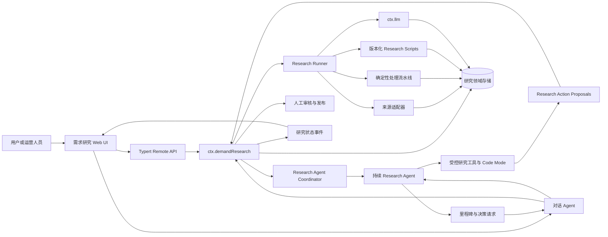
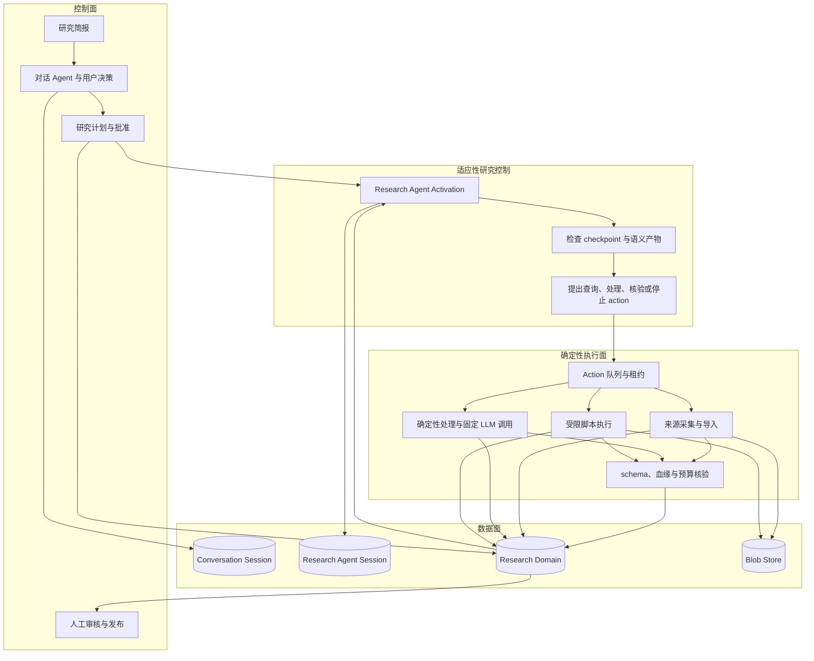
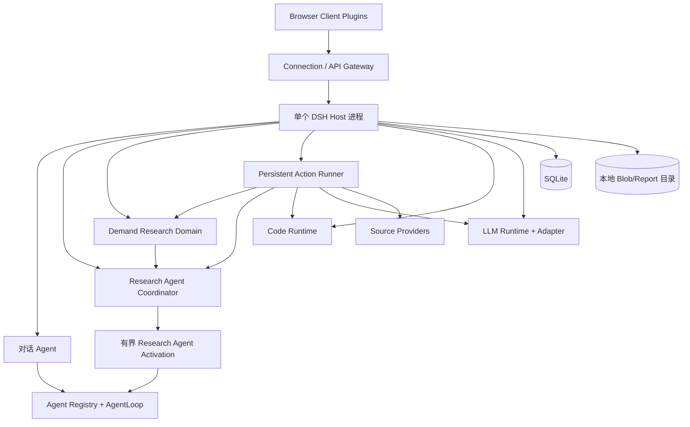
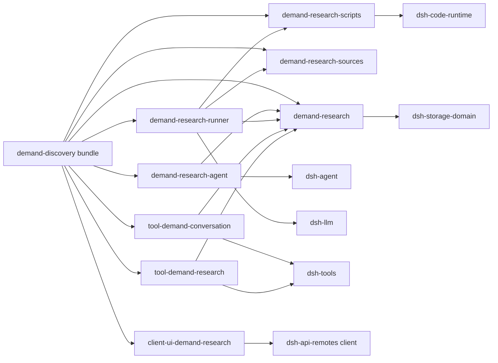
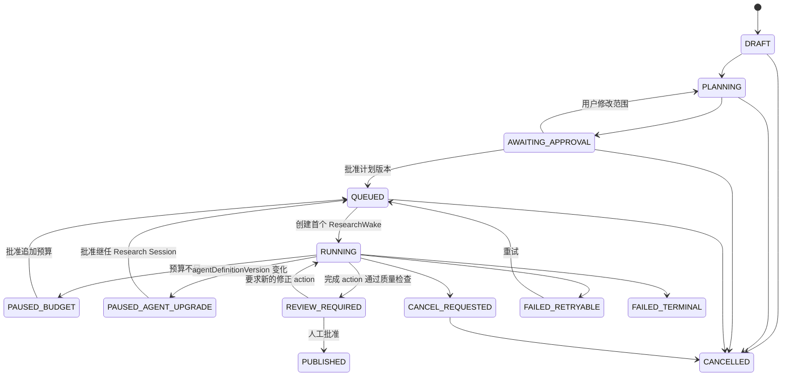
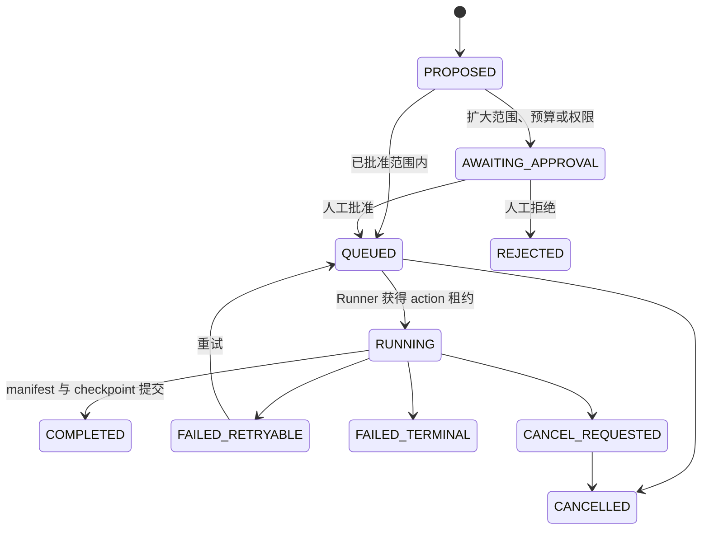

# Demand Discovery Agent Technical Design

English | [中文](demand-discovery-agent-technical-design.zh.md)

> Status: target design, draft; version: v0.2; updated: 2026-08-21; requirements: [Demand Discovery Agent Product Requirements](demand-discovery-agent-prd.md); implementation scope: internal research workbench and supervised L1 single-run research Agent

This document describes how to implement the first engineering version of Demand Radar on DeepSeek Harness. It defines the target architecture, component responsibilities, data model, runtime state machine, collaboration among the Conversational Agent, Research Agent, and Research Runner, Web integration, reliability and security requirements, and staged implementation path. This is a target design; the demand-research packages described here do not yet exist in the repository.

## 1. Design Summary

The first version is a modular monolith in which three runtime units with distinct responsibilities collaborate:

1. **Conversational Agent** faces the user and owns the research brief, clarification, plan and budget confirmation, status explanation, report questions, and interactions that require a human decision.
2. **Research Agent** faces the research task and owns a separate durable Session. Across a sequence of bounded activations, it selects queries, acquires material, inspects intermediate artifacts, authors or selects processing scripts, proposes the next research action, and adapts the strategy to results.
3. **Research Runner** is the deterministic durable executor and verifier. It enforces admitted actions, source and budget policy, script isolation, immutable artifacts, evidence lineage, leases, checkpoints, and crash recovery.

"Continuous" does not mean one Agent turn that never ends. The Research Agent runs one activation bounded by tokens, time, and action count, then ends after submitting an action or wait condition. Durable wake records in the domain trigger the next activation after action completion, approval, a scheduled condition, or Host recovery. Closing the browser, disposing a live Agent, or restarting the Host must not erase the research record.

The two Agents' [`Session`](subsystems/session.md) logs separately store model-visible facts from the user conversation and research decisions. Research projects, raw materials, actions, scripts, structured signals, opportunity cards, report versions, wakes, and execution checkpoints belong in a separate Research Domain. The Research Agent reads domain artifacts through paginated tools and changes them only through typed actions; it cannot bypass the Runner to mutate authoritative records.



The core design decisions are:

| ID | Decision | Direct consequence |
| --- | --- | --- |
| TD-01 | Give the Conversational Agent and Research Agent separate Sessions and presets | User interaction state and internal research traces do not mix, and each can resume and compact independently |
| TD-02 | Give adaptive research control to the Research Agent and deterministic execution to the Runner | The Agent owns query iteration, semantic judgment, and next-step selection; durable writes, policy enforcement, and verification remain inspectable |
| TD-03 | Make the Research Agent continuous through bounded activations and durable wakes | No unbounded turn is required, and the next decision point can recover after Host restart |
| TD-04 | Store model-visible facts in Sessions and research business facts in the Research Domain | Raw material does not consume model context, while research results remain independently auditable and versioned |
| TD-05 | Let the Agent submit only typed ResearchActions, which the Runner executes and commits | The model cannot mutate the corpus, evidence, or checkpoints directly |
| TD-06 | Use Code Mode for orchestration within one activation and promote reusable programs to ResearchScripts | The Agent can author processing logic while script versions, inputs, outputs, permissions, and lineage remain durable and inspectable |
| TD-07 | Keep fixed high-volume model analysis as direct Runner calls through `ctx.llm` | Individual source fragments do not create Agent steps, while the Research Agent inspects results and decides whether to iterate |
| TD-08 | Require human approval for plan expansion, budget expansion, script privilege, and report publication | The model may propose drafts but cannot expand authority or publish conclusions |
| TD-09 | Use one Host, SQLite, and local object storage for L1 | Deliver the internal workbench quickly; replace these before L2 with Providers that support multi-process leases and user isolation |
| TD-10 | Use immutable artifacts, a mutable Run pointer, and verified report inputs | Retries do not overwrite history, and temporary model or script output cannot bypass verification and enter a report |

## 2. Scope and Non-goals

### 2.1 Covered by this design

- Data structures for opportunity exploration, idea validation, and competitor or alternative research; the first product vertical is fixed to idea validation.
- Structured research briefs, Agent-generated research plans, plan editing, and approval.
- A Research Agent that is separate from the Conversational Agent and works continuously across multiple activations.
- Iterative queries, controlled corpus acquisition, intermediate-artifact inspection, Code Mode orchestration, and versioned ResearchScripts authored by the Research Agent.
- CSV, user-provided URLs, and one public-source adapter that has completed compliance review.
- Normalization, deduplication, filtering, signal extraction, clustering, counter-evidence, and evidence verification over 100 to 500 items.
- Five to eight opportunity cards; fewer are allowed when data is insufficient, but the system must explain the degradation.
- Human review, immutable report versions, controlled sharing, opportunity feedback, and deletion workflows.
- Up to 20 queued tasks in one process; configuration limits actual concurrent execution.
- Action/wake recovery after Host restart, checkpoints, cancellation, budget pauses, and partial source failure.

### 2.2 Not covered by this design

- Multi-tenant SaaS identity, payments, enterprise SSO, complex role permissions, or multi-region deployment.
- Whole-web crawling, bypassing authentication or CAPTCHAs, or sources that require browser account state.
- Unsupervised multi-week monitoring and user-facing proactive notifications; the L1 Research Agent works continuously only within one approved Run.
- Automatic posting, direct messaging, advertising, purchasing, or other external writes.
- Vector databases, complex knowledge graphs, unconstrained multi-Agent networks, or unrestricted model-authored scripts.
- Treating the existing [`workflow`](subsystems/workflow.md) or [`jobs-local`](subsystems/jobs.md) as the persistent research queue.

## 3. Harness Capability Mapping

The implementation follows the plugin, Service, event, and reversible-effect model in the [Harness architecture](architecture.md). Business packages depend on capability definitions, not concrete Providers.

| Research need | Reused Harness capability | Usage |
| --- | --- | --- |
| Agent creation, messages, and cancellation | `ctx.agents`, default `ctx.agentLoop` | Create or resume Conversational and Research Agents separately; each Research activation uses an ordinary bounded turn |
| Continuous-Agent lifecycle pattern | continuable subagents, `ctx.agents.resume()` | Reuse durable Session, cold-resume, and activation concepts; a dedicated Coordinator manages the Research Agent because Host wakes cannot depend on a live parent |
| Persona, research rules, and tool schemas | `ctx.systemPrompt`, Agent Preset | Assemble different prompts, tools, and context for the two Agents |
| Model calls | `ctx.llm` | AgentLoop handles reasoning for both Agents; the Runner makes direct fixed-schema batch-analysis calls |
| Model-visible tools | `ctx.tools` | Conversational Agent uses plan and query tools; Research Agent uses action, corpus, evidence, and script tools |
| Script and batch tool orchestration | Code Mode, `ctx.codeRuntime` | Run temporary programs with research-only bindings inside one activation; the Runner executes durable versioned scripts |
| Conversation and research-trace replay | `ctx.sessions`, Session persistence | Store user messages, research decisions, tool calls, and model-visible outcomes separately |
| Non-Session domain data | `ctx.storageDomain`, SQLite backend | Store L1 projects, Runs, plans, indexes, and structured research records |
| Human questions | `ctx.userQuestions` | Ask at most three clarifying questions that materially affect scope; optionally provide a fallback plan-review interaction |
| One-action approval | `ctx.approval` | Use only for dangerous tool actions; it does not replace approval of a versioned research plan |
| Host/Client RPC | Typert Remote, Connection | Serve structured forms, plan editing, review, publication, and paginated reads |
| Web plugins | Client module and slot system | Add research briefs, run progress, opportunity cards, evidence, and review UI |
| Structured logs and Session telemetry | Harness logging and optional telemetry | Record run metrics; raw research text does not enter ordinary logs or default telemetry |

### 3.1 Current capability gaps

The following capabilities must be added rather than relabeling an existing component:

- **Research Agent Coordinator**: existing continuable-subagent follow-up requires an exact live parent, while a background wake cannot depend on the Conversational Agent being online. A new Coordinator owns Research Agent create/resume, activation, flush, dispose, and Host-start recovery.
- **Persistent Research Action Runner**: existing Workflow runs in-process subagent scripts, while Local Jobs end with Agent or process lifecycle. Neither provides action leases, durable queuing, or restart recovery.
- **Research Script Registry/Executor**: Code Mode starts fresh each run and its intermediate canonical values cannot be replayed from the Session. Reusable scripts need domain versions, input/output schemas, resource limits, approval, and artifact manifests.
- **Research source registry**: existing `ctx.web` serves general model tools and does not carry source-policy versions, query cursors, acquisition logs, global pause controls, or research-specific normalization.
- **Research raw-file storage**: current attachment storage is for message images, and storage-domain provides KV only. CSV files, raw responses, and report files need independently deletable blob ownership.
- **Research-domain UI and state feed**: the Session mux delivers Session facts only, while background Runs must remain observable without a live Agent.
- **Public-sharing deployment**: Harness Web is currently primarily a local application. Public links additionally require TLS, deployment identity, rate limiting, and a production network boundary; generating a token alone is insufficient.

## 4. Logical Architecture

### 4.1 Four runtime planes



The control plane decides the research goal, authority, budget, and publication. The Research Agent owns adaptive research control and selects the next step from the latest artifacts, but it may submit only typed actions. The deterministic execution plane validates each action against the approved plan before producing immutable artifacts. The data plane stores reconstructable facts. Neither the Research Agent nor Runner may expand sources, time range, network destinations, script privileges, or budget unless the control plane writes a newly approved version.

### 4.2 Host and Agent scope

The research-domain service, Research Agent Coordinator, Runner, source registry, script registry, blob store, Remote API, and run events belong to the Host plane because they must survive without a live Agent. The conversational Persona and planning tools register through the `demand-conversation` preset; the research Persona, Code Mode, and action/corpus/script tools register through the `demand-research` preset.

The Research Agent uses a separate Session but L1 does not masquerade it as an ordinary subagent: `SessionHeader.origin` currently accepts only `subagent`, and that marker activates existing subagent-catalog and cold-session authorization semantics. A `ResearchAgentLink` in the Research Domain associates project, Run, conversation Session, and research Session; Web lists hide internal Sessions through that relationship. The Coordinator calls `ctx.agents.create/resume()` with the exact preset and flushes and disposes the Agent after each activation reaches quiescence.

This allocation follows the scoping rules of [Agent Presets](../packages/preset/agent-presets/README.md): Host services cannot live in a preset's isolated realm, and model-visible tools cannot be registered globally for every Session. When one or more helper Research Agents have an exact live parent, the Research Agent may still use existing continuable subagents, but they are not the persistent action queue.

### 4.3 L1 deployment topology



One Host process is the only SQLite writer. `storage-domain` currently has no cross-table transactions, secondary indexes, or cross-process notifications, and the [SQLite storage backend](../packages/storage/storage-sqlite/README.md) does not coordinate multi-process writes. L1 therefore cannot scale by starting multiple Host processes.

### 4.4 L2 replacement points

When the product reaches self-service and multi-tenancy, preserve `ctx.demandResearch`, source interfaces, tool schemas, and Remote DTOs while replacing these implementations:

- Replace the storage-domain Repository with a PostgreSQL Repository.
- Replace the local action and wake scheduler with Providers backed by database leases or a managed workflow system.
- Replace the local blob Provider with an S3-compatible Provider.
- Replace local single-user authorization with Workspace, User, and Role checks.
- Replace or bridge in-process `research/*` events with a durable message bus.

## 5. Proposed Package Structure

Place the first implementation in `packages/experimental/` so that the project does not promise a stable product API before quality and business boundaries are validated. The Web UI follows existing Client package naming and dual-entry rules.

```text
packages/experimental/demand-research/
  领域类型、Run/Action/Wake 状态机、存储 schema、ctx.demandResearch、Remote 方法
packages/experimental/demand-research-agent/
  Research Agent Coordinator、create/resume、activation 预算、wake 消费和里程碑报告
packages/experimental/demand-research-runner/
  本地持久 action 队列、租约、确定性执行器、固定模型调用和检查点
packages/experimental/demand-research-sources/
  ctx.demandSources 注册表、导入 Provider 和来源 Provider contract suite
packages/experimental/demand-research-scripts/
  ResearchScript 版本、准入、Code Runtime bindings、资源限制和产物提交
packages/experimental/tool-demand-conversation/
  对话 Agent 的计划、状态、卡片和报告查询工具
packages/experimental/tool-demand-research/
  Research Agent 的 action、corpus、证据、脚本和 checkpoint 工具
packages/client/ui-demand-research/
  浏览器对象层、研究页面、机会卡、证据和审核 UI
packages/bundle/demand-discovery/
  Host rows、Client row、来源 Provider、Coordinator、Runner 和 profile patch
apps/cli/config/agent-presets/demand-conversation/
  用户对话 Persona 与用户可见工具组合
apps/cli/config/agent-presets/demand-research/
  研究 Persona、Code Mode 与受控研究工具组合
examples/demand-discovery/
  可重放的完整组合、固定 CSV 和 snapshot 场景
```

### 5.1 Package dependency direction



Neither tool package may depend on the Runner implementation, the Coordinator must not store live Agent handles in domain records, the UI must not read SQLite or internal Session objects directly, and the Runner must not depend on Client or tool packages. The composition bundle may depend on every concrete plugin, while ordinary consumers depend only on Service Definitions.

### 5.2 Whether to split a storage Provider immediately

While L1 has only one storage implementation, keep the Repository interface and storage-domain implementation internal to `demand-research` rather than creating a public Service with one implementation. When a second persistence implementation enters the repository, extract a `ctx.demandResearchStore` Service Definition, storage-domain Provider, and PostgreSQL Provider, and update all references together.

## 6. Domain Model

### 6.1 IDs and versions

Every cross-package ID uses `Branded<B>` rather than interchangeable bare strings:

- `ResearchProjectId`
- `ResearchRunId`
- `ResearchPlanId`
- `ResearchActionId`
- `ResearchWakeId`
- `ResearchScriptId`
- `ResearchDecisionId`
- `SourceDocumentId`
- `ContentFragmentId`
- `SignalId`
- `SignalClusterId`
- `InsightCardId`
- `ClaimId`
- `EvidenceLinkId`
- `ReportId`
- `ResearchArtifactId`
- `ModelCallId`

The research-domain format starts at `0`. L1 makes no migration promise for older formats; a mismatched format must fail to load instead of silently filling defaults.

Each editable aggregate has a monotonically increasing `revision`. Remote writes carry `expectedRevision`; a stale edit returns a conflict and requires the client to reread rather than allowing last-arriving data to overwrite an earlier write.

### 6.2 Core records

| Record | Mutability | Key fields and responsibility |
| --- | --- | --- |
| `ResearchProject` | Mutable aggregate | Task type, topic, audience, decision goal, constraints, exclusions, conversation Session, current Run, revision |
| `ResearchRun` | Mutable control record | Status, phase, coverage, approved plan, budget, current checkpoint, open actions, failure, timestamps, revision |
| `ResearchPlan` | Mutable draft, immutable after approval | Subquestions, query terms, sources, time range, sample and budget estimates, limitations, version |
| `ResearchAgentLink` | Mutable control record | Project/Run, conversation Session, current and predecessor Research Agent Sessions, preset ID, agentDefinitionVersion, latest decision/wake, activation count, revision |
| `ResearchDecision` | Immutable | Research Agent Session, turn, input checkpoint, selected action or wait reason, rationale, stop condition |
| `ResearchAction` | Mutable control record | Kind/version, action dependencies, input artifact/hash, parameters, budget estimate, state, lease, attempt, output manifest, error |
| `ResearchWake` | Mutable delivery record | Research Agent Session, reason, Run/action revision, deduplication key, state, lease, accepted MessageId |
| `ResearchScript` | Immutable version | Source/hash, language, input and output schemas, allowed bindings, resource limits, creating decision, approval state |
| `SourceFetch` | Immutable | Source, query, policyVersion, request time, status, cursor, error, response artifact |
| `SourceDocument` | Immutable | Canonical URL, title, public author reference, publication time, text hash, raw artifact, fetch record |
| `ContentFragment` | Immutable | Document, normalized text, UTF-8 byte span, context, language, and quality labels |
| `DuplicateGroup` | Immutable | Canonical fragment, members, rule version, similarity evidence |
| `Signal` | Immutable | Audience, scenario, job, pain, alternative, behavioral and commercial signals, evidence span, model version |
| `SignalCluster` | Versioned artifact | Label, members, representative samples, outliers, audience and scenario boundaries, human-override references |
| `InsightCard` | Versioned artifact | Claims, per-dimension scores, confidence, product hypothesis, validation experiment, limitations |
| `EvidenceLink` | Immutable | Claim, fragment, stance, strength, citation span, verification status |
| `Report` | Immutable version | Sections, card IDs, quality result, publication status, share policy, artifact |
| `HumanOverride` | Immutable | Target record, prior revision, replacement value, reason, operator, time |
| `ModelCall` | Immutable outcome | Purpose, route, prompt/schema versions, input hash, attempt, usage, output artifact, failure |
| `Feedback` | Append-only | Target type and ID, rating, reason, time, operator |

### 6.3 Lineage

Every published claim must satisfy this traversable relationship:

```text
Report
  -> InsightCard version
    -> Claim
      -> EvidenceLink
        -> Signal and ContentFragment
          -> SourceDocument
            -> SourceFetch and Source policy version
  -> producing ResearchAction
    -> input artifact manifests
    -> optional ResearchScript version
```

Citations use half-open UTF-8 byte ranges `[startByte, endByte)` in normalized text and also store the quoted-text hash. The verifier slices the bytes again and compares the hash. If document content, span, or quoted text differs, the EvidenceLink cannot enter `verified` state. Every derived artifact also records its producing action, input manifest/hash, algorithm or script version, configuration hash, and optional model call, so Agent-initiated custom processing cannot break lineage.

### 6.4 Immutable action artifacts

Each action writes one or more immutable records and then an immutable manifest. It then marks `ResearchAction` complete, updates `ResearchRun.checkpoint`, and creates a `ResearchWake`, in that order. Records outside the Run that are not referenced by a checkpoint or action are orphan artifacts and may be removed by maintenance.

```text
AcquisitionManifest
NormalizedCorpusManifest
SignalExtractionManifest
ScriptOutputManifest
ClusterManifest
VerificationManifest
ReportManifest
```

This order accommodates storage-domain's lack of cross-table transactions. A crash before the manifest leaves only invisible orphan records. A crash before the action or Run update lets recovery reuse the completed manifest through the action idempotency key. A crash before the wake write lets reconciliation recreate the same wake from the completed action and Run revision. ResearchDecision first stores the action ID, idempotency key, and complete proposal as immutable fields, then materializes ResearchAction; after a crash between them, reconciliation recreates the action from the decision. A script may produce candidate records and a manifest but cannot update the checkpoint directly.

## 7. Run State Machine

The PRD places execution stages, terminal states, and coverage quality in one enum. The implementation separates them into orthogonal fields so that `PARTIAL` cannot mean both a runtime status and a result-quality assessment.

### 7.1 Main status



### 7.2 Research phase

`ResearchRun.phase` is the Research Agent's current focus rather than a forward-only pipeline counter:

```text
ACQUIRING
PROCESSING
SYNTHESIZING
VERIFYING
REPORTING
```

After finding new counter-evidence or a coverage gap, the Research Agent can return from `VERIFYING` to `ACQUIRING`; after a script produces new semantic fields, it can return to `PROCESSING`. The `ResearchAction` dependency graph and checkpoint are the execution history. Phase serves only summaries, UI, and scheduling policy.

### 7.3 ResearchAction state



Action kinds include source search and fetch, import, normalization, deduplication, filtering, fixed-schema extraction, script transform, clustering, counter-evidence, verification, scoring, reporting, and a Run-completion proposal. Each action declares input manifests, expected output schema, resource estimate, and stop condition. An action may depend on several completed actions but cannot depend on uncommitted artifacts or artifacts from another Run.

### 7.4 ResearchWake state

`ResearchWake` follows `PENDING -> CLAIMED -> DELIVERED`. On claim, Coordinator writes both a short lease and a stable `MessageId` derived from the wake ID. After materializing the Agent, it first checks whether the persisted Session already contains that message. If absent, it calls `followup()` with a frozen `UserMessage`, then calls `sessions.flush()`, and finally marks the wake `DELIVERED`. After a process exit at any point, lease expiry retries with the same MessageId: if the Session contains it, recovery only fills `DELIVERED`; otherwise it redelivers. The deduplication key combines Research Session, Run revision, action revision, and reason, so reconciliation can recreate a missing wake without triggering the same decision point twice. An old wake may enter `SUPERSEDED` when a newer checkpoint already includes the same reason.

### 7.5 Coverage quality

`coverage` describes the execution result and does not determine whether the Run is active:

- `COMPLETE`: every approved source reaches its minimum sample requirement.
- `PARTIAL`: at least one source failed or was insufficient, but remaining evidence reaches the limited-report threshold.
- `INSUFFICIENT`: the system cannot produce core opportunity conclusions and may deliver only exploratory findings and gap recommendations.

The task strategy and approved plan jointly define thresholds; plugins do not hardcode them.

### 7.6 Transition ownership

| Transition | Sole owner |
| --- | --- |
| `DRAFT -> PLANNING -> AWAITING_APPROVAL` | Conversational Agent proposes a draft through the structured plan tool |
| `AWAITING_APPROVAL -> QUEUED` | User or operator approves the exact plan revision through Remote |
| `QUEUED -> RUNNING` and first wake | Plan approval writes a Run startup intent; reconciliation idempotently materializes the link and wake |
| `PENDING wake -> DELIVERED` | Research Agent Coordinator |
| `PROPOSED action` | Typed tool call from the Research Agent |
| `PROPOSED -> AWAITING_APPROVAL/QUEUED` | Domain policy based on approved scope, budget, and permissions |
| `QUEUED action -> RUNNING -> terminal` | Current action lease holder |
| `COMPLETED action -> checkpoint + wake` | Runner in the fixed commit order |
| `RUNNING -> REVIEW_REQUIRED` | Research Agent proposes completion and Runner finishes the final quality action |
| `REVIEW_REQUIRED -> PUBLISHED` | Operator review Remote |
| Cancellation request | User or operator Remote; Coordinator and Runner converge activation and action separately |
| Retry and budget increase | User or operator Remote |

The model cannot directly approve, publish, increase a budget, or delete data.

## 8. Research Action Runner and Agent Coordinator

### 8.1 Why Runner and Coordinator are still required

- A Research Agent can work continuously across many turns, but a live Agent, turn, or `AgentHandle` still belongs to the current process and cannot represent pending work after restart.
- Workflow can perform bounded model orchestration within one activation, but its worker, subagents, and result handle still belong to the current process and provide no action checkpoint or recovery.
- Local Jobs can host helper work within an activation, but disposal of the Agent or service cancels and drains them, so they cannot be the source of truth for corpus construction.
- `ResearchAction` and `ResearchWake` are durable facts; an in-process Promise, Agent activation, Workflow, or Job is only the current action or wake attempt.

### 8.2 Scheduling model

At L1 Host startup, action and wake processing each perform one reconciliation and then wake from a Cordis timer or domain-change event:

1. Move expired `RUNNING` actions to `FAILED_RETRYABLE`, and restore expired `CLAIMED` wakes whose message was not accepted to `PENDING`.
2. Runner reads `QUEUED` actions by creation time; Coordinator reads `PENDING` wakes in Run and revision order.
3. Each uses one domain write-chain operation to check revision, dependencies, concurrency capacity, and budget before writing lease owner, expiry, and attempt.
4. Runner executes only one action, writes immutable records and a manifest, commits the action and checkpoint, and creates a wake.
5. Coordinator creates or resumes the Research Agent, delivers a message containing only IDs, revisions, counts, and error summaries, waits for activation quiescence, flushes the Session, and disposes the handle.
6. Runner and Coordinator renew their leases independently; after renewal failure, they stop creating side effects and allow started source, script, model, or Agent operations to converge.
7. When several actions complete against one checkpoint, reconciliation may coalesce wakes into one latest revision; wakes requiring separate human decisions cannot be coalesced.
8. Plugin unload aborts the in-process attempt without writing business cancellation; the next process recovers after the action or wake lease expires.

Configuration includes at least:

- `maxConcurrentActions`
- `maxConcurrentResearchActivations`
- `leaseDurationMs`
- `heartbeatIntervalMs`
- `pollIntervalMs`
- `maxAttemptsPerAction`
- timeout for every action kind
- `activationTimeoutMs`
- `maxActionsPerActivation`
- per-Run limits for documents, fragments, input bytes, model tokens, model calls, and wall-clock time

Every deployment-varying value must be a validated Config field rather than only a constant or test hook.

### 8.3 Idempotency key

Each action computes a stable key:

```text
sha256(
  runId,
  decisionId,
  approvedPlanId,
  actionKind,
  actionVersion,
  inputManifestHashes,
  scriptVersion,
  actionConfigHash
)
```

If a complete manifest already exists under the same key, reuse it and finish any missing action/checkpoint/wake commits. Different inputs, scripts, or configuration versions create new artifacts. External reads may repeat, but each response is deduplicated by canonical URL, content hash, source-policy version, and acquisition window. If the Research Agent submits the same action from the same decision twice, the service returns the existing action ID.

### 8.4 At-least-once execution and side effects

Runner provides at-least-once action execution, and Coordinator provides at-least-once wake claiming; neither claims exactly-once semantics. Initial sources are read-only, and scripts can produce only candidate artifacts, not posts, purchases, or other external writes. A model call may have incurred cost before a crash prevented result persistence; the system records the call as `unknown`, charges it conservatively against the budget, and cannot replay it indefinitely. Wake deduplication keys and accepted `MessageId` values prevent recovery from repeating the same Agent decision point.

### 8.5 Budget ledger

Each direct Runner model call first writes a `ModelCall` reservation, invokes the adapter, and then writes completed usage or failure:

```text
RESERVED -> COMPLETED
RESERVED -> FAILED
RESERVED -> UNKNOWN_AFTER_RECOVERY
```

`UNKNOWN_AFTER_RECOVERY` consumes the reserved maximum. Before delivering a wake, Coordinator reserves the maximum model budget for that Research Agent activation and reconciles it against new `assistant/message` usage after completion; an unconfirmed activation also consumes the reservation. If the next action or activation would exceed the budget, the Run enters `PAUSED_BUDGET` and returns to the queue only after the user approves a new budget version.

### 8.6 Cancellation

The cancellation Remote first writes `CANCEL_REQUESTED`. Coordinator calls `cancel({ kind: 'user' })` on a live Research Agent, and Runner aborts the current action; source Providers, script bindings, and model Providers must accept `AbortSignal`. Completed manifests remain, the uncommitted action does not become the checkpoint, and `CANCELLED` is written only after the activation and action both reach quiescence. Deletion can proceed only after both leases are released.

### 8.7 Research Agent activation contract

One Research Agent Session has at most one activation at a time. Plan approval reserves `researchSessionId` and writes the link and first wake. On the first wake, Coordinator calls `ctx.agents.create()` to materialize the Session; later it calls `ctx.agents.resume()` and mounts the `demand-research` preset ID recorded by the link during setup. Domain records store only IDs, revisions, and `agentDefinitionVersion`, never a live `Agent` or `AgentHandle`.

Agent Presets persist a preset ID but do not promise to recover an old in-memory generation after a Host upgrade. Coordinator compares the link's `agentDefinitionVersion` with the current version of the Research Persona, tools, and script bindings. An ordinary restart under the same version resumes the same Session; a changed version moves the Run to `PAUSED_AGENT_UPGRADE`. After human approval, the system creates a successor Research Session that reads business state from the Research Domain checkpoint rather than an old Session seed, while the link retains predecessor Session IDs. A tool-set change therefore cannot silently alter an active research trace.

The delivered message contains only wake reason, Run/action/checkpoint revisions, failure summaries, and queryable artifact IDs; it does not inline the corpus. The Research Agent reads required pages through tools and must end the activation with one durable outcome: submit an action, await an action, request human approval, report Run completion, or record a blocker. An action-submission tool calls `concludeTurn()` after successful queueing; read-only inspection may combine calls through Code Mode in the same activation.

If `maxActionsPerActivation`, the time limit, or model budget is reached without a durable outcome, Coordinator cancels the activation, writes a retryable diagnostic, and creates a backoff-limited wake. Exceeding the configured consecutive limit changes the Run to `FAILED_TERMINAL` so the Research Agent cannot spin.

`whenIdle()` proves only that the current live activity reached quiescence. Coordinator then explicitly calls `sessions.flush()` and disposes the handle; the next wake resumes the same Session. Research Agent continuity comes from Session, ResearchAgentLink, and ResearchWake, not a resident JavaScript object.

## 9. Agent Roles and Collaboration

### 9.1 Conversational Agent preset

The `demand-conversation` preset contains only the capabilities needed for user collaboration and report explanation:

- User-facing demand-research Persona.
- `tool-demand-conversation`.
- `tool-ask-user`.
- Required compaction and token meter.
- Optional read-only Skill provider for research methods and report-explanation rules.

By default it excludes source acquisition, corpus transformation, script execution, Shell, file mutation, general Web, Subagent, Workflow, and background Job controls. The Conversational Agent cannot perform internal research actions instead of the Research Agent.

### 9.2 Conversational Agent responsibilities

The conversational Persona requires the Agent to:

- Identify the task type, target decision, target audience, time range, sources, and team constraints.
- Ask questions only when missing information would materially change research scope, with at most three questions.
- Generate and revise ResearchPlanDraft and explain scope, budget, and limitations to the user.
- Translate Research Agent milestones, blockers, and approval requests into understandable user decisions.
- Separate observed facts, model extraction, synthesized inference, solution suggestions, and unknown hypotheses when explaining reports.
- Never approve plans, budgets, script privilege, data retention, or publication on the user's behalf.

### 9.3 Conversational Agent tools

| Tool | Purpose | Result bound |
| --- | --- | --- |
| `research_plan_propose` | Write a structured plan draft and enter `AWAITING_APPROVAL` | Return plan ID, revision, scope, and estimate summary |
| `research_run_get` | Read the current state and coverage gaps of one Run | Return status, phase, counts, failure summary, and report ID |
| `research_cards_list` | Page through opportunity-card summaries | Small default page; omit complete evidence text |
| `research_card_get` | Read one card's claims, scores, confidence, and limitations | Return bounded fields and evidence IDs |
| `research_evidence_get` | Page through supporting or opposing evidence for one claim | Include minimal context, source, and original URL per item |
| `research_report_summary` | Read the published report summary and version | Do not return complete HTML |

Tool bodies return schema-validated JSON values, and `output.render` owns only model-visible text. UI cards use pure `presentCall`, `presentationMeta`, and `presentResult` projections as required by the [Tool authoring reference](cookbook/adding-a-tool.md).

After `research_plan_propose` succeeds, it calls `concludeTurn()` on the execution context so the model cannot pretend to continue research before the user approves the plan.

### 9.4 Research Agent preset

The `demand-research` preset contains only the capabilities needed for adaptive research inside an approved Run:

- Internal research Persona and method rules.
- `tool-demand-research`.
- Code Mode and TypeScript Code Runtime.
- Required compaction and token meter.
- Optional read-only research Skill provider.
- Optional continuable-subagent tools restricted by tool filter, depth, and count for independent bounded analysis.

By default it excludes arbitrary Shell, filesystem writes, dynamic plugins, self-modification, Ralph, and general background Jobs. Research-source tools wrap source access. A deployment may add general `web_search` as a non-authoritative lead tool, but its results cannot become evidence until a `research_source_fetch` or import action admits them to the Research Domain.

### 9.5 Research Agent responsibilities

The Research Persona requires the Agent to:

- Read the latest checkpoint, open actions, budget, coverage gaps, and pending approvals at the start of each activation.
- Select one next action with explicit input, output, budget, and stop condition rather than narrating future work.
- Iterate search terms, source candidates, corpus partitions, and semantic fields and cite the domain evidence that changed the strategy.
- Use Code Mode to compose read-only queries or propose a versioned ResearchScript over existing artifacts.
- Seek counter-evidence, satisfactory alternatives, sample bias, and evidence conflicts proactively.
- Never mark temporary script output, general Web results, or its own conclusions as verified evidence directly.
- Submit an approval request and end the activation when scope, budget, sources, retention, or permissions must expand.
- Propose Run completion after reaching stop conditions, without publishing the report.

### 9.6 Research Agent tools

| Tool | Purpose | Result bound |
| --- | --- | --- |
| `research_checkpoint_get` | Read current checkpoint, coverage, open-action, and pending-approval summaries | Revisions, counts, states, and artifact IDs only |
| `research_artifacts_list` | Page through artifact manifests by kind, action, or revision | Small default page without artifact bodies |
| `research_corpus_query` | Run a bounded query over normalized fragments, signals, clusters, or evidence | Minimal context, IDs, hashes, and pagination cursor |
| `research_source_search` | Submit a query action within approved sources and budget | Action ID, estimate, and queue state, then conclude the turn |
| `research_source_fetch` | Submit a fetch/import action for an approved URL or candidate | Action ID, policy version, and queue state, then conclude the turn |
| `research_action_propose` | Submit normalization, deduplication, extraction, clustering, counter-evidence, verification, scoring, or report action | Existing or new action ID, approval requirement, and dependencies |
| `research_script_propose` | Store a ResearchScript draft with declared inputs, outputs, and bindings | Script ID, version, hash, and admission result |
| `research_script_execute` | Submit an action naming an exact script version and input manifest | Action ID, resource estimate, and approval requirement, then conclude the turn |
| `research_milestone_report` | Store a milestone, blocker, or decision request for the Conversational Agent and operator UI | Milestone ID and delivery state |
| `research_run_complete` | Propose completion after coverage and quality conditions hold | Final quality-action ID, then conclude the turn |

`research_source_search` and `research_source_fetch` are domain Consumers of the source seam, not unrecorded network operations executed inside tool bodies. Every tool that creates authoritative data first writes a ResearchDecision and ResearchAction. After queueing succeeds, it calls `concludeTurn()` and waits for Runner completion and the next wake. Code Mode may combine read-only tools within one activation.

### 9.7 Code Mode, ResearchScript, and Workflow

| Mechanism | Lifetime | Callable capability | Durable result | Use case |
| --- | --- | --- | --- | --- |
| Code Mode program | One Research Agent tool call | Typed research tools visible in the current scope | Outer `run_code` result and each sub-dispatch log; intermediate canonical values are not durable | Batch queries, artifact comparison, construction of one action proposal |
| ResearchScript | Immutable version across activations | Runner-provided artifact-read, statistics, and candidate-output bindings | Source/hash, schema, resource limits, execution action, and output manifest | Custom cleaning, field derivation, grouping, and repeatable semantic processing |
| Workflow | One foreground workflow run | Restricted subagent orchestration | Lifecycle records in the Session, without workflow recovery | Optional bounded parallel analysis, never the Run scheduler |

A `ResearchScript` declares at least language, source/hash, input artifact kind, output schema, allowed bindings, maximum input bytes, maximum output bytes, timeout, creating decision, and approval state. Runner invokes `ctx.codeRuntime.run()` with only paginated artifact reads, deterministic statistics, and candidate-emission bindings; it exposes no network, file paths, environment variables, processes, or credentials.

Code Runtime's `worker-thread` isolation is an execution-substrate label, not a security claim. Runner must still restrict bindings, hard-terminate on timeout, validate lossless JSON, validate output schema and lineage, and first store script output as candidate artifacts. A script cannot call checkpoint APIs. Policy may automatically admit a one-off script that uses fixed bindings within approved scope and budget; promotion to a reusable script or any new binding requires human approval, and L1 does not support privilege expansion to network, Shell, or filesystem bindings.

### 9.8 Operations that are not model tools

Only the UI/Remote or internal Runner can perform these operations:

- Approve plans and budgets.
- Claim, renew, force-retry, or cancel actions and wakes.
- Approve script privilege, reusable versions, or new bindings.
- Apply human corrections, sign quality checks, and publish.
- Create and revoke share links.
- Delete raw data or projects.

### 9.9 Model-visible state and Agent coordination

The domain plugin registers different bounded state for each preset. The Conversational Agent sees only project/run ID, approved plan, status, phase, coverage, budget, milestones, pending approvals, and report version. The Research Agent additionally sees checkpoint revision, open actions, artifact-manifest summaries, recent failures, and wake reason. AgentLoop records changed runtime context as a plugin-sourced `user/message` before sending it to the corresponding model.

Complete source material, full signal sets, and report bodies never enter the prompt. An Agent requests details through paginated tools, whose results AgentLoop records in that Agent's Session. Research Agent action proposals, accepted action IDs, script versions, and milestones also remain in the Research Session through tool results. Runner-internal data enters a Session only when it becomes model-visible.

Routine progress reaches the UI through revisioned Research Domain events and Remote snapshots rather than conversation messages. `research_milestone_report` writes a durable milestone: an ordinary milestone appears only in UI and the next conversational context; a milestone requiring a user decision enters the pending-approval list and injects a bounded notice when the Conversational Agent is live. Because the Research Agent is not an ordinary subagent, it does not use `reportFrom()`; continuable helpers created by the Research Agent may use it to report back to the Research Agent.

## 10. Research Pipeline

### 10.1 Planning stage

The input is a versioned `ResearchBrief`: task type, topic, audience, existing hypothesis, decision goal, time range, sources, exclusions, and team constraints. The Conversational Agent produces a strict `ResearchPlanDraft` containing:

- Three to eight subquestions and their relationship to the decision goal.
- Core terms, colloquial expressions, problem terms, alternative terms, and exclusions.
- One to three available sources with selection reasons, limitations, and policy version.
- Target sample range for each source.
- Estimated ranges for time, model calls, tokens, and cost.
- Insufficient-data, source-failure, and stop conditions.

Approval first writes an immutable `ResearchPlan`, then stores approved plan ID, approver, approval time, budget envelope, and reserved Research Agent Session ID in `ResearchRun.startupIntent`. Reconciliation idempotently creates `ResearchAgentLink` and the first `ResearchWake` from that intent; the same request ID can reuse an orphan plan left by an interrupted approval. Coordinator creates the actual Session when consuming the first wake. The Research Agent and Runner always read the approved snapshot, never a subsequently edited draft.

### 10.2 Adaptive action loop

1. Coordinator claims a wake and creates or resumes a Research Agent activation.
2. Research Agent reads the checkpoint summary and pages through artifacts, corpus, signals, clusters, and evidence as needed.
3. Research Agent selects one next action among acquisition, processing, script, comparison, counter-evidence, verification, reporting, and stopping.
4. A tool first writes `ResearchDecision` with the complete proposal and reserved action ID, then idempotently materializes `ResearchAction`; reconciliation completes interrupted materialization, and an authority expansion puts the action in `AWAITING_APPROVAL`.
5. Runner claims a `QUEUED` action and executes only the declared operation through a source Provider, fixed processor, direct LLM call, or ResearchScript.
6. Runner validates output schema, resource ledger, artifact ownership, and lineage before committing an immutable manifest.
7. Runner completes the action, advances the Run checkpoint, and creates a wake carrying the new revision.
8. Coordinator resumes the same Research Agent Session; the Agent inspects new artifacts and decides whether to iterate, request a human decision, or finish.
9. Milestones and approval requests reach UI and the Conversational Agent through the Research Domain; routine action detail remains in the Research Session and operator view.
10. `research_run_complete` creates the final quality action; only after that action passes does the Run enter `REVIEW_REQUIRED`.

Every loop produces at least one durable decision or blocker. The Research Agent cannot merely say "continue researching" and expect Coordinator to infer the next step, and Runner cannot choose the next action after completing one.

### 10.3 ACQUISITION actions

Through `research_source_search`, `research_source_fetch`, or general `research_action_propose`, the Research Agent selects the query, source, candidate URLs, and stop condition. Domain policy resolves the approved plan into an action spec, and Runner then calls the Source Provider. The Provider receives approved queries, time range, limits, cursor, and signal and returns normalized candidate documents plus fetch logs. One source failure does not cancel other sources; the result records counts for success, skipped, failure, retry, and rate limiting.

User imports and network sources produce the same `SourceDocument` type. Missing source, publication time, or author remains `unknown`; the system does not infer it.

### 10.4 NORMALIZE actions

The deterministic action:

- Normalizes URLs, Unicode, line endings, whitespace, and time.
- Extracts verifiable body text while retaining the raw artifact hash.
- Splits ContentFragments while retaining necessary context.
- Labels language, short content, malformed text, and missing context.
- Minimizes public author display names or replaces them with project-local irreversible references.

Instructions, scripts, and hidden text in HTML pages remain untrusted data and never enter the Runner's control prompt.

### 10.5 DEDUPLICATE actions

First perform exact deduplication with normalized-content SHA-256, then use a maintained near-text dependency for shingle/MinHash or an equivalent algorithm. Algorithm, threshold, and dependency versions enter `pipelineVersion`. Duplicate items are not silently discarded: `DuplicateGroup` retains the canonical document, members, and propagation relationship.

### 10.6 FILTER actions

Rules first label advertisements, recruiting, pure reposts, content-free items, and format anomalies. The model handles only cases that rules cannot classify reliably. Each result stores labels, reasons, and rule or model version. Low-relevance and noisy samples do not enter core statistics but remain in an auditable manifest.

### 10.7 EXTRACT actions

The Research Agent selects input manifests, the target signal schema, and corpus partitions to prioritize. Relevant fragments are batched by input-byte and token budgets, and Runner calls the selected model directly through `ctx.llm.stream()`. This fixed extraction call receives no research tools or network access and can only transform input fragments into structured signals.

Every extracted field must cite an input `fragmentId` and byte span. Strict schema, citation-range, and enum validation applies to the output. Unsupported fields remain empty or `unknown`; the parser cannot manufacture them. In the next activation, the Research Agent inspects field coverage, conflicts, and failed samples and may propose another extraction action or ResearchScript without mutating the current manifest.

### 10.8 CLUSTER actions

L1 does not introduce an embedding Service or vector database. The Research Agent selects clustering inputs, dimensions that must remain separate, and candidate groups requiring review. Runner first produces candidate groups from structured fields and deterministic text similarity; a capable model then groups and names them and selects representative samples and outliers. Different audiences or scenarios remain separate by default; a merge must explain the shared job and differences.

If fixed-sample evidence later shows inadequate semantic recall, add a complete Text Embedding capability with Service Definition, Provider, Consumer, model version, and vector dimension rather than importing one vendor's embedding SDK directly into the Runner.

### 10.9 COUNTER_EVIDENCE actions

The Research Agent proposes counter-evidence search conditions for each candidate opportunity, and Runner executes them across all valid and down-weighted material for:

- Problems that are mild or infrequent.
- Users satisfied with existing solutions.
- No willingness to pay or switch.
- Alternatives with sufficiently low cost.
- Evidence originating from one repost chain or interested party.
- Samples representing only one platform or unusual audience.

When no counter-evidence is found, the card must record "no counter-evidence found" and the actual search scope rather than claiming that counter-evidence does not exist.

### 10.10 VERIFY actions

The evidence verifier performs deterministic checks:

- Every core Claim references at least one existing EvidenceLink.
- Every citation span can be reconstructed exactly from its ContentFragment.
- Supporting and opposing evidence has an explicit stance.
- Citations do not cross document, Run, or project ownership.
- Counts, proportions, time distribution, and source distribution come from programmatic statistics.
- Independent evidence count after deduplication matches the card display.
- The model does not directly map engagement to need strength or willingness-to-pay level.
- Opportunity suggestions and user facts use distinct claim types.

A failed Claim is removed, downgraded to unknown, or sends the card to human correction. The pipeline cannot log a warning and publish it anyway.

### 10.11 SCORE actions

Versioned rules score verified evidence. Each dimension stores `value | unknown`, EvidenceLink IDs, and an explanation; missing evidence cannot receive a default midpoint. A total is computed only when required dimensions are available and always remains distinct from high, medium, or low confidence.

### 10.12 REPORT and QUALITY_CHECK actions

The report generator may read only the VerificationManifest, deterministic statistics, and verified Card versions. A model may organize summaries and recommendations but cannot introduce new factual Claims; factual references in new prose must map to existing Claim IDs.

Final quality checks include:

- 100% citation coverage for core Claims.
- Report numbers match the manifest.
- Invalid or deleted evidence is explicitly unavailable.
- The summary and methods disclose insufficient data, source failures, and platform bias.
- Unnecessary personal identifiers and sensitive information are removed.
- All HTML is escaped, and the model cannot provide executable HTML.

After a report action, the Research Agent may inspect missing citations, contradictions, and narrative bias and return to any required phase. The Run enters `REVIEW_REQUIRED` only after the Agent proposes completion and the final quality action passes; it is never automatically published.

## 11. Runner Direct LLM Calls

### 11.1 Call envelope

Runner configures an independent route and limits for each fixed batch-model purpose:

- relevance classification
- signal extraction
- cluster synthesis
- counter-evidence classification
- report synthesis

Each call records action ID, provider, model, purpose, promptVersion, schemaVersion, inputManifestHash, input record IDs, maxTokens, start and completion times, usage, finish reason, attempt, and error. Source version identifies the Prompt template; ordinary logs do not copy the complete Prompt.

### 11.2 Structured output

Prefer exposing the target schema as a ToolSchema used only for returning data and require the model to emit exactly one corresponding tool-call block. The Runner parses raw JSON arguments and applies domain-schema validation without executing the tool. If a Provider does not reliably support that method, use JSON text and the same schema validation.

An invalid result receives at most the configured number of repair attempts. A repair Prompt carries only validation errors and the original output and does not expand input material. Exhaustion creates `FAILED_RETRYABLE` or a batch failure; tolerant parsing cannot guess fields.

### 11.3 Retry

The two Agents' `dsh-llm-retry` instances consume only their respective `agent/request-error` events and do not handle Runner's direct `ctx.llm.stream()` calls. Runner must apply bounded backoff from the serving registration's retry policy or its own explicit configuration and record every Provider attempt in one ModelCall aggregate.

### 11.4 Prompt-injection defenses

- Put raw content in ID-addressed data containers, never adjacent to system instructions.
- Give analysis calls no Shell, Web, or other executable tools.
- Do not let model output choose new sources, URLs, budgets, or subsequent code paths.
- Validate URLs, file paths, IDs, statistics, and ownership programmatically.
- Generate report HTML through a controlled renderer and never render model-provided tags or scripts.

### 11.5 Relationship to Research Agent model calls

Research Agent reasoning continues through AgentLoop: its system prompt, tool schemas, input, chunks, assistant messages, usage, and tool results enter the Research Session and use ordinary Agent retry. Direct Runner calls apply only to high-volume actions with fixed input/output contracts and no adaptive tool choice. Runner output must be inspected by the Research Agent after the next wake; schema validity alone cannot replace research judgment.

## 12. Sources and Import

### 12.1 `ctx.demandSources`

The source registry stores Providers under stable source IDs. Registration is a Cordis effect; after disposal, new actions can no longer select that Provider. An approved plan or queued action that references an unavailable Provider fails before claiming with an explicit error.

A Provider declares at least:

- Source ID, display name, and capabilities.
- Policy version, review date, and permitted acquisition method.
- Supported tasks, queries, and time ranges.
- Rate and maximum pagination capabilities.
- `estimate()` and `collect()`.
- Pause state and reason.

Source policy is a deployment fact and cannot be changed by the model. A global source switch belongs to Host settings. Once disabled, new collection fails while previously stored data remains readable under retention policy.

### 12.2 Research Agent acquisition loop

The Research Agent never receives a Provider or HTTP handle directly. `research_source_search` and `research_source_fetch` write source ID, policy version, query/URL, cursor, time range, limit, budget, input checkpoint, and decision ID into a ResearchAction. Runner resolves the Provider, executes the request, and persists `SourceFetch`, response hash, normalized documents, and AcquisitionManifest before completing the action and creating a wake.

The next activation receives only action, manifest, and count summaries. Through paginated tools, the Research Agent reads candidates and chooses whether to expand the query, fetch a document, stop the source, or enter a processing action. If general `web_search` is enabled, its result is only a lead in the Session; content that has not passed through a source action, persistence, and policy recording cannot enter the corpus, statistics, or EvidenceLink.

### 12.3 CSV import

CSV upload uses a Remote or dedicated protected upload endpoint behind the existing `/api` trust check, with a Config-defined size bound. The server stores the original bytes before parsing; the client may suggest field mappings but cannot be the sole parser.

The import flow is upload -> encoding and CSV parsing -> field preview -> user confirms mapping -> immutable import snapshot -> submit import action. CSV export protects cells beginning with `= + - @` against formula injection.

### 12.4 URL import

The general `web-fetch-http` should not currently be used directly for arbitrary user URLs. The research URL Provider must:

- Permit only `http` and `https`.
- Reject loopback, link-local, private, cloud-metadata, and reserved addresses after DNS resolution.
- Revalidate every redirect target.
- Bound redirects, response bytes, decompressed bytes, MIME, and time.
- Never forward Host credentials, cookies, or environment-proxy credentials.
- Record robots handling, terms review, and acquisition-policy version; technical reachability does not grant commercial use.
- Parse HTML and extract bodies with maintained dependencies rather than regular expressions.

### 12.5 Blob ownership

The Research Blob Store saves bytes by content hash and uses separate ownership records to associate project/run/artifact. Project deletion first removes ownership and then reclaims a blob when no owners remain. The Blob API accepts no arbitrary file paths; the local Provider confines every path beneath its configured root.

## 13. Remote API and State Events

### 13.1 Remote method groups

| Group | Representative methods | Write requirement |
| --- | --- | --- |
| Project | `create`, `get`, `list`, `updateBrief` | Updates carry expected revision |
| Plan | `getDraft`, `updateDraft`, `approve` | approve names exact plan revision and budget |
| Run | `get`, `list`, `cancel`, `retry`, `approveBudget` | State-machine validation and idempotent request ID |
| Research Agent | `getAgentLink`, `listDecisions`, `retryWake` | Internal Session exposes safe summaries only; retry requires operator permission |
| Action | `listActions`, `getAction`, `approveAction`, `retryAction` | Action revision, dependencies, approved authority, and idempotent request ID |
| Script | `listScripts`, `getScript`, `approveScript`, `revokeScript` | Exact script version, bindings, and approval state |
| Milestone | `listMilestones`, `acknowledgeDecision` | Append acknowledgment without rewriting the Research Agent's report |
| Import | `uploadCsv`, `previewMapping`, `commitMapping`, `addUrl` | Validate size, type, ownership, and source policy |
| Review | `getQueue`, `applyOverride`, `requestReprocess`, `publish` | Operator role only; L1 uses the local administrator |
| Evidence | `listCards`, `getCard`, `listEvidence`, `getFragmentContext` | Pagination, bounded context, project ownership |
| Report | `get`, `createShare`, `revokeShare`, `export` | Published versions only |
| Feedback | `rateCard`, `recordAction` | Append records rather than overwrite history |
| Data | `purgeRawData`, `deleteProject` | Second confirmation, Run cancellation, recoverable deletion workflow |

All pagination uses opaque cursors and server-side bounds. Remote DTOs contain only browser-required data and never expose internal storage-domain records or blob paths on the wire.

### 13.2 State events

After a durable write, the domain service emits whole-value notifications:

- `research/project-changed`
- `research/run-changed`
- `research/action-changed`
- `research/agent-changed`
- `research/script-changed`
- `research/milestone-created`
- `research/report-published`
- `research/source-status-changed`

Payloads contain IDs, revision, and a safe current summary without raw text. `api-remotes` forwards them through an explicit allowlist. After reconnecting, the client obtains a snapshot through Remote and then accepts events by revision. Events are refresh hints, not the source of truth.

### 13.3 Session association

`ResearchProject` stores `conversationSessionId`, and `ResearchAgentLink` stores `researchSessionId` and the associated Run. Neither SessionHeader carries complete research state, and the Research Agent does not receive a fabricated `origin: 'subagent'`. When a cold Session resumes, its Agent obtains preset-specific bounded runtime context from the domain service using project/run IDs.

The first version does not add numerous `SessionEventMap` variants. The respective AgentLoops already record plan tools, ResearchDecision, action proposals, script proposals, query results, and milestone tool results; action leases, artifacts, and wake state belong to the research domain. Every model-visible Research Agent input must come from context or a tool result in its Session. If a future generic transcript must permanently display cross-Session research nodes, design a small set of stable reconstructable link events and update both SDKs and snapshots together.

## 14. Web Workbench

### 14.1 L1 information architecture

L1 reuses the current Harness three-column Web shell instead of starting a separate Next.js application:

- Left: project and Run history, status, Research Agent activity, and failure markers.
- Center: research brief, Conversational Agent, plan review, phase/action progress, milestones, and report body.
- Right: action/script details, opportunity cards, Claims, supporting and opposing evidence, source context, and review information.

The research UI registers slots and object services as a `dsh.client` plugin. When the Node half has no Host behavior, it retains an empty `apply`; Host business logic lives in the `demand-research` Remote Service.

### 14.2 Core views

1. **Research Brief**: template, task type, topic, audience, decision, time, sources, exclusions, and team constraints.
2. **Plan Review**: editable subquestions, terms, sources, samples, and budget; the Approve button calls the domain Remote rather than generic tool approval.
3. **Run Progress**: phase, current activation, wake, open actions, per-source counts, model budget, failures, and cancellation.
4. **Research Activity**: show durable Research Agent decisions as actions and milestones without displaying hidden reasoning text.
5. **Action Graph**: dependencies, input manifests, lease, attempts, outputs, and checkpoint revision.
6. **Script Review**: source diff, hash, bindings, schema, resource limits, execution history, and approval.
7. **Signal Review**: operators inspect filtering, duplicate groups, structured signals, and clusters and create HumanOverrides.
8. **Opportunity Cards**: score dimensions, confidence, Claim types, supporting/opposing evidence, and validation experiments.
9. **Report Review**: quality checks, citation status, limitations, publication, and sharing.

### 14.3 Specialized conversational presentation

`research_plan_propose` uses a specialized tool card to show the plan summary and awaiting-approval state. Action/script tools in the Research Session also use specialized cards for operator review, while ordinary users see only milestones and approval requests. Run progress and reports update through the domain UI rather than continuously appending chat messages, so 30-second status updates do not pollute either Session. After publication, the conversation may show a stable report-link card, but its body still loads from the Research Domain.

### 14.4 Accessibility

- Every state uses text and an icon rather than color alone.
- Plan tables, evidence drawers, and review actions support keyboard operation.
- Long card titles, source URLs, and Chinese terms wrap or truncate in narrow columns while preserving access to full text.
- Loading, empty data, partial failure, invalid citations, and permission rejection each have distinct states.

## 15. Reports, Publication, and Sharing

### 15.1 Report renderer

Reports store structured JSON and an optional prerendered HTML artifact. A deterministic template or React server renderer generates HTML from structured data; the model cannot emit HTML directly. The Renderer version enters the Report record, so style changes can rerender without reanalyzing all material.

### 15.2 Publication

Publication requires:

- Run is `REVIEW_REQUIRED`.
- Every automatic quality check passes.
- An operator confirms or explicitly excludes every core card.
- Citation availability and data-deletion status have been rechecked.
- The operator submits publication notes.

Publication creates a new immutable Report version without modifying older versions. Taking down a seriously incorrect version preserves its status and correction record.

### 15.3 Sharing

Share tokens use cryptographically secure random values, while the database stores only a hash. A share record contains report ID, creation time, expiry time, revocation time, and access policy. Share responses set `noindex`, strict CSP, `Referrer-Policy`, and safe caching and load no third-party scripts or images referenced by the report.

An L1 local deployment can validate share routing and revocation semantics but must not expose the local Host directly to the public Internet. Production public sharing requires TLS, a reverse proxy, request rate limiting, abuse protection, and deployment identity.

## 16. Deletion and Retention

### 16.1 Raw-data purge

`purgeRawData` retains projects, reports, opportunity cards, and statistics but deletes source files, complete body text, readable fragment text, and raw model outputs. It marks related EvidenceLinks as `unavailable: purged`. Reports must show that citations are no longer verifiable and cannot continue displaying cached quotes.

### 16.2 Project deletion

Deletion uses a persistent state machine:

```text
ACTIVE -> DELETE_REQUESTED -> DELETING -> DELETED
```

Steps revoke shares, request Run cancellation, await the Research Agent activation and every action/wake lease, delete both Sessions, remove child domain records, remove blob ownership, reclaim orphan blobs, and delete the primary record. Each step is retryable. A deletion receipt without user text records deletion time, scope, and retry failures but retains none of the deleted content.

### 16.3 Retention configuration

Raw data, structured results, raw model output, both Sessions, run logs, scripts, and reports have separate retention periods. Retention maintenance is a persistent maintenance action and never relies on a transient `setTimeout` for irrecoverable deletion.

## 17. Security and Compliance

### 17.1 Trust boundaries

| Input | Trust level | Required validation |
| --- | --- | --- |
| Agent tool arguments | Model-generated JSON | Tool schema, business state, ownership |
| Remote arguments | Browser or another client | Typert codec, revision, permission, size, state transition |
| CSV/URL content | Untrusted external data | Type, size, encoding, SSRF, body extraction, malicious content |
| LLM output | Untrusted external result | Schema, ID, span, enum, citation, budget |
| ResearchScript | Model-generated program | Source hash, bindings, input/output schemas, resource limits, approval, artifact ownership |
| ResearchWake | Durable scheduling input | Session/Run/action revision, deduplication key, lease, accepted MessageId |
| storage-domain data | Persistence boundary | Domain schema, format version |
| Report HTML | Browser-facing | Escaping, CSP, link protocol, personal-data minimization |

### 17.2 Data minimization

- Do not save avatars, contact details, cookies, authentication state, or cross-platform personal identifiers by default.
- Store only a source-local public display name or project-local irreversible author reference.
- Ordinary logs contain IDs, phase/action/wake, counts, duration, and error codes, not raw fragments, script inputs, or Prompts.
- Keep Session telemetry disabled by default; enabling it requires explicit consent and research-data handling rules.
- Mark high-risk topics during planning and require human review or reject publication.

### 17.3 Source compliance

Every network Provider configuration and SourceFetch records a policy version. A Provider requires review of terms, APIs, privacy, copyright, commercial use, and rate limits before activation. When a review expires or source rules change, the Host can pause the Provider globally; technical fallback must never switch automatically to an access-control bypass.

## 18. Observability

### 18.1 Structured logs

Each log record includes at least `projectId`, `runId`, `phase`, `attempt`, and a stable error code. When available, it adds `conversationSessionId`, `researchSessionId`, `actionId`, `wakeId`, or `scriptId`. Source calls add `sourceId`; model calls add `modelCallId`, provider, and model. Logs contain no raw user text, hidden reasoning, or script input.

### 18.2 Metrics

- Action/wake queue depth, lease age, action duration, wake lag, activation duration, and Run success/failure/cancel rate.
- Per-Run activation, decision, action, no-durable-outcome, backoff, and consecutive-failure counts.
- Per-source success, skipped, failure, rate-limited, and sample counts.
- Per-purpose model calls, tokens, retries, invalid structured outputs, and estimated cost.
- Per-script proposals, automatic admissions, human approvals, executions, timeouts, schema failures, and output bytes.
- Deduplication rate, relevance rate, signal yield, Claim citation coverage, and counter-evidence coverage.
- Human override count, review time, publication rate, and citation errors.

### 18.3 Audit

Plan approval, budget increases, Research Agent decisions, action approvals, script approval/revocation, human corrections, retries, publication, takedown, sharing, revocation, and deletion append immutable audit records. ResearchDecision itself stores model-visible rationale; ordinary audit records retain only actor IDs and actions without copying sensitive text.

## 19. Configuration

Configuration is divided by ownership, and every deployment-varying parameter is changeable through Cordis config:

| Configuration group | Representative fields |
| --- | --- |
| Domain | Storage backend, format version, retention period by data type |
| Coordinator | Research Agent provider/model/preset, activation concurrency, timeout, action limit, wake lease, backoff, spin limit |
| Runner | Action concurrency, poll, lease, heartbeat, attempt, timeout by action kind |
| Budget | Maximum documents, fragments, input bytes, tokens, calls, runtime, and estimated cost |
| Models | Provider, model, maxTokens, batch bytes, and retry for Conversational Agent, Research Agent, and each Runner purpose |
| Scripts | Language, bindings allowlist, input/output bytes, timeout, automatic-admission and approval rules |
| Sources | Enabled state, policy version, rate, pagination, response size, time range |
| Import | CSV size, encoding, rows, columns, URL response bound |
| Reports | Renderer version, citation length, share expiry, download bound |
| Safety | High-risk topic policy, PII rules, content retention, review requirement |

An approved plan stores the resolved scope and budget snapshot. A live configuration update can affect only unapproved new Runs and cannot change the current Run's scope without a newly approved version.

## 20. Test Strategy

Follow the repository [Testing policy](testing.md). Mock only expensive or nondeterministic boundaries such as LLM, network, clock, and external blob media; use real domain services, Runner, tools, and storage.

### 20.1 Unit tests

- Every legal and illegal state transition.
- ResearchAgentLink, Action, Wake, and Script revision, dependency, deduplication, and ownership checks.
- Revision conflicts, idempotent request IDs, and ownership checks.
- Span/hash verification, deduplication, scoring, statistics, and report-quality rules.
- BudgetLedger, lease claim, renewal, expiry, and cancellation convergence.
- Coordinator single-activation, flush/dispose, wake supersession, backoff, and spin limits.
- ResearchScript binding allowlist, output schema, timeout, abort, and checkpoint-write denial.
- Prompt-output schema parsing and bounded repair attempts.
- Deletion, share revocation, and retention state machines.
- Every Cordis registration unwinds after fiber disposal.

### 20.2 Provider contract tests

Run one contract suite against every Source Provider:

- Limits, cursors, cancellation, and timeout.
- Policy version and acquisition logs.
- Partial failure, rate limiting, duplicate results, and malformed input.
- No new calls after Provider disposal.
- URL Provider tests for SSRF, redirects, decompression bombs, and MIME.

### 20.3 Coordinator and Runner integration tests

- With temporary SQLite, real storage-domain, fixed CSV, and a scripted LLM adapter, let the Conversational Agent approve a plan, the Research Agent submit actions, Runner produce artifacts, and the same Research Session iterate at least twice.
- Inject a crash at every records, manifest, action, checkpoint, and wake write and verify that a restarted Host resumes the same Research Agent Session from the last complete revision.
- Inject a crash between wake claim, Agent inbox acceptance, Session flush, and handle disposal and verify that one deduplication key cannot produce two ResearchDecisions.
- Produce conservative `UNKNOWN_AFTER_RECOVERY` when a model call completes but ModelCall does not commit.
- Keep `PARTIAL` when one source fails and produce `INSUFFICIENT` when all evidence is inadequate.
- Retrying the same action does not create a duplicate current artifact, and a duplicate proposal returns the same action ID.
- A ResearchScript can read only declared inputs and produce candidate artifacts; illegal bindings, limits, and schema errors cannot advance the checkpoint.
- Cancellation retains completed checkpoints and lets the incomplete action and activation both reach quiescence.

### 20.4 Real composition and snapshots

- Start the real bundle through Loader in `examples/demand-discovery`, mocking only source and LLM boundaries.
- Keyless snapshots separately pin the Conversational and Research Agent presets, tool schemas, model-visible state, action iteration, and Session logs.
- A Web snapshot covers brief entry, plan edit and approval, Research Activity, Action Graph, Script Review, partial failure, evidence drawer, and publication.
- Record a real-application GIF for product-visible GUI changes, as required by the repository's GUI PR policy.

### 20.5 Real API e2e

With a key, exercise Conversational Agent planning, two Research Agent action-selection rounds, Code Mode read-only orchestration, structured extraction, clustering, counter-evidence, report recommendation, and cancellation through a real DeepSeek route. Tests read fixed material that may legally be committed and assert ResearchDecisions, actions, artifacts, checkpoints, and lineage instead of accepting either Agent's self-report of completion.

### 20.6 Offline quality evaluation

Keep the evaluation set separate from test fixtures. Every prompt/schema/model/ResearchScript version change reports differences in relevance, signal-field precision, clustering merges, citation consistency, counter-evidence coverage, invalid Research Agent action rate, mean activation count, and cost; a version below the PRD threshold cannot become the default.

## 21. Implementation Path

Implementation proceeds through runnable vertical slices. Every stage produces functionality verifiable through a real entry point instead of building an unusable complete platform first.

### Stage 0: Freeze the design and fixed sample

**Goal**: Freeze the first vertical slice and evaluable output.

**Scope**:

- Fix the task type to idea validation.
- Fix input to one legal CSV containing 50 to 100 rows.
- Freeze ResearchBrief, Plan, Signal, Claim, EvidenceLink, Card, and Report schema v0.
- Build manually labeled fixtures and opportunity-card templates for two to three topics.
- Resolve compliance for the first source; enable CSV only until that review is complete.

**Exit criteria**: A manual report and target structured result for the same fixture can be compared field by field; remove unresolved fields or mark them explicitly as optional/unknown.

### Stage 1: Domain skeleton and persistent state machine

**Goal**: Build a recoverable model-free research Run.

**Scope**:

- `demand-research` domain service, branded IDs, domain schemas, and Remote API.
- SQLite storage route, Project/Run/Plan/ResearchAgentLink/Action/Wake/Script, revision, and audit.
- Action queue, wake queue, leases, reconciliation, cancellation, and empty checkpoints.
- Minimal Host state events and list UI.

**Exit criteria**: After approving a Run, terminate the Host and recover queued actions/wakes in a new Host. Empty executors can commit manifests, advance checkpoints, and produce the next wake; illegal transitions and revision conflicts are rejected.

### Stage 2: Conversational Agent planning and approval loop

**Goal**: Turn a structured brief into an editable plan that cannot bypass human approval.

**Scope**:

- `demand-conversation` preset, Persona, and `tool-demand-conversation`.
- `research_plan_propose`, status-query tools, and runtime context.
- Brief, Plan Review, and approval UI.
- Association between Conversation Session and Project.
- Keyless conversation transcript snapshot.

**Exit criteria**: The Conversational Agent asks at most three necessary questions and generates three to eight subquestions. Before UI approval, the system creates no Research Agent Session or wake and incurs no acquisition or model cost; after approval, domain records use the exact plan revision.

### Stage 3: Continuous Research Agent and action loop

**Goal**: Let a separate Research Agent Session make continuous decisions across bounded activations.

**Scope**:

- `demand-research` preset, Research Persona, `tool-demand-research`, and Code Mode.
- Research Agent Coordinator, create/resume, wake delivery, flush/dispose, budget, and spin limits.
- Checkpoint/artifact queries, ResearchDecision, action proposals, milestones, and completion proposals.
- Dual-Session UI and snapshots for Conversational and Research Agents.

**Exit criteria**: Driven by action results, a scripted Research Agent completes at least two activations and resumes the same researchSessionId after Host restart. Each activation creates one durable outcome, and routine progress does not pollute the conversation transcript.

### Stage 4: CSV, normalization, deterministic actions, and scripts

**Goal**: Turn 100 to 500 inputs into an auditable corpus.

**Scope**:

- Research Blob Store, local Provider, and CSV upload/mapping.
- Normalizing, fragments, exact/near deduplication, quality, and noise rules.
- ResearchScript Registry/Executor, fixed bindings, schemas, resource limits, and Script Review.
- Acquisition/Corpus manifests, source counts, and error UI.
- Raw-data purge and retention foundation.

**Exit criteria**: Replaying the fixed CSV produces identical hashes, fragments, and statistics; duplicates and noise remain visible in operator UI but do not enter core statistics; the Host recovers after a crash at each checkpoint.

### Stage 5: Structured model analysis and Agent iteration

**Goal**: Produce need, commercial, and behavioral signals bound to original-text spans.

**Scope**:

- Runner direct LLM calls, ModelCall, usage, budget, and structured-output validation.
- Relevance and Signal Extraction.
- Batching, bounded repair retries, and `PAUSED_BUDGET`.
- Research Agent inspects field coverage, failed samples, and conflicts before proposing follow-up actions.
- Offline evaluation and real API smoke test.

**Exit criteria**: Every accepted field binds to a valid fragment/span; invalid output cannot enter the Signal manifest; agreed manual precision is reached, and the UI explains budgets and failures.

### Stage 6: Clustering, counter-evidence, cards, and reports

**Goal**: Deliver a complete research result that still requires human review.

**Scope**:

- Candidate grouping, LLM clustering, outliers, and human overrides.
- Counter Evidence, EvidenceLink verification, scoring, and confidence.
- Five to eight Cards, insufficient-data degradation, and validation experiments.
- Structured Report, deterministic HTML renderer, and automatic quality checks.
- Research Agent iterates between acquisition, processing, verification, and reporting phases and proposes completion.

**Exit criteria**: Core Claim citation coverage is 100%, numerical consistency is 100%, and citation semantic consistency on the fixed evaluation set reaches the PRD threshold; insufficient data never forces five cards.

### Stage 7: Human review, publication, and sharing

**Goal**: Complete the internal L1 delivery loop.

**Scope**:

- Review Queue, human corrections, reprocess request, and publication.
- Immutable Report versions, takedown, and correction records.
- Share tokens, revocation, expiry, and read-only pages.
- Card ratings, action records, and complete cost/human-time tracking.
- Web snapshots, security tests, and full Loader composition test.

**Exit criteria**: Unreviewed reports cannot publish; share revocation takes effect immediately; a serious citation error can be taken down and traced to model, Prompt, schema, and source versions; an internal researcher can complete a real task.

### Stage 8: First network source and L1 stabilization

**Goal**: Validate source adaptation and partial failure within a compliant access path.

**Scope**:

- `ctx.demandSources` contract suite.
- URL Import Provider and one reviewed source Provider.
- Rate limits, cursors, global pause, policy version, and source health.
- Reliability, cost, and quality corrections over ten consecutive real tasks.

**Exit criteria**: One source failure does not affect others; pausing a source immediately prevents new acquisition; the latest ten real tasks meet the PRD's L1 successful-delivery and human-time thresholds.

## 22. P0 Requirement-to-Component Mapping

| PRD range | Primary components | Implementation stages |
| --- | --- | --- |
| FR-001 to FR-004 projects, drafts, templates, and history | Domain + UI + Remote | 1, 2 |
| FR-010 to FR-014 planning, terms, sources, and approval | Conversational Agent + plan tool + Plan Review | 2 |
| FR-020 to FR-025 URL/CSV, sources, progress, and deletion | Research Agent + source registry + blob + action Runner | 4, 8 |
| FR-030 to FR-034 normalization, deduplication, relevance, and noise | Deterministic actions + ResearchScript | 4, 5 |
| FR-040 to FR-045 signals, clustering, citations, and counter-evidence | Research Agent + LLM actions + verifier | 5, 6 |
| FR-050 to FR-054 opportunity cards, evidence, and feedback | Domain + Research Agent + card UI + feedback | 6, 7 |
| FR-060 to FR-063 reports, quality, sharing, and source links | Report actions + review + share | 6, 7 |
| FR-070 minimal validation experiment | Research Agent + Card/report synthesis | 6 |
| FR-090 to FR-094 review, publication, versions, cost, and source switches | Operator UI + audit + source registry | 5, 7, 8 |

## 23. Required Deliverables for Each PR

Each non-mechanical PR includes:

- A domain or architecture Agent Note recording decisions, alternatives, and verification tiers.
- Package README and affected subsystem documentation; model-visible behavior documents Prompt, token, and KV Cache effects.
- Unit tests and a real Loader composition test.
- A keyless snapshot for model-, protocol-, or user-visible changes.
- Browser snapshot and real-flow GIF for Web GUI changes.
- The exact checks run, without substituting an unrun full-repository suite.

A new capability must design Service Definition, Provider, and Consumer together. If only one package-local implementation exists and does not need independent evolution, keep it as a package-internal interface instead of creating an empty Service.

## 24. Main Risks and Technical Controls

| Risk | Technical control |
| --- | --- |
| Treating either Session as a business database | Raw data and business state enter only the Research Domain; the two Sessions store conversation, research decisions, and bounded tool results separately |
| Treating a live Research Agent as a durable worker | Use ResearchAgentLink, Action, Wake, and checkpoint as the source of truth and flush/dispose after every activation |
| Research Agent spins or researches indefinitely | Activation time/action/token limits, durable-outcome requirement, backoff, budget pause, and consecutive-failure termination |
| Agent and Runner both choose the next step | Agent proposes actions only; Runner executes actions only and returns control through a wake |
| Wake is duplicated or lost | Revisioned deduplication key, short lease, accepted MessageId, and startup reconciliation |
| Model-authored scripts gain Host authority | Fixed Code Runtime bindings, no network/Shell/FS, schema/byte/timeout limits, human approval for privilege changes |
| General Web results bypass lineage | General search is a lead only; only source-action documents may enter corpus and EvidenceLink |
| Model-generated conclusions without provenance | Require evidence ID/span for fields and Claims; reports read only VerificationManifest |
| Cross-table writes leave partial output | Immutable records -> manifest -> action -> Run pointer -> wake; orphan records are invisible to readers |
| Duplicate model-call cost | Reserve ModelCall, charge unknown results conservatively, pause budgets, and bound retry |
| Source rules change | Provider policy version, global pause, plan snapshot, and per-fetch logs |
| URL import creates SSRF | Validate DNS/IP/redirect throughout and do not reuse general fetch without those guarantees |
| 500 items exhaust context | Batch processing, manifests, paginated tools, and summary context; complete material never enters the Agent Prompt |
| UI depends on lossy events | Snapshot + revision is the authoritative read; events only prompt refresh |
| SQLite is mistaken for multi-process scaling | L1 explicitly uses one Host; L2 replaces Repository/Runner Providers |
| Public sharing expands attack surface | Disable public exposure by default; require token hashes, CSP, noindex, TLS, and rate limits |

## 25. Open Decisions

The following decisions must close before their implementation stage begins:

1. Whether the first formal vertical remains idea validation or Stage 0 payment data selects another task type.
2. Maximum CSV bytes, rows, columns, and supported encodings.
3. Legal and platform-policy review for the first network source.
4. Whether the L1 Blob Store needs content encryption or relies on a controlled host and disk encryption.
5. Model route, batch size, maximum calls, and cost-estimate source for each purpose.
6. Minimum independent-evidence, source, and user-expression thresholds for insufficient data.
7. Per-activation Research Agent action, token, time, and consecutive-failure limits.
8. Which ResearchScripts may be admitted automatically and which changes define a reusable version or binding privilege expansion.
9. How a HumanOverride applies to the current version and which edits require downstream actions to rerun.
10. Whether L1 sharing remains local/intranet only; if public, which system supplies production identity and deployment boundaries.
11. Default retention periods for raw data, both Sessions, scripts, model output, and reports.
12. When real quality evidence justifies a Text Embedding capability.

## 26. Architecture Acceptance Criteria

The technical architecture reaches L1 usability only when all of these hold:

- After a Host restart, an approved Run resumes from the latest complete checkpoint.
- Closing the browser or making either Agent cold does not lose actions, wakes, or research progress.
- An unapproved plan creates no Research Agent Session and incurs no collection or model cost.
- Conversational and Research Agents use separate Sessions, presets, tools, and runtime context.
- Based on a new artifact from one action, the Research Agent can propose a different next action and retain the same researchSessionId across at least two activations.
- Runner never selects the next research action itself; after action completion, it returns control to the Research Agent through a durable wake.
- A ResearchScript's source/hash, bindings, inputs, outputs, resource usage, and producing action are fully traceable, and the script cannot advance the checkpoint directly.
- Every core Claim traverses to a verified source fragment and source-fetch record.
- Every research state sent to a model is reconstructable from context or tool results in the corresponding Agent Session log.
- Complete raw material is never stored as a Prompt or Session event.
- Partial source failure, insufficient budget, invalid model output, cancellation, and insufficient data each have deterministic states and recovery paths.
- Report publication requires automatic quality checks and human approval.
- Deletion, share revocation, and source pausing each produce retryable durable outcomes.
- Fixed-sample, real Loader, real Web, failure-recovery, and real API coverage all exist.

Only after meeting these conditions does the system have a reliable foundation for L2 project memory, self-service research, and deep dives. Before then, implementation must not expand into continuous monitoring, multi-Agent networks, or adjacent Product Agent responsibilities.