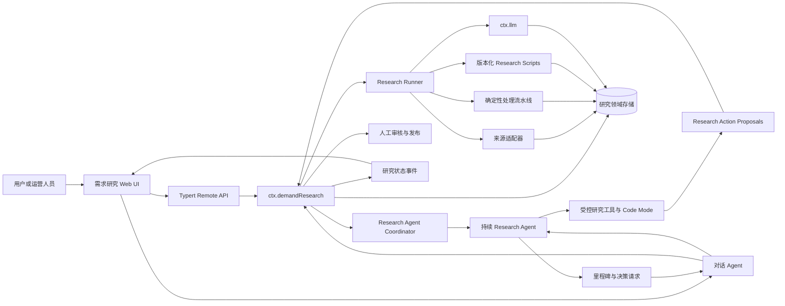
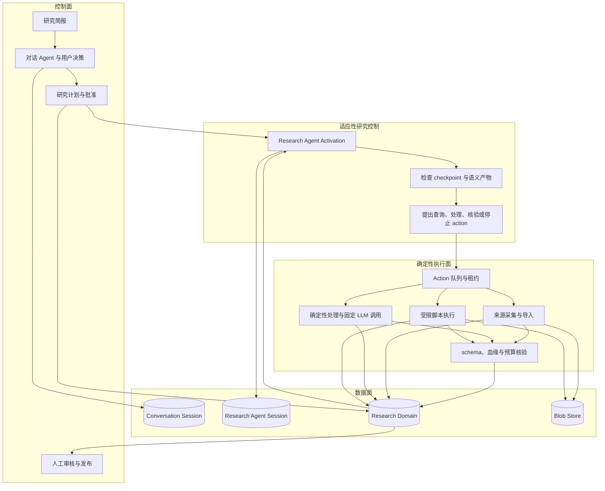
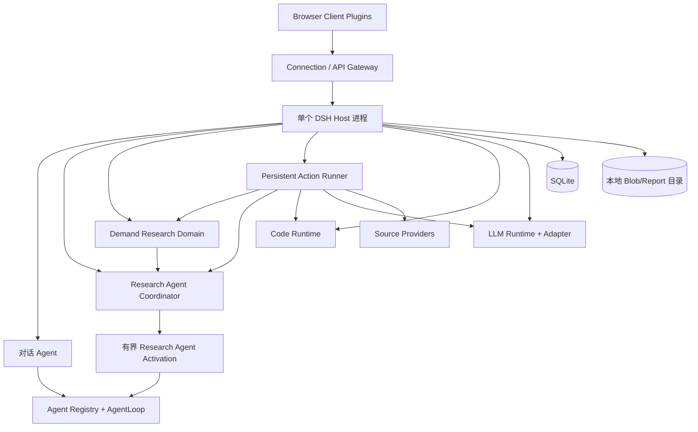
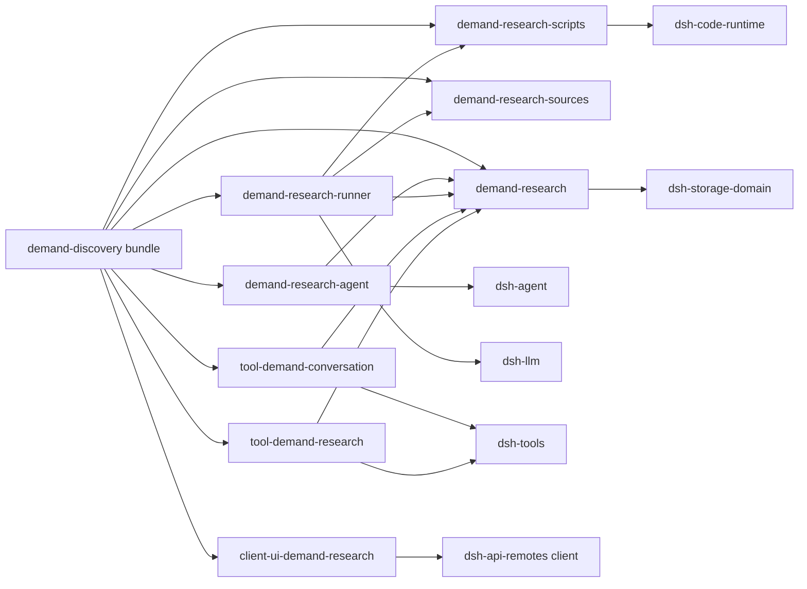
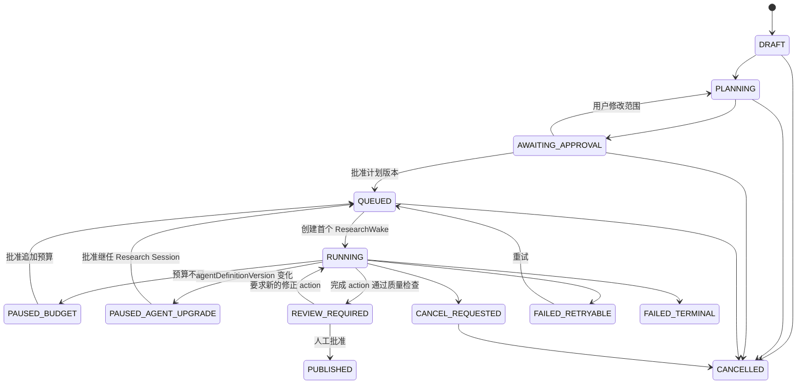
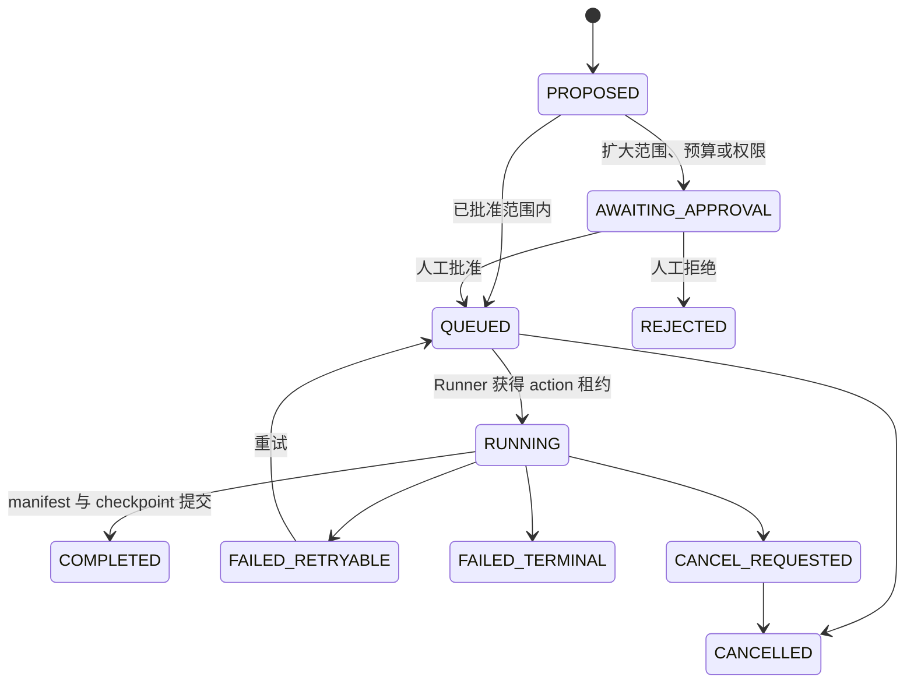

# 需求发现 Agent 技术设计

[English](demand-discovery-agent-technical-design.md) | 中文

> 文档状态：目标设计，讨论稿；文档版本：v0.2；更新日期：2026-08-21；实施范围：内部研究工作台与有监督的 L1 单次研究 Agent

本文描述如何基于 DeepSeek Harness 实现“需求雷达”的首个工程版本。它定义目标架构、组件职责、数据模型、运行状态机、Agent 与后台研究流水线的协作方式、Web 接入、可靠性和安全要求，以及分阶段实施路径。本文描述的是待实现设计，不代表这些需求研究包已经存在于当前仓库。

## 1. 设计摘要

首版采用一个模块化单体，由三个职责不同的运行单元协作：

1. **对话 Agent** 面向用户，负责研究简报、澄清、计划与预算确认、状态解释、报告问答和需要人决策的交互。
2. **Research Agent** 面向研究任务，拥有独立的持久 Session，以一系列有界 activation 持续选择查询、获取语料、检查中间产物、编写或选择处理脚本、提出下一步 research action，并根据结果迭代策略。
3. **Research Runner** 是确定性的持久执行器和核验器，负责执行已准入 action、来源与预算策略、脚本隔离、不可变产物、证据血缘、租约、检查点和崩溃恢复。

“持续”不表示一个永不结束的 Agent turn。Research Agent 每次只运行一个受 token、时间和 action 数量限制的 activation；它提交 action 或等待条件后结束。领域中的 durable wake 记录在 action 完成、审批、定时条件或 Host 恢复后触发下一次 activation。浏览器关闭、live Agent 释放或 Host 重启都不应使研究记录消失。

两个 Agent 的 [`Session`](subsystems/session.zh.md) 分别保存用户对话和研究决策中已经模型可见的事实。研究项目、原始语料、action、脚本、结构化信号、机会卡、报告版本、wake 和执行检查点进入独立 Research Domain。Research Agent 通过分页工具读取领域产物并以类型化 action 修改它，不能绕过 Runner 直接改写权威记录。



核心设计决定如下：

| 编号 | 决定 | 直接结果 |
| --- | --- | --- |
| TD-01 | 对话 Agent 与 Research Agent 使用独立 Session 和 preset | 用户交互状态与内部研究轨迹不会混杂，二者可以独立恢复和压缩 |
| TD-02 | Research Agent 拥有适应性研究控制，Runner 拥有确定性执行 | 查询迭代、语义判断和下一步选择由 Agent 完成，持久写入、策略执行和核验保持可检查 |
| TD-03 | Research Agent 通过有界 activation 和 durable wake 持续工作 | 不需要一个无限 turn，Host 重启后仍能恢复下一个决策点 |
| TD-04 | Session 与 Research Domain 分别保存模型可见事实和研究业务事实 | 原始语料不会挤占模型上下文，研究结果仍可独立审计和版本化 |
| TD-05 | Agent 只提交类型化 ResearchAction，Runner 执行并提交产物 | 模型不能直接改写 corpus、证据或 checkpoint |
| TD-06 | Code Mode 用于单次 activation 内编排工具，可复用程序升级为 ResearchScript | Agent 能编写处理逻辑，同时脚本版本、输入、输出、权限和血缘保持持久可查 |
| TD-07 | 固定、大批量模型分析仍由 Runner 直接调用 `ctx.llm` | 不为每条语料制造 Agent step，Research Agent 负责检查结果并决定是否迭代 |
| TD-08 | 计划扩展、预算扩展、脚本升权和报告发布由人通过领域服务批准 | 模型只能提出草案，不能自行扩大授权或发布结论 |
| TD-09 | L1 使用单 Host、SQLite 和本地对象存储 | 快速交付内部工作台；L2 前替换为支持多进程租约和用户隔离的 Provider |
| TD-10 | 不可变产物、可变 Run 指针和已核验报告输入 | 重试不会覆盖历史，临时模型或脚本输出不能绕过核验进入报告 |

## 2. 范围与非目标

### 2.1 本设计覆盖

- 机会探索、想法验证、竞品与替代方案研究三种数据结构，其中第一条产品纵向切片固定为“想法验证”。
- 结构化研究简报、Agent 研究计划、计划编辑与批准。
- 一个与对话 Agent 分离、可跨多次 activation 持续工作的 Research Agent。
- Research Agent 迭代查询、受控语料获取、中间产物检查、Code Mode 编排和版本化 ResearchScript。
- CSV、用户提供 URL 和一个完成合规评估的公开来源适配器。
- 100 至 500 条内容的标准化、去重、过滤、信号提取、聚类、反证和证据核验。
- 5 至 8 张机会卡；数据不足时允许更少，但必须产生降级原因。
- 人工审阅、不可变报告版本、受控分享、机会反馈和删除流程。
- 单进程内最多 20 个排队任务；实际同时执行数由配置限制。
- Host 重启后的 action/wake 恢复、checkpoint、取消、预算暂停和部分来源失败。

### 2.2 本设计不覆盖

- 多租户 SaaS 身份、支付、企业 SSO、复杂角色权限和跨区域部署。
- 全网爬取、绕过登录或验证码、需要浏览器账号状态的来源。
- 跨周无人监督监控和面向用户的主动通知；L1 的 Research Agent 只在一个已批准 Run 内持续工作。
- 自动发帖、私信、投放、购买或其他外部写操作。
- 向量数据库、复杂知识图谱、自由多 Agent 网络和不受约束的模型脚本。
- 把现有 [`workflow`](subsystems/workflow.zh.md) 或 [`jobs-local`](subsystems/jobs.zh.md) 当作持久研究队列。

## 3. Harness 能力映射

本实现遵循 [Harness 架构](architecture.zh.md) 的插件、Service、事件和可逆 effect 模型。业务包依赖能力定义，不依赖具体 Provider。

| 研究需求 | 复用的 Harness 能力 | 使用方式 |
| --- | --- | --- |
| Agent 创建、消息和取消 | `ctx.agents`、默认 `ctx.agentLoop` | 分别创建或恢复对话 Agent 与 Research Agent，每次 Research activation 使用普通有界 turn |
| 持续 Agent 生命周期模式 | continuable subagent、`ctx.agents.resume()` | 复用 durable Session、cold resume 和 activation 思路；Host wake 不依赖 live parent，因此由专用 Coordinator 管理 Research Agent |
| Persona、研究规则和工具 schema | `ctx.systemPrompt`、Agent Preset | 为两个 Agent 组装不同 Prompt、工具和上下文 |
| 模型调用 | `ctx.llm` | AgentLoop 处理两个 Agent 的推理；Runner 直接执行固定 schema 的批量分析调用 |
| 模型可见工具 | `ctx.tools` | 对话 Agent 使用计划与查询工具；Research Agent 使用 action、corpus、证据和脚本工具 |
| 脚本和批量工具编排 | Code Mode、`ctx.codeRuntime` | 单次 activation 内运行只含研究 bindings 的临时程序；持久脚本由 Runner 版本化执行 |
| 对话与研究轨迹重放 | `ctx.sessions`、Session persistence | 分别保存用户消息、研究决策、工具调用和模型可见结果 |
| 非 Session 领域数据 | `ctx.storageDomain`、SQLite backend | L1 保存项目、Run、计划、索引和结构化研究记录 |
| 人类问答 | `ctx.userQuestions` | Agent 最多提出 3 个影响范围的澄清问题；可提供计划评审降级入口 |
| 一次动作审批 | `ctx.approval` | 仅用于工具级危险动作；不能替代研究计划版本批准 |
| Host/Client RPC | Typert Remote、Connection | 结构化表单、计划编辑、审核、发布和分页读取 |
| Web 插件 | Client module 与 slot 系统 | 加入研究简报、运行进度、机会卡、证据和审核界面 |
| 结构化日志与 Session telemetry | Harness 日志和可选 telemetry | 记录运行指标；原始研究文本不进入普通日志或默认 telemetry |

### 3.1 当前能力缺口

以下能力需要新增，不能由现有组件改名代替：

- **Research Agent Coordinator**：现有 continuable subagent 需要精确的 live parent 才能接收 follow-up；后台 wake 不能依赖对话 Agent 在线。新 Coordinator 负责 Research Agent 的 create/resume、activation、flush、dispose 和 Host 启动恢复。
- **持久 Research Action Runner**：现有 Workflow 是进程内子 Agent 脚本，现有 Local Jobs 随 Agent 和进程生命周期结束，都不满足 action 租约、重启恢复和持久排队要求。
- **Research Script Registry/Executor**：Code Mode 每次运行状态全新且中间 canonical value 不可从 Session 回放；可复用脚本需要领域版本、输入/输出 schema、资源限制、审批和产物 manifest。
- **研究来源注册表**：现有 `ctx.web` 面向通用模型工具，不携带来源条款版本、查询游标、采集日志、全局暂停和研究数据标准化要求。
- **研究原始文件存储**：现有 attachment 存储面向消息图片，storage-domain 只有 KV；CSV、原始响应和报告文件需要独立、可删除的 blob 所有权。
- **研究领域 UI 和状态流**：Session mux 只投递 Session 事实；后台 Run 在没有 live Agent 时仍需被 UI 查询和观察。
- **公共分享部署能力**：Harness Web 当前首先是本地应用。公开链接还需要 TLS、部署身份、速率限制和生产网络边界，不能仅靠生成 token 宣称完成。

## 4. 逻辑架构

### 4.1 四个运行平面



控制面决定研究目标、授权范围、预算和发布。适应性研究控制由 Research Agent 承担，它根据最新产物选择下一步，但只能提交类型化 action。确定性执行面验证 action 是否属于已批准计划，再产生不可变产物。数据面保存可重建事实。Research Agent 和 Runner 都不能扩大来源、时间范围、网络目的地、脚本权限或预算，除非控制面写入新的批准版本。

### 4.2 Host 与 Agent scope

研究领域服务、Research Agent Coordinator、Runner、来源注册表、脚本注册表、blob 存储、Remote API 和运行事件属于 Host 平面，因为它们必须在没有 live Agent 时继续存在。对话 Persona 与计划工具通过 `demand-conversation` preset 注册；研究 Persona、Code Mode 和 action/corpus/script 工具通过 `demand-research` preset 注册。

Research Agent 使用独立 Session，但 L1 不把它伪装成普通 subagent：`SessionHeader.origin` 当前只接受 `subagent`，该标记会触发现有 subagent catalog 和冷会话授权语义。`ResearchAgentLink` 在 Research Domain 中关联 project、run、对话 Session 与研究 Session；Web 列表通过该关联隐藏内部 Session。Coordinator 直接通过 `ctx.agents.create/resume()` 挂载精确 preset，并在每次 activation 完全停稳后 flush 和 dispose。

这种分配遵循 [Agent Preset](../packages/preset/agent-presets/README.zh.md) 的作用域规则：Host 服务不能放进 preset 的 isolate realm；模型可见工具不能注册为所有 Session 共享的全局工具。需要一个或多个有明确 live parent 的辅助研究 Agent 时，Research Agent 仍可使用现有 continuable subagent，但它们不是持久 action 队列。

### 4.3 L1 部署拓扑



SQLite 只由一个 Host 进程写入。`storage-domain` 当前没有跨表事务、二级索引和跨进程通知，[SQLite storage backend](../packages/storage/storage-sqlite/README.zh.md) 也不提供多进程写入协调，因此不能通过启动多个 Host 扩容 L1。

### 4.4 L2 替换点

进入自助和多租户阶段时，保留 `ctx.demandResearch`、来源接口、工具 schema 和 Remote DTO，替换以下实现：

- storage-domain Repository 替换为 PostgreSQL Repository。
- 本地 action 和 wake scheduler 替换为支持数据库租约或托管工作流的 Provider。
- 本地 blob Provider 替换为 S3 兼容 Provider。
- 本地单用户授权替换为 Workspace、User 和 Role 检查。
- 进程内 `research/*` 事件替换或桥接到持久消息总线。

## 5. 建议包结构

首批实现放在 `packages/experimental/`，避免在质量和业务边界尚未验证前承诺稳定产品 API。Web UI 遵守现有 Client 包命名和双入口规则。

```text
packages/experimental/demand-research/
  领域类型、Run/Action/Wake 状态机、存储 schema、ctx.demandResearch、Remote 方法
packages/experimental/demand-research-agent/
  Research Agent Coordinator、create/resume、activation 预算、wake 消费和里程碑报告
packages/experimental/demand-research-runner/
  本地持久 action 队列、租约、确定性执行器、固定模型调用和检查点
packages/experimental/demand-research-sources/
  ctx.demandSources 注册表、导入 Provider 和来源 Provider contract suite
packages/experimental/demand-research-scripts/
  ResearchScript 版本、准入、Code Runtime bindings、资源限制和产物提交
packages/experimental/tool-demand-conversation/
  对话 Agent 的计划、状态、卡片和报告查询工具
packages/experimental/tool-demand-research/
  Research Agent 的 action、corpus、证据、脚本和 checkpoint 工具
packages/client/ui-demand-research/
  浏览器对象层、研究页面、机会卡、证据和审核 UI
packages/bundle/demand-discovery/
  Host rows、Client row、来源 Provider、Coordinator、Runner 和 profile patch
apps/cli/config/agent-presets/demand-conversation/
  用户对话 Persona 与用户可见工具组合
apps/cli/config/agent-presets/demand-research/
  研究 Persona、Code Mode 与受控研究工具组合
examples/demand-discovery/
  可重放的完整组合、固定 CSV 和 snapshot 场景
```

### 5.1 包依赖方向



两个 tool 包不得依赖 Runner 实现，Coordinator 不得把 live Agent 句柄写入领域记录，UI 不得直接读取 SQLite 或 Session 内部对象，Runner 不得依赖 Client 或工具包。Composition bundle 可以依赖所有具体插件，但普通消费者只依赖 Service Definition。

### 5.2 是否立即拆分存储 Provider

L1 只实现一种存储时，Repository 接口和 storage-domain 实现可以保留在 `demand-research` 包内部，避免制造只有一个实现的公开 Service。第二种持久化实现进入代码库时，再提取 `ctx.demandResearchStore` Service Definition、storage-domain Provider 和 PostgreSQL Provider，并同时更新所有引用。

## 6. 领域模型

### 6.1 ID 和版本

所有跨包 ID 使用 `Branded<B>`，不得使用可互换的裸字符串：

- `ResearchProjectId`
- `ResearchRunId`
- `ResearchPlanId`
- `ResearchActionId`
- `ResearchWakeId`
- `ResearchScriptId`
- `ResearchDecisionId`
- `SourceDocumentId`
- `ContentFragmentId`
- `SignalId`
- `SignalClusterId`
- `InsightCardId`
- `ClaimId`
- `EvidenceLinkId`
- `ReportId`
- `ResearchArtifactId`
- `ModelCallId`

研究领域格式从 `0` 开始。L1 不承诺旧格式迁移；不匹配的格式必须拒绝加载，而不是静默补默认值。

每个可编辑聚合包含单调递增的 `revision`。Remote 写操作携带 `expectedRevision`，过期编辑返回冲突并要求客户端重读，不能以后到写覆盖先到写。

### 6.2 核心记录

| 记录 | 可变性 | 关键字段与职责 |
| --- | --- | --- |
| `ResearchProject` | 可变聚合 | 任务类型、主题、人群、决策目标、约束、排除项、对话 Session、当前 Run、revision |
| `ResearchRun` | 可变控制记录 | 状态、phase、coverage、批准计划、预算、当前 checkpoint、open actions、失败、时间戳、revision |
| `ResearchPlan` | 草稿可变，批准后不可变 | 子问题、查询词、来源、时间范围、样本和预算估算、限制、版本 |
| `ResearchAgentLink` | 可变控制记录 | project/run、对话 Session、当前和前序 Research Agent Session、preset ID、agentDefinitionVersion、最后 decision/wake、activation 计数、revision |
| `ResearchDecision` | 不可变 | Research Agent Session、turn、输入 checkpoint、选择的 action 或等待原因、理由、停止条件 |
| `ResearchAction` | 可变控制记录 | kind/version、依赖 action、输入 artifact/hash、参数、预算估算、状态、租约、attempt、输出 manifest、错误 |
| `ResearchWake` | 可变投递记录 | Research Agent Session、原因、run/action revision、去重键、状态、租约和已接收 MessageId |
| `ResearchScript` | 不可变版本 | source/hash、语言、输入和输出 schema、允许的 bindings、资源上限、创建 decision、审批状态 |
| `SourceFetch` | 不可变 | 来源、query、policyVersion、请求时间、状态、游标、错误、响应 artifact |
| `SourceDocument` | 不可变 | canonical URL、标题、公开作者引用、发布时间、文本 hash、raw artifact、获取记录 |
| `ContentFragment` | 不可变 | 文档、规范化文本、UTF-8 byte span、上下文、语言和质量标签 |
| `DuplicateGroup` | 不可变 | canonical fragment、成员、规则版本、相似性依据 |
| `Signal` | 不可变 | 人群、场景、任务、痛点、替代方案、行为和商业信号、证据 span、模型版本 |
| `SignalCluster` | 版本化产物 | label、成员、代表样本、离群项、人群和场景边界、人工修正引用 |
| `InsightCard` | 版本化产物 | claims、各维度评分、置信度、产品假设、验证实验、限制 |
| `EvidenceLink` | 不可变 | claim、fragment、stance、strength、引用 span、核验状态 |
| `Report` | 不可变版本 | sections、card IDs、quality result、发布状态、share policy、artifact |
| `HumanOverride` | 不可变 | 目标记录、原 revision、修改值、原因、操作者和时间 |
| `ModelCall` | 不可变结果 | purpose、route、prompt/schema 版本、输入 hash、attempt、usage、输出 artifact、失败 |
| `Feedback` | 不可变追加 | 目标类型和 ID、评价、原因、时间和操作者 |

### 6.3 血缘

每个发布声明必须满足以下可遍历关系：

```text
Report
  -> InsightCard version
    -> Claim
      -> EvidenceLink
        -> Signal and ContentFragment
          -> SourceDocument
            -> SourceFetch and Source policy version
  -> producing ResearchAction
    -> input artifact manifests
    -> optional ResearchScript version
```

引用使用规范化 UTF-8 文本中的半开 byte range `[startByte, endByte)`，并同时保存引用文本 hash。核验器重新切片并比较 hash；文档内容、span 或引用文本不一致时，EvidenceLink 不能进入 `verified`。每个派生产物还记录 producing action、输入 manifest/hash、算法或脚本版本、配置 hash 和可选模型调用，因此 Agent 发起的自定义处理不会切断血缘。

### 6.4 不可变 action 产物

每个 action 先写一个或多个不可变记录，再写不可变 manifest，随后依次把 `ResearchAction` 标为完成、更新 `ResearchRun.checkpoint` 并创建 `ResearchWake`。Run 之外但未被 checkpoint 或 action 引用的记录视为孤立产物，可以由维护任务清理。

```text
AcquisitionManifest
NormalizedCorpusManifest
SignalExtractionManifest
ScriptOutputManifest
ClusterManifest
VerificationManifest
ReportManifest
```

该顺序适配 `storage-domain` 缺少跨表事务的现状：崩溃发生在 manifest 前，只留下不可见的孤立记录；发生在 action 或 Run 更新前，重启后可以根据 action 幂等键复用已完成 manifest；发生在 wake 写入前，reconcile 根据已完成 action 和 Run revision 补建同一个 wake。ResearchDecision 把 action ID、幂等键和完整 proposal 作为不可变字段先写入，随后物化 ResearchAction；两者之间崩溃时 reconcile 从 decision 补建 action。脚本只能产生候选记录和 manifest，不能直接改写 checkpoint。

## 7. Run 状态机

PRD 将执行阶段、终态和覆盖质量放在一个枚举中。实现中将其拆成正交字段，避免 `PARTIAL` 同时被解释为运行状态和结果质量。

### 7.1 主状态



### 7.2 Research phase

`ResearchRun.phase` 是 Research Agent 当前关注点，不是只能向前的流水线计数器：

```text
ACQUIRING
PROCESSING
SYNTHESIZING
VERIFYING
REPORTING
```

Research Agent 可以在新反证或覆盖缺口出现后从 `VERIFYING` 回到 `ACQUIRING`，也可以在脚本产生新语义字段后回到 `PROCESSING`。`ResearchAction` 依赖图和 checkpoint 是实际执行历史，phase 只供摘要、UI 和调度策略读取。

### 7.3 ResearchAction 状态



Action kind 包括来源搜索与获取、导入、规范化、去重、过滤、固定 schema 提取、脚本转换、聚类、反证、核验、评分、报告和 Run 完成建议。每个 action 声明输入 manifest、预期输出 schema、资源估算和停止条件；action 可以依赖多个已完成 action，但不能依赖未提交或不同 Run 的产物。

### 7.4 ResearchWake 状态

`ResearchWake` 使用 `PENDING -> CLAIMED -> DELIVERED` 状态。Coordinator 领取时同时写短租约和由 wake ID 派生的稳定 `MessageId`。物化 Agent 后，它先检查持久 Session 是否已经出现该消息；未出现才用冻结的 `UserMessage` 调用 `followup()`，随后执行 `sessions.flush()`，最后把 wake 标为 `DELIVERED`。进程在任一点退出时，租约到期后用同一 MessageId 重试：Session 已记录时只补写 `DELIVERED`，未记录时重新投递。去重键由 Research Session、Run revision、action revision 和 reason 组成，reconcile 可以安全补建而不会重复触发同一决策点。较新的 checkpoint 已包含同一原因时，旧 wake 可以进入 `SUPERSEDED`。

### 7.5 覆盖质量

`coverage` 是执行结果，不决定是否正在运行：

- `COMPLETE`：所有批准来源达到最小样本要求。
- `PARTIAL`：至少一个来源失败或不足，但剩余证据仍达到有限报告阈值。
- `INSUFFICIENT`：不能生成核心机会结论，只能交付探索性结果和缺口建议。

阈值由任务策略配置和批准计划共同确定，不在插件中写死。

### 7.6 转换所有权

| 转换 | 唯一所有者 |
| --- | --- |
| `DRAFT -> PLANNING -> AWAITING_APPROVAL` | 对话 Agent 通过结构化计划工具提出草稿 |
| `AWAITING_APPROVAL -> QUEUED` | 用户或运营人员通过 Remote 批准精确 plan revision |
| `QUEUED -> RUNNING` 和首个 wake | 计划批准写入 Run startup intent；reconcile 幂等物化 link 和 wake |
| `PENDING wake -> DELIVERED` | Research Agent Coordinator |
| `PROPOSED action` | Research Agent 的类型化工具调用 |
| `PROPOSED -> AWAITING_APPROVAL/QUEUED` | 领域策略根据已批准范围、预算和权限决定 |
| `QUEUED action -> RUNNING -> terminal` | 当前 action 租约持有者 |
| `COMPLETED action -> checkpoint + wake` | Runner 按固定提交顺序执行 |
| `RUNNING -> REVIEW_REQUIRED` | Research Agent 提交完成建议，Runner 完成最终质量 action |
| `REVIEW_REQUIRED -> PUBLISHED` | 运营审核 Remote |
| 取消请求 | 用户或运营 Remote；Coordinator 和 Runner 分别收敛 activation 与 action |
| 重试和追加预算 | 用户或运营 Remote |

模型不能直接执行批准、发布、扩大预算或删除数据。

## 8. Research Action Runner 与 Agent Coordinator

### 8.1 为什么仍需要 Runner 和 Coordinator

- Research Agent 可以跨多个 turn 持续工作，但一个 live Agent、turn 或 `AgentHandle` 仍只属于当前进程，不能作为重启后的待办事实。
- Workflow 可在一次 activation 内执行有界的模型编排，但其 worker、子 Agent 和结果句柄仍属于当前进程，不提供 action checkpoint 或恢复。
- Local Jobs 可承载 activation 内的辅助任务，但 Agent 或服务释放时会取消并等待它们，不能成为 corpus 构建的真源。
- `ResearchAction` 和 `ResearchWake` 是持久事实；进程中的 Promise、Agent activation、Workflow 或 Job 只是当前 action 或 wake 的执行尝试。

### 8.2 调度模型

L1 Host 启动时对 action 和 wake 各执行一次 reconcile，之后由 Cordis timer 或领域变更事件唤醒：

1. 将租约过期的 `RUNNING` action 转为 `FAILED_RETRYABLE`，并把未接收消息的过期 `CLAIMED` wake 恢复为 `PENDING`。
2. Runner 按创建时间读取 `QUEUED` action；Coordinator 按 Run 和 revision 顺序读取 `PENDING` wake。
3. 各自在一个领域写链操作中检查 revision、依赖、并发容量和预算，再写入 lease owner、expiry 和 attempt。
4. Runner 只执行一个 action，写不可变记录和 manifest，提交 action 与 checkpoint，再创建 wake。
5. Coordinator 创建或恢复 Research Agent，投递只含 ID、revision、计数和错误摘要的消息，等待 activation 完全停稳后 flush Session 并 dispose handle。
6. Runner 和 Coordinator 分别续租；续租失败后停止产生新副作用，等待已开始的来源、脚本、模型或 Agent 操作收敛。
7. 多个 action 在同一 checkpoint 前完成时，reconcile 可以把 wake 合并为一个最新 revision；需要独立人类决策的 wake 不能合并。
8. 插件卸载时中止本进程尝试但不写业务取消；action 或 wake 租约过期后由下一进程恢复。

配置至少包括：

- `maxConcurrentActions`
- `maxConcurrentResearchActivations`
- `leaseDurationMs`
- `heartbeatIntervalMs`
- `pollIntervalMs`
- `maxAttemptsPerAction`
- 每种 action 的 timeout
- `activationTimeoutMs`
- `maxActionsPerActivation`
- 单 Run 文档、片段、输入字节、模型 Token、模型调用和墙钟上限

所有部署可变值必须是经过验证的 Config 字段，不能只以常量或测试 hook 存在。

### 8.3 幂等键

每个 action 计算稳定 key：

```text
sha256(
  runId,
  decisionId,
  approvedPlanId,
  actionKind,
  actionVersion,
  inputManifestHashes,
  scriptVersion,
  actionConfigHash
)
```

相同 key 已有完整 manifest 时直接复用并补齐 action/checkpoint/wake 提交；不同输入、脚本或配置版本产生新产物。外部读取允许重复，但每个响应按 canonical URL、内容 hash、来源策略版本和获取窗口去重。Research Agent 重复提交同一 decision 的相同 action 时返回已有 action ID。

### 8.4 At-least-once 与副作用

Runner 提供 at-least-once action 执行，Coordinator 提供 at-least-once wake 领取，两者都不宣称 exactly-once。首版来源只允许读取，脚本只能产生候选 artifact，不执行发帖、购买或其他外部写操作。模型调用可能已经计费但在结果持久化前崩溃，系统将该调用记录为 `unknown` 并按保守预算计入，不能无限自动重放。wake 的去重键和已接收 `MessageId` 防止恢复时重复同一个 Agent 决策点。

### 8.5 预算账本

Runner 的每次直接模型调用先写 `ModelCall` 预留记录，再调用 adapter，最后写完成 usage 或失败：

```text
RESERVED -> COMPLETED
RESERVED -> FAILED
RESERVED -> UNKNOWN_AFTER_RECOVERY
```

`UNKNOWN_AFTER_RECOVERY` 按预留上限计入预算。Coordinator 在投递 wake 前为本次 Research Agent activation 预留模型预算，activation 完成后从新增 `assistant/message` usage 对账；未能确认的 activation 也按预留上限计入。下一次 action 或 activation 会使预算越界时，Run 进入 `PAUSED_BUDGET`，由用户批准新的预算版本后重新排队。

### 8.6 取消

取消 Remote 先写 `CANCEL_REQUESTED`。Coordinator 对 live Research Agent 调用 `cancel({ kind: 'user' })`，Runner abort 当前 action；来源、脚本 binding 和模型 Provider 必须接受 `AbortSignal`。已完成 manifest 保留，当前未提交 action 不成为 checkpoint，待 activation 和 action 都完全停稳后写 `CANCELLED`。删除流程只能在两个 lease 都释放后继续。

### 8.7 Research Agent activation 合约

同一 Research Agent Session 同时最多有一个 activation。批准计划时领域服务预留 `researchSessionId`，写入 link 和首个 wake；Coordinator 在首次 wake 时通过 `ctx.agents.create()` 实际创建 Session，之后通过 `ctx.agents.resume()` 恢复，并在 setup 中挂载 link 记录的 `demand-research` preset ID。领域记录只保存 ID、revision 和 `agentDefinitionVersion`，不保存 live `Agent` 或 `AgentHandle`。

Agent Preset 当前持久化 preset ID，但不承诺在 Host 升级后恢复旧的内存 generation。Coordinator 比较 link 的 `agentDefinitionVersion` 与当前 Research Persona、工具和脚本 bindings 定义版本：相同版本的普通重启恢复同一个 Session；版本变化使 Run 进入 `PAUSED_AGENT_UPGRADE`。人工批准后创建继任 Research Session，从 Research Domain checkpoint 而不是旧 Session seed 读取业务状态，并在 link 中保留前序 Session ID。这样工具集变化不会静默改变一条正在运行的研究轨迹。

投递消息只包含 wake reason、Run/action/checkpoint revision、失败摘要和可查询 artifact ID，不内联 corpus。Research Agent 使用工具读取所需页面，并必须以以下一种 durable outcome 结束 activation：提交 action、等待 action、请求人类批准、报告 Run 完成，或记录阻塞原因。action 提交工具在成功排队后调用 `concludeTurn()`；只读检查可以在同一 activation 内通过 Code Mode 合并。

达到 `maxActionsPerActivation`、时间上限或模型预算而没有 durable outcome 时，Coordinator 取消 activation，写入 retryable diagnostic，并创建一个受退避限制的 wake；连续超过配置次数后转为 `FAILED_TERMINAL`，避免 Research Agent 自旋。

`whenIdle()` 只证明当前 live activity 完全停稳。Coordinator 随后显式 `sessions.flush()`，再 dispose handle；下一次 wake 重新恢复同一个 Session。Research Agent 的持续性来自 Session、ResearchAgentLink 和 ResearchWake，而不是常驻 JavaScript 对象。

## 9. Agent 角色与协作

### 9.1 对话 Agent preset

`demand-conversation` preset 只包含用户协作和报告解释所需能力：

- 面向用户的需求研究 Persona。
- `tool-demand-conversation`。
- `tool-ask-user`。
- 必要的 compaction 和 token meter。
- 可选的只读 Skill provider，用于加载研究方法和报告解释规范。

它默认不包含来源采集、corpus 变换、脚本执行、Shell、文件修改、通用 Web、Subagent、Workflow 或后台 Job 控制。对话 Agent 不能代替 Research Agent 执行内部研究 action。

### 9.2 对话 Agent 责任

对话 Persona 规定：

- 识别任务类型、目标决策、目标人群、时间范围、来源和团队约束。
- 只有缺失信息会显著改变研究范围时才提问，最多 3 个问题。
- 生成和修订 ResearchPlanDraft，并向用户解释范围、预算和限制。
- 把 Research Agent 的里程碑、阻塞和审批请求转成用户可理解的决策。
- 解释报告时区分观察事实、模型提取、综合推断、方案建议和未知假设。
- 不能代表用户批准计划、预算、脚本升权、数据保留或发布。

### 9.3 对话 Agent 工具

| 工具 | 作用 | 结果上限 |
| --- | --- | --- |
| `research_plan_propose` | 写入结构化计划草稿并进入 `AWAITING_APPROVAL` | 返回 plan ID、revision、范围和估算摘要 |
| `research_run_get` | 查询一个 Run 的当前状态和覆盖缺口 | 返回状态、phase、计数、失败摘要和报告 ID |
| `research_cards_list` | 分页读取机会卡摘要 | 默认小页；不返回全部证据正文 |
| `research_card_get` | 读取单卡声明、评分、置信度和限制 | 返回有界字段和 evidence IDs |
| `research_evidence_get` | 分页读取一个声明的支持或反对证据 | 每项包含最小上下文、来源和原始链接 |
| `research_report_summary` | 读取已发布报告摘要和版本 | 不返回完整 HTML |

工具 body 返回 schema 校验后的 JSON 值，`output.render` 只负责模型可见文本。UI 卡片通过纯 `presentCall`、`presentationMeta` 和 `presentResult` 投影实现，遵循 [Tool authoring reference](cookbook/adding-a-tool.zh.md)。

`research_plan_propose` 成功后调用执行上下文的 `concludeTurn()`，避免模型在用户尚未批准时继续假装执行研究。

### 9.4 Research Agent preset

`demand-research` preset 只包含在一个批准 Run 内做适应性研究所需能力：

- 面向内部研究的 Persona 和方法规则。
- `tool-demand-research`。
- Code Mode 与 TypeScript Code Runtime。
- 必要的 compaction 和 token meter。
- 可选的只读研究 Skill provider。
- 可选且受 tool filter、depth 和数量限制的 continuable subagent 工具，用于独立的有界分析任务。

它默认不包含任意 Shell、文件系统写入、动态插件、自修改、Ralph 或通用后台 Job。来源访问由研究来源工具包装；部署可以把通用 `web_search` 作为非权威线索工具加入，但其结果必须通过 `research_source_fetch` 或 import action 进入 Research Domain 后才能成为证据。

### 9.5 Research Agent 责任

Research Persona 规定：

- 每次 activation 先读取最新 checkpoint、open action、预算、覆盖缺口和待审批项。
- 根据目标决策选择一个有明确输入、输出、预算和停止条件的下一 action，而不是叙述将要做什么。
- 迭代搜索词、来源候选、corpus 分区和语义字段，并说明改变策略的领域证据。
- 使用 Code Mode 组合只读查询，或提出版本化 ResearchScript 处理现有 artifact。
- 主动寻找反证、满意替代方案、样本偏差和证据冲突。
- 不把临时脚本输出、通用 Web 结果或自己的结论直接标记为已核验证据。
- 范围、预算、来源、保留期或权限需要扩大时提交审批请求并停止 activation。
- 达到停止条件时提交 Run 完成建议；不能自行发布报告。

### 9.6 Research Agent 工具

| 工具 | 作用 | 结果上限 |
| --- | --- | --- |
| `research_checkpoint_get` | 读取当前 checkpoint、coverage、open action 和 pending approval 摘要 | 只返回 revision、计数、状态和 artifact IDs |
| `research_artifacts_list` | 按 kind、action 或 revision 分页列出 artifact manifest | 默认小页，不内联 artifact body |
| `research_corpus_query` | 对规范化 fragment、signal、cluster 或 evidence 做有界查询 | 返回最小上下文、ID、hash 和分页 cursor |
| `research_source_search` | 在批准来源和预算内提交查询 action | 返回 action ID、估算和排队状态，并结束 turn |
| `research_source_fetch` | 为批准 URL 或候选引用提交获取/import action | 返回 action ID、policy version 和排队状态，并结束 turn |
| `research_action_propose` | 提交规范化、去重、提取、聚类、反证、核验、评分或报告 action | 返回已有或新 action ID、审批要求和依赖 |
| `research_script_propose` | 保存具有声明输入/输出和 bindings 的 ResearchScript 草稿 | 返回 script ID、version、hash 和准入结果 |
| `research_script_execute` | 提交引用精确 script version 和输入 manifest 的 action | 返回 action ID、资源估算和审批要求，并结束 turn |
| `research_milestone_report` | 写入面向对话 Agent 和运营 UI 的里程碑、阻塞或决策请求 | 返回 milestone ID 和 delivery 状态 |
| `research_run_complete` | 在 coverage 和质量条件满足时提交完成建议 | 返回最终质量 action ID，并结束 turn |

`research_source_search` 和 `research_source_fetch` 是来源 seam 的领域 Consumer，不是在 tool body 内直接执行未记录网络请求。所有会产生新权威数据的工具都先写 ResearchDecision 和 ResearchAction；成功排队后调用 `concludeTurn()`，等待 Runner 完成并产生下一 wake。只读工具可由 Code Mode 在一个 activation 内批量调用。

### 9.7 Code Mode、ResearchScript 与 Workflow

| 机制 | 生命周期 | 可调用能力 | 持久结果 | 适用场景 |
| --- | --- | --- | --- | --- |
| Code Mode program | 单个 Research Agent tool call | 当前 scope 中的类型化研究工具 | 外层 `run_code` 结果和每个 sub-dispatch 日志；中间 canonical value 不持久 | 批量查询、比较 artifact、构造一个 action 提案 |
| ResearchScript | 跨 activation 的不可变版本 | Runner 提供的 artifact 读取、统计和候选输出 bindings | source/hash、schema、资源上限、执行 action 和 output manifest | 自定义清洗、字段派生、分组和可重复语义处理 |
| Workflow | 单个前台 workflow run | 受限子 Agent 编排 | Session 中的 lifecycle 记录，不提供 workflow 恢复 | 可选的有界并行分析，不作为 Run 调度器 |

`ResearchScript` 至少声明 language、source/hash、输入 artifact kind、输出 schema、允许 bindings、最大输入字节、最大输出字节、timeout、创建 decision 和审批状态。Runner 通过 `ctx.codeRuntime.run()` 执行，只提供分页 artifact 读取、确定性统计和 candidate emission bindings；不提供网络、文件路径、环境变量、进程或凭据。

Code Runtime 的 `worker-thread` isolation 只是执行载体标签，不是安全声明。Runner 仍需限制 bindings、硬终止超时、验证 lossless JSON、校验输出 schema 和血缘，并把脚本结果先写为候选 artifact。脚本不能调用 checkpoint API。使用固定 bindings、位于批准范围和预算内的一次性脚本可由策略自动准入；提升为可复用脚本或请求新增 binding 必须人工批准，L1 不支持网络、Shell 或文件系统 binding 升权。

### 9.8 不暴露为模型工具的操作

以下操作只能通过 UI/Remote 或 Runner 内部调用：

- 批准计划和预算。
- 领取、续租、强制重试或取消 action/wake。
- 批准脚本升权、可复用版本或新增 binding。
- 人工修正、质量签字和发布。
- 创建、撤销分享链接。
- 删除原始数据或项目。

### 9.9 模型可见状态与 Agent 协作

领域插件为两个 preset 注册不同的有界状态。对话 Agent 只看到 project/run ID、批准计划、状态、phase、coverage、预算、里程碑、待审批和报告版本；Research Agent 还看到 checkpoint revision、open action、artifact manifest 摘要、最近失败和 wake reason。AgentLoop 将变化后的 runtime context 作为 plugin-sourced `user/message` 记录后再发给对应模型。

完整语料、全部信号和报告正文不进入 Prompt。Agent 需要细节时调用分页工具，工具结果已经由 AgentLoop 写入自己的 Session。Research Agent 的 action proposal、accepted action ID、脚本版本和 milestone 也通过 tool result 留在 Research Session；Runner 内部数据只在变成模型可见时进入 Session。

常规进度通过 revisioned Research Domain event 和 Remote snapshot 到达 UI，不生成对话消息。`research_milestone_report` 写入 durable milestone：普通里程碑只在 UI 和下一次对话上下文显示；需要用户决策的 milestone 进入待审批列表，并在对话 Agent live 时注入有界 notice。由于 Research Agent 不是普通 subagent，它不使用 `reportFrom()`；它创建的 continuable helper 可以使用该能力向 Research Agent 报告。

## 10. 研究流水线

### 10.1 计划阶段

输入为版本化 `ResearchBrief`：任务类型、主题、人群、已有假设、决策目标、时间范围、来源、排除项和团队约束。对话 Agent 输出严格结构化 `ResearchPlanDraft`：

- 3 至 8 个子问题及其与决策目标的关系。
- 核心词、用户口语、问题词、替代方案词和排除词。
- 1 至 3 个可用来源及选择理由、限制和 policy version。
- 每个来源的目标样本范围。
- 时间、模型调用、Token 和费用估算区间。
- 数据不足、来源失败和停止条件。

批准操作先写不可变 `ResearchPlan`，再把 approved plan ID、批准人、批准时间、budget envelope 和预留 Research Agent Session ID 写入 `ResearchRun.startupIntent`。reconcile 从该 intent 幂等创建 `ResearchAgentLink` 和首个 `ResearchWake`；中断时遗留的 plan 可由同一 request ID 复用。Coordinator 在消费首个 wake 时创建实际 Session。Research Agent 和 Runner 永远读取批准快照，不读取之后被编辑的草稿。

### 10.2 适应性 action 循环

1. Coordinator 领取 wake，并创建或恢复 Research Agent activation。
2. Research Agent 读取 checkpoint 摘要，并按需分页查询 artifact、corpus、signal、cluster 和 evidence。
3. Research Agent 选择获取、处理、脚本、比较、反证、核验、报告或停止中的一个下一 action。
4. 工具先写包含完整 proposal 和预留 action ID 的 `ResearchDecision`，再幂等物化 `ResearchAction`；reconcile 补齐中断的物化，超出授权时 action 进入 `AWAITING_APPROVAL`。
5. Runner 领取 `QUEUED` action，并只通过来源 Provider、固定处理器、直接 LLM 调用或 ResearchScript 执行已声明操作。
6. Runner 校验输出 schema、资源账本、artifact ownership 和血缘，再提交 immutable manifest。
7. Runner 完成 action、移动 Run checkpoint 并创建包含新 revision 的 wake。
8. Coordinator 恢复同一个 Research Agent Session；Agent 检查新产物并决定迭代、请求人类决策或结束。
9. 里程碑和审批请求通过 Research Domain 到达 UI 与对话 Agent，常规 action 细节只留在 Research Session 和运营视图。
10. `research_run_complete` 创建最终质量 action；该 action 通过后 Run 才进入 `REVIEW_REQUIRED`。

每个循环至少产生一个 durable decision 或 blocker。Research Agent 不得仅输出自然语言“继续研究”后等待 Coordinator 猜测下一步，Runner 也不得在 action 完成后自行选择下一 action。

### 10.3 ACQUISITION actions

Research Agent 通过 `research_source_search`、`research_source_fetch` 或通用 `research_action_propose` 选择查询、来源、候选 URL 和停止条件。领域策略把批准计划解析为 action spec，Runner 再调用 Source Provider。Provider 接收批准的查询、时间范围、上限、游标和 signal，返回标准化候选文档及获取日志。一个来源失败不会取消其他来源；结果记录成功、跳过、失败、重试和限速数量。

用户导入数据与网络来源使用相同 `SourceDocument` 输出。缺少来源、发布时间或作者时保留 `unknown`，不得猜测。

### 10.4 NORMALIZE actions

确定性 action 负责：

- 规范 URL、Unicode、换行、空白和时间。
- 提取可核验正文并保留原始 artifact hash。
- 切分保留上下文的 ContentFragment。
- 标记语言、过短、乱码和上下文缺失。
- 对作者公开显示名进行最小化或不可逆项目内引用处理。

HTML 页面中的指令、脚本和隐藏文本均作为不可信数据，不进入 Runner 的控制 Prompt。

### 10.5 DEDUPLICATE actions

先用规范化内容 SHA-256 执行精确去重，再使用维护良好的近似文本依赖执行 shingle/MinHash 或等价算法。算法、阈值和依赖版本进入 `pipelineVersion`。重复项不被静默删除：`DuplicateGroup` 保留 canonical 文档、成员和传播关系。

### 10.6 FILTER actions

规则优先标记广告、招聘、纯转发、无实质内容和格式异常；模型只处理规则无法稳定判断的部分。每个结果保存标签、理由、规则或模型版本。低相关和噪音样本不进入核心统计，但保留在可审计 manifest 中。

### 10.7 EXTRACT actions

Research Agent 选择输入 manifest、目标 signal schema 和需优先检查的 corpus 分区。相关片段按输入字节和 Token 预算分批，Runner 使用 `ctx.llm.stream()` 直接调用选定模型。这个固定提取调用没有研究工具，也不能访问网络，只能把输入片段转换为结构化信号。

每个提取字段必须引用输入 `fragmentId` 和 byte span。输出经严格 schema、引用范围和枚举校验；无证据字段返回空值或 `unknown`，不能由解析器补齐。Research Agent 在下一 activation 检查字段覆盖、冲突和失败样本，可以提出新的提取 action 或 ResearchScript，但不能修改当前 manifest。

### 10.8 CLUSTER actions

L1 不引入 embedding Service 或向量数据库。Research Agent 选择聚类输入、必须保持分离的维度和需复核的候选组；Runner 先以结构化字段和确定性文本相似度产生候选组，再让高能力模型完成分组、命名、代表样本和离群项判断。不同人群或场景默认不合并；合并必须给出共同任务和差异说明。

若后续固定样本证明语义召回不足，再新增完整的 Text Embedding capability，包括 Service Definition、Provider、Consumer、模型版本和向量维度，不把某家 embedding SDK直接写进 Runner。

### 10.9 COUNTER_EVIDENCE actions

Research Agent 对每个候选机会提出反证检索条件，Runner 在全部有效和被降权语料中执行：

- 问题不痛或只偶发。
- 用户对现有方案满意。
- 没有付费或切换意愿。
- 替代方案成本足够低。
- 证据来自同一搬运链或同一利益相关方。
- 样本只代表一个平台或特殊人群。

核心卡没有反证时也必须记录“未发现反证”和实际检索范围，不能将其表述为“不存在反证”。

### 10.10 VERIFY actions

证据核验器执行确定性检查：

- 每个核心 Claim 至少关联一个已存在 EvidenceLink。
- 每个引用 span 能从 ContentFragment 精确重建。
- 支持和反对证据 stance 明确。
- 引用没有越过文档、Run 或项目所有权。
- 数量、比例、时间分布和来源分布来自程序统计。
- 去重后的独立证据数量与卡片显示一致。
- 模型没有把互动量直接映射为需求强度或付费等级。
- 机会建议和用户事实使用不同声明类型。

未通过的 Claim 被删除、降级为未知或使整个卡片进入人工修正，不能只记录 warning 后继续发布。

### 10.11 SCORE actions

评分由版本化规则对已核验证据计算。每个维度保存 `value | unknown`、EvidenceLink IDs 和解释；缺少证据不能自动获得中间分。总分只在所需维度可用时计算，并始终与高/中/低置信度分开。

### 10.12 REPORT 与 QUALITY_CHECK actions

报告生成器只能读取 VerificationManifest、确定性统计和已核验 Card 版本。模型可以组织摘要和建议，但不能引入新的事实 Claim；新文本中的事实引用必须映射回现有 Claim ID。

最终质量检查包括：

- 核心 Claim 引用覆盖率 100%。
- 报告数字与 manifest 一致。
- 失效或已删除证据明确显示不可用。
- 数据不足、来源失败和平台偏差在摘要与方法部分披露。
- 不必要个人标识和敏感信息已移除。
- HTML 所有内容经过转义，模型不能提供可执行 HTML。

Research Agent 可以在报告 action 后检查缺失引用、矛盾和叙述偏差，并回到任意必要 phase。只有它提交完成建议且最终质量 action 通过，Run 才进入 `REVIEW_REQUIRED`，不会自动发布。

## 11. Runner 直接 LLM 调用

### 11.1 调用包络

Runner 对每一种固定批处理模型用途配置独立 route 和上限：

- relevance classification
- signal extraction
- cluster synthesis
- counter-evidence classification
- report synthesis

每次调用记录 action ID、provider、model、purpose、promptVersion、schemaVersion、inputManifestHash、输入记录 IDs、maxTokens、开始和完成时间、usage、finish reason、attempt 和错误。Prompt 模板以源码版本标识，不把完整 Prompt 复制进普通日志。

### 11.2 结构化输出

优先把目标 schema 暴露为一个仅用于返回数据的 ToolSchema，并要求模型生成恰好一个对应 tool-call block；Runner 解析 raw JSON arguments 后执行领域 schema 校验，但不执行该工具。Provider 不可靠支持这种方式时，使用 JSON 文本输出并走同一 schema 校验。

一次无效输出最多执行配置数量的修复尝试。修复 Prompt 只携带验证错误和原输出，不扩大输入语料；耗尽后产生 `FAILED_RETRYABLE` 或记录批次失败，不能凭容错解析猜字段。

### 11.3 重试

两个 Agent 的 `dsh-llm-retry` 只消费各自的 `agent/request-error`，不会自动处理 Runner 的直接 `ctx.llm.stream()`。Runner 必须根据 serving registration 的 retry policy 或自己的明确配置执行有限退避，并将每个 Provider attempt 记录到同一个 ModelCall 聚合。

### 11.4 Prompt injection 防护

- 原始内容放入带 ID 的数据容器，不与 system 指令拼接。
- 分析调用不提供 Shell、Web 或任何可执行工具。
- 模型输出不能选择新来源、URL、预算或后续代码路径。
- URL、文件路径、ID、统计和所有权由程序验证。
- 报告 HTML 由受控 renderer 生成，不渲染模型提供的标签或脚本。

### 11.5 与 Research Agent 模型调用的关系

Research Agent 的推理继续经过 AgentLoop：其 system prompt、工具 schema、输入、chunk、assistant message、usage 和 tool result 进入 Research Session，并由普通 Agent retry 处理。Runner 直接调用只用于输入/输出约定固定、无需适应性工具选择的大批量 action。Runner 的输出必须在下一次 wake 后由 Research Agent 检查，不能因为 schema 校验通过就替代研究判断。

## 12. 来源和导入

### 12.1 `ctx.demandSources`

来源注册表按稳定 source ID 保存 Provider。注册是 Cordis effect，卸载后新 action 不再选择该 Provider；已批准计划或 queued action 引用不可用 Provider 时应在领取前失败并给出明确错误。

一个 Provider 至少声明：

- source ID、显示名和能力。
- policy version、评估日期和允许的获取方式。
- 支持的任务、查询和时间范围。
- 速率和最大分页能力。
- `estimate()` 和 `collect()`。
- 暂停状态及原因。

来源策略是部署事实，不由模型修改。全局来源开关属于 Host 设置；关闭后新采集失败，已保存数据仍按保留策略可读。

### 12.2 Research Agent 获取循环

Research Agent 不直接获得 Provider 或 HTTP handle。`research_source_search` 和 `research_source_fetch` 把 source ID、policy version、query/URL、cursor、时间范围、上限、预算、输入 checkpoint 和 decision ID 写入 ResearchAction。Runner 再解析 Provider、执行请求并先持久化 `SourceFetch`、响应 hash、标准化文档和 AcquisitionManifest，最后完成 action 并产生 wake。

下一次 activation 只收到 action、manifest 和计数摘要；Research Agent 通过分页工具读取候选项，选择扩展查询、获取指定文档、停止来源或进入处理 action。通用 `web_search` 的结果若被启用，只是 Session 中的线索；未经过来源 action、持久化和 policy 记录的内容不能进入 corpus、统计或 EvidenceLink。

### 12.3 CSV 导入

CSV 上传使用现有 `/api` 信任检查下的 Remote 或专用受保护上传入口，大小上限是 Config。服务端保存原始 bytes 后再解析，客户端只提供字段映射建议，不能成为唯一解析者。

导入流程为：上传 -> 编码和 CSV 解析 -> 字段预览 -> 用户确认映射 -> 创建不可变 import snapshot -> 提交 import action。导出 CSV 时对以 `= + - @` 开头的字段进行公式注入防护。

### 12.4 URL 导入

通用 `web-fetch-http` 当前不应直接用于用户任意 URL。研究 URL Provider 必须具备：

- 仅允许 `http` 和 `https`。
- DNS 解析后拒绝 loopback、link-local、私网、云元数据和保留地址。
- 每次 redirect 重新校验目标。
- 限制 redirect、响应字节、解压后字节、MIME 和时间。
- 不转发 Host 凭据、Cookie 或环境代理凭据。
- 记录 robots、条款评估和获取策略版本；技术可访问不代表允许商用。
- HTML 解析与正文提取使用维护依赖，不以正则表达式解析页面。

### 12.5 Blob 所有权

Research Blob Store 以内容 hash 保存 bytes，并用独立 ownership 记录关联 project/run/artifact。删除 project 时先删除 ownership，再在没有其他所有者时回收 blob。Blob API 不接受任意文件路径；本地 Provider 将所有路径固定在配置 root 下。

## 13. Remote API 和状态事件

### 13.1 Remote 方法分组

| 分组 | 代表方法 | 写入要求 |
| --- | --- | --- |
| Project | `create`、`get`、`list`、`updateBrief` | 更新携带 expected revision |
| Plan | `getDraft`、`updateDraft`、`approve` | approve 指向精确 plan revision 和预算 |
| Run | `get`、`list`、`cancel`、`retry`、`approveBudget` | 状态机校验和幂等 request ID |
| Research Agent | `getAgentLink`、`listDecisions`、`retryWake` | 内部 Session 只暴露安全摘要；retry 需要 operator 权限 |
| Action | `listActions`、`getAction`、`approveAction`、`retryAction` | action revision、依赖、授权范围和幂等 request ID |
| Script | `listScripts`、`getScript`、`approveScript`、`revokeScript` | 精确 script version、bindings 和审批状态 |
| Milestone | `listMilestones`、`acknowledgeDecision` | 追加确认，不改写 Research Agent 原报告 |
| Import | `uploadCsv`、`previewMapping`、`commitMapping`、`addUrl` | 大小、类型、所有权和来源策略校验 |
| Review | `getQueue`、`applyOverride`、`requestReprocess`、`publish` | 仅运营角色；L1 是本地管理员 |
| Evidence | `listCards`、`getCard`、`listEvidence`、`getFragmentContext` | 分页、有界上下文、项目所有权 |
| Report | `get`、`createShare`、`revokeShare`、`export` | 只能操作已发布版本 |
| Feedback | `rateCard`、`recordAction` | 追加记录，不覆写历史反馈 |
| Data | `purgeRawData`、`deleteProject` | 二次确认、取消运行和可恢复删除流程 |

所有分页使用 opaque cursor 和服务器端上限。Remote DTO 只包含浏览器需要的数据，不把 storage-domain 内部记录或 blob 路径直接暴露到 wire。

### 13.2 状态事件

领域服务在 durable write 完成后发出 whole-value 通知：

- `research/project-changed`
- `research/run-changed`
- `research/action-changed`
- `research/agent-changed`
- `research/script-changed`
- `research/milestone-created`
- `research/report-published`
- `research/source-status-changed`

事件负载包含 ID、revision 和安全的当前摘要，不包含原始文本。它们通过 `api-remotes` 的显式 allowlist 转发给客户端；重连后客户端先调用 Remote 获取 snapshot，再按 revision 接受新事件。事件是刷新提示，不是唯一事实源。

### 13.3 Session 关联

`ResearchProject` 保存 `conversationSessionId`，`ResearchAgentLink` 保存 `researchSessionId` 和关联 Run。两个 SessionHeader 都不承载完整研究状态，也不为 Research Agent 伪造 `origin: 'subagent'`。冷 Session 恢复时，Agent 根据 project/run ID 从领域服务获得自己 preset 对应的有界 runtime context。

首版不新增大量 `SessionEventMap` 类型。计划工具、ResearchDecision、action proposal、脚本 proposal、查询结果和 milestone tool result 已由各自 AgentLoop 记录；action lease、artifact 和 wake 状态属于研究领域。Research Agent 的模型可见输入必须来自其 Session 中的 context 或 tool result。只有未来需要在通用 transcript 中永久显示跨 Session 研究节点时，才为稳定、可重建的链接事实设计少量 Session 事件，并同时更新两个 SDK 和 snapshot。

## 14. Web 工作台

### 14.1 L1 信息架构

L1 复用 Harness 当前三栏 Web Shell，不另起 Next.js 应用：

- 左侧：项目和 Run 历史、状态、Research Agent 活动与失败标记。
- 中间：研究简报、对话 Agent、计划评审、phase/action 进度、里程碑和报告主体。
- 右侧：action/script 详情、机会卡、Claim、支持与反对证据、原文上下文和审核信息。

研究 UI 作为 `dsh.client` 插件注册 slot 和对象服务。Node half 没有 Host 行为时保持空 `apply`；Host 业务逻辑位于 `demand-research` Remote Service。

### 14.2 核心界面

1. **Research Brief**：模板、任务类型、主题、人群、决策、时间、来源、排除项和团队约束。
2. **Plan Review**：可编辑子问题、关键词、来源、样本和预算；Approve 按钮调用领域 Remote，不调用通用 tool approval。
3. **Run Progress**：phase、当前 activation、wake、open action、每来源计数、模型预算、失败和取消。
4. **Research Activity**：以 action 和 milestone 显示 Research Agent 的 durable decision，不展示隐藏推理文本。
5. **Action Graph**：依赖、输入 manifest、租约、attempt、输出和 checkpoint revision。
6. **Script Review**：source diff、hash、bindings、schema、资源上限、执行历史和审批。
7. **Signal Review**：运营人员查看过滤、重复组、结构化信号和聚类，并创建 HumanOverride。
8. **Opportunity Cards**：评分维度、置信度、Claim 类型、支持/反对证据和验证实验。
9. **Report Review**：质量检查、引用状态、局限性、发布和分享。

### 14.3 对话中的专用展示

`research_plan_propose` 使用专用工具卡展示计划摘要和等待批准状态。Research Session 中的 action/script 工具也使用专用卡供运营审查，但普通用户只看到 milestone 和审批请求。运行进度和报告不通过持续追加聊天消息展示，而由领域 UI 更新；这样不会用 30 秒一次的状态事件污染任一 Session。报告发布后可在对话中显示一个稳定报告链接卡，但其正文仍从 Research Domain 读取。

### 14.4 可访问性

- 所有状态同时提供文本和图标，不只依赖颜色。
- 计划表格、证据抽屉和审核操作可使用键盘。
- 长卡片标题、来源 URL 和中文长词在窄栏中换行或截断并提供完整文本。
- 数据加载、空数据、部分失败、失效引用和权限拒绝均有独立状态。

## 15. 报告、发布和分享

### 15.1 报告 renderer

报告保存结构化 JSON 和可选预渲染 HTML artifact。HTML 由确定性模板或 React server renderer 从结构化数据生成，禁止模型直接输出 HTML。Renderer 版本进入 Report 记录，改变样式可以重新渲染而不重新分析语料。

### 15.2 发布

发布前必须满足：

- Run 为 `REVIEW_REQUIRED`。
- 自动质量检查全部通过。
- 每张核心卡完成运营确认或明确排除。
- 引用可用状态和数据删除状态已重新检查。
- 操作者提交发布说明。

发布生成新的不可变 Report version，不修改旧版本。严重错误下架旧版本时保留状态和修正记录。

### 15.3 分享

分享 token 使用密码学随机值，数据库只保存 hash。分享记录包含 report ID、创建时间、过期时间、撤销时间和访问策略。分享响应设置 `noindex`、严格 CSP、`Referrer-Policy` 和安全缓存策略，不加载报告中引用的第三方脚本或图片。

L1 本地部署可以验证分享路由和撤销语义，但不能把本地 Host 直接暴露到公网。生产公共分享必须在具备 TLS、反向代理、请求限速、滥用防护和部署身份后启用。

## 16. 删除和保留

### 16.1 原始数据清除

`purgeRawData` 保留项目、报告、机会卡和统计，但删除原始文件、完整正文、fragment 可读文本和模型原始输出，并将相关 EvidenceLink 标记为 `unavailable: purged`。报告必须显示引用已不可核验，不能继续显示缓存原文。

### 16.2 项目删除

删除采用持久状态机：

```text
ACTIVE -> DELETE_REQUESTED -> DELETING -> DELETED
```

步骤为撤销分享、请求取消 Run、等待 Research Agent activation 以及所有 action/wake lease 释放、删除两个 Session、删除领域子记录、删除 blob ownership、回收孤立 blob、删除主记录。每步可重试。保留一个不含用户文本的 deletion receipt，用于确认删除时间、范围和失败重试，不保留已删除内容。

### 16.3 保留配置

原始数据、结构化结果、模型原始输出、两个 Session、运行日志、脚本和报告分别配置保留期限。保留维护也是持久 maintenance action，不使用临时 `setTimeout` 执行不可恢复删除。

## 17. 安全和合规

### 17.1 信任边界

| 输入 | 信任级别 | 必须验证 |
| --- | --- | --- |
| Agent 工具参数 | 模型生成 JSON | Tool schema、业务状态和所有权 |
| Remote 参数 | 浏览器或其他客户端 | Typert codec、revision、权限、大小和状态转换 |
| CSV/URL 内容 | 外部不可信数据 | 类型、大小、编码、SSRF、正文提取和恶意内容 |
| LLM 输出 | 外部不可信结果 | schema、ID、span、枚举、引用和预算 |
| ResearchScript | 模型生成程序 | source hash、bindings、输入/输出 schema、资源上限、审批和 artifact ownership |
| ResearchWake | 持久调度输入 | Session/Run/action revision、去重键、租约和已接收 MessageId |
| storage-domain 数据 | 持久边界 | 领域 schema 和 format version |
| Report HTML | 面向浏览器 | 转义、CSP、链接协议和个人信息最小化 |

### 17.2 数据最小化

- 默认不保存头像、联系方式、Cookie、登录状态或跨平台个人标识。
- 作者只保存来源内公开显示名或项目内不可逆引用。
- 普通日志只记录 ID、phase/action/wake、计数、耗时和错误码，不记录原始片段、脚本输入或 Prompt。
- Session telemetry 默认保持关闭；部署需要启用时必须先提供明确同意和研究数据处理规则。
- 高风险主题在计划阶段标记，并在发布前强制人工复核或拒绝。

### 17.3 来源合规

每个网络 Provider 的配置和每次 SourceFetch 都记录 policy version。Provider 上线需要完成条款、API、隐私、版权、商业使用和限速评估。评估过期或来源规则变化时，Host 可全局暂停 Provider；不得通过技术降级自动切换到绕过访问控制的采集方式。

## 18. 可观测性

### 18.1 结构化日志

每条日志至少包含 `projectId`、`runId`、`phase`、`attempt` 和稳定错误码；有对应值时增加 `conversationSessionId`、`researchSessionId`、`actionId`、`wakeId` 或 `scriptId`。来源调用增加 `sourceId`，模型调用增加 `modelCallId`、provider 和 model。日志不包含用户原始文本、隐藏推理或脚本输入。

### 18.2 指标

- action/wake queue depth、lease age、action duration、wake lag、activation duration 和 Run success/failure/cancel rate。
- 每 Run activation、decision、action、无 durable outcome、退避和连续失败次数。
- 每来源成功、跳过、失败、限速和样本数。
- 每 purpose 的模型调用、Token、重试、无效结构化输出和成本估算。
- 每脚本 proposal、自动准入、人工批准、执行、timeout、schema failure 和 output bytes。
- 去重率、相关率、信号产出率、Claim 引用覆盖率和反证覆盖率。
- 人工 override 数量、审核时间、发布率和引用错误。

### 18.3 审计

计划批准、预算追加、Research Agent 决策、action 审批、脚本批准/撤销、人工修正、重试、发布、下架、分享、撤销和删除均写不可变审计记录。ResearchDecision 自身保存模型可见理由；普通审计记录只保存主体 ID 和动作，不复制敏感正文。

## 19. 配置

配置按所有权拆分，任何部署可变参数都可在 Cordis 配置中修改：

| 配置组 | 代表字段 |
| --- | --- |
| Domain | storage backend、format version、各类保留期限 |
| Coordinator | Research Agent provider/model/preset、activation 并发、timeout、action 上限、wake lease、退避和自旋上限 |
| Runner | action 并发、poll、lease、heartbeat、attempt 和各 action timeout |
| Budget | 最大文档、片段、输入 bytes、Token、调用数、运行时间和费用估算 |
| Models | 对话 Agent、Research Agent 和各 Runner purpose 的 provider、model、maxTokens、batch bytes、retry |
| Scripts | language、bindings allowlist、输入/输出 bytes、timeout、自动准入和审批规则 |
| Sources | 启用、policy version、速率、分页、响应大小、时间范围 |
| Import | CSV 大小、编码、行数、列数和 URL 响应上限 |
| Reports | renderer version、引用长度、分享过期和下载上限 |
| Safety | 高风险主题策略、PII 规则、内容保留和审核要求 |

批准计划保存实际解析后的范围和预算快照，因此运行中的配置热更新只能影响尚未批准的新 Run；不能在没有新批准版本的情况下改变当前 Run 的范围。

## 20. 测试策略

遵循仓库的 [Testing policy](testing.zh.md)，只 mock LLM、网络、时钟和外部 blob medium 等昂贵或不确定边界，领域服务、Runner、工具和存储使用真实实现。

### 20.1 单元测试

- 状态机的所有合法和非法转换。
- ResearchAgentLink、Action、Wake 和 Script 的 revision、依赖、去重和所有权检查。
- revision 冲突、幂等 request ID 和所有权检查。
- span/hash 核验、去重、评分、统计和报告质量规则。
- BudgetLedger、lease 领取、续租、过期和取消收敛。
- Coordinator 的单 activation、flush/dispose、wake supersede、退避和自旋上限。
- ResearchScript binding allowlist、输出 schema、timeout、abort 和禁止 checkpoint 写入。
- Prompt 输出 schema 解析与修复尝试上限。
- 删除、分享撤销和 retention 状态机。
- 每个 Cordis 注册在 fiber dispose 后正确解除。

### 20.2 Provider contract tests

为所有 Source Provider 运行同一套契约测试：

- 上限、游标、取消和超时。
- policy version 和获取日志。
- 部分失败、限速、重复结果和 malformed 输入。
- Provider dispose 后无新调用。
- URL Provider 的 SSRF、redirect、压缩炸弹和 MIME 测试。

### 20.3 Coordinator 与 Runner 集成测试

- 使用临时 SQLite、真实 storage-domain、固定 CSV 和 scripted LLM adapter，让对话 Agent 批准计划、Research Agent 提交 action、Runner 产生产物并由同一 Research Session 至少迭代两次。
- 在 records、manifest、action、checkpoint 和 wake 每个写入点注入崩溃，重启 Host 后验证相同 Research Agent Session 从最后完整 revision 恢复。
- 在 wake claim、Agent inbox acceptance、Session flush 和 handle dispose 之间注入崩溃，验证同一去重键不会产生两个 ResearchDecision。
- 模型调用完成但 ModelCall 未提交时产生保守 `UNKNOWN_AFTER_RECOVERY`。
- 一个来源失败仍产生 `PARTIAL`，全部不足产生 `INSUFFICIENT`。
- 同一 action 重试不生成重复当前产物，重复 proposal 返回同一 action ID。
- ResearchScript 只能读取声明输入并产生候选 artifact，非法 binding、超限和 schema 错误不能移动 checkpoint。
- 取消时已完成 checkpoint 保留，未完成 action 和 activation 都完全停稳。

### 20.4 真实组合和 snapshot

- `examples/demand-discovery` 通过 Loader 启动真实 bundle，mock 仅覆盖来源和 LLM。
- Keyless snapshot 分别固定对话 Agent 与 Research Agent 的 preset、工具 schema、模型可见状态、action 迭代和 Session 日志。
- Web snapshot 覆盖简报、计划编辑批准、Research Activity、Action Graph、Script Review、部分失败、证据抽屉和发布流程。
- 对 product-user-visible GUI 变更录制真实应用 GIF，遵循仓库 GUI PR 要求。

### 20.5 Real API e2e

有 key 时用真实 DeepSeek route 覆盖：对话 Agent 计划、Research Agent 两轮 action 选择、Code Mode 只读编排、结构化提取、聚类、反证、报告建议和取消。测试从固定、可合法提交的语料读取，断言 ResearchDecision、action、artifact、checkpoint 和证据链，不以任一 Agent 自述“完成”作为成功条件。

### 20.6 离线质量评估

评估集和测试 fixture 分离。每次 prompt/schema/model/ResearchScript 版本变化输出相关性、信号字段精确率、聚类错误合并、引用一致性、反证覆盖、Research Agent 无效 action 率、平均 activation 数和成本差异；未达到 PRD 门槛不能成为默认版本。

## 21. 实现路径

实施按可运行纵向切片推进。每个阶段都产生可以从真实入口验证的功能，不先建设无法使用的完整底层平台。

### 阶段 0：设计冻结和固定样本

**目标**：冻结第一条纵向切片和可评估输出。

**范围**：

- 任务类型固定为“想法验证”。
- 输入固定为一份 50 至 100 行合法 CSV。
- 冻结 ResearchBrief、Plan、Signal、Claim、EvidenceLink、Card 和 Report schema v0。
- 建立 2 至 3 个主题的人工标注 fixture 和机会卡模板。
- 明确第一个来源的合规结论；结论未完成前只启用 CSV。

**退出标准**：同一 fixture 的人工报告和目标结构化结果可以逐字段比较；尚未确定的字段被删除或明确标记为 optional/unknown。

### 阶段 1：领域骨架和持久状态机

**目标**：建立无模型的可恢复研究 Run。

**范围**：

- `demand-research` 领域服务、branded IDs、domain schemas 和 Remote API。
- SQLite storage route、Project/Run/Plan/ResearchAgentLink/Action/Wake/Script、revision 和 audit。
- Action queue、wake queue、lease、reconcile、cancel 和空 checkpoint。
- 最小 Host 状态事件和列表 UI。

**退出标准**：批准一个 Run 后终止 Host，在新 Host 中恢复 queued action/wake；空执行器可以提交 manifest、移动 checkpoint 并产生下一 wake；非法状态转换和 revision 冲突均被拒绝。

### 阶段 2：对话 Agent 计划和批准闭环

**目标**：从结构化简报得到可编辑、不可越权的批准计划。

**范围**：

- `demand-conversation` preset、Persona 和 `tool-demand-conversation`。
- `research_plan_propose`、状态查询工具和 runtime context。
- Brief、Plan Review 和批准 UI。
- Conversation Session 与 Project 关联。
- Keyless conversation transcript snapshot。

**退出标准**：对话 Agent 最多提 3 个必要问题，生成 3 至 8 个子问题；未经 UI 批准不创建 Research Agent Session、wake 或产生采集/模型费用，批准后领域记录使用精确 plan revision。

### 阶段 3：持续 Research Agent 与 action 闭环

**目标**：让独立 Research Agent Session 在多个有界 activation 中持续决策。

**范围**：

- `demand-research` preset、Research Persona、`tool-demand-research` 和 Code Mode。
- Research Agent Coordinator、create/resume、wake delivery、flush/dispose、预算和自旋限制。
- checkpoint/artifact 查询、ResearchDecision、action proposal、milestone 和完成建议。
- 对话 Agent 与 Research Agent 的双 Session UI 和 snapshot。

**退出标准**：scripted Research Agent 在 action 结果驱动下至少完成两次 activation，Host 重启后恢复同一个 researchSessionId；每次 activation 产生一个 durable outcome，普通进度不污染对话 transcript。

### 阶段 4：CSV、标准化、确定性 action 与脚本

**目标**：让 100 至 500 条输入形成可审计 corpus。

**范围**：

- Research Blob Store、本地 Provider 和 CSV 上传/映射。
- Normalizing、fragment、exact/near dedup、质量和噪音规则。
- ResearchScript Registry/Executor、固定 bindings、schema、资源限制和 Script Review。
- Acquisition/Corpus manifests、来源计数和错误 UI。
- 数据清除和 retention 基础。

**退出标准**：固定 CSV 重跑得到相同 hash、fragment 和统计；重复/噪音不进入核心统计但可在运营 UI 查看；Host 在每个 checkpoint 崩溃后均可恢复。

### 阶段 5：结构化模型分析与 Agent 迭代

**目标**：生成与原文 span 绑定的需求、商业和行为信号。

**范围**：

- Runner 直接 LLM 调用、ModelCall、usage、预算和结构化输出校验。
- Relevance 与 Signal Extraction。
- 批处理、有限修复重试、`PAUSED_BUDGET`。
- Research Agent 检查字段覆盖、失败样本和冲突后提交后续 action。
- 离线评估和真实 API smoke。

**退出标准**：所有采用字段都绑定合法 fragment/span；无效输出不能进入 Signal manifest；达到约定人工抽样精确率，预算和失败在 UI 中可解释。

### 阶段 6：聚类、反证、机会卡和报告

**目标**：交付完整但尚需人工审核的研究结果。

**范围**：

- 候选分组、LLM 聚类、离群项和人工 override。
- Counter Evidence、EvidenceLink 核验、评分和置信度。
- 5 至 8 张 Card、数据不足降级和验证实验。
- 结构化 Report、确定性 HTML renderer 和自动质量检查。
- Research Agent 在获取、处理、核验和报告 phase 之间迭代并提交完成建议。

**退出标准**：核心 Claim 引用覆盖率 100%，数字一致率 100%，固定评估集引用语义一致率达到 PRD 门槛；不足数据不会强行生成 5 张卡。

### 阶段 7：人工审核、发布和分享

**目标**：完成 L1 内部交付闭环。

**范围**：

- Review Queue、人工修正、要求重跑和发布。
- 不可变 Report version、下架和修正记录。
- 分享 token、撤销、过期和只读页面。
- 卡片评价、行动记录和完整成本/人工时间。
- Web snapshot、安全测试和完整 Loader composition test。

**退出标准**：未审核报告无法发布；分享撤销立即生效；严重引用错误可以下架并定位到模型、Prompt、schema 和来源版本；内部研究员能完成真实任务。

### 阶段 8：首个网络来源和 L1 稳定化

**目标**：在合规边界内验证来源适配和部分失败。

**范围**：

- `ctx.demandSources` contract suite。
- URL Import Provider 和一个完成评估的来源 Provider。
- 限速、游标、全局暂停、policy version 和 source health。
- 10 个连续真实任务的可靠性、成本和质量修正。

**退出标准**：单来源失败不影响其他来源；来源暂停立即阻止新获取；最近 10 个真实任务达到 PRD L1 成功交付和人工时间门槛。

## 22. P0 需求到组件映射

| PRD 范围 | 主要组件 | 实现阶段 |
| --- | --- | --- |
| FR-001 至 FR-004 项目、草稿、模板和历史 | Domain + UI + Remote | 1、2 |
| FR-010 至 FR-014 计划、关键词、来源和批准 | Conversational Agent + plan tool + Plan Review | 2 |
| FR-020 至 FR-025 URL/CSV、来源、进度和删除 | Research Agent + source registry + blob + action Runner | 4、8 |
| FR-030 至 FR-034 标准化、去重、相关和噪音 | Deterministic actions + ResearchScript | 4、5 |
| FR-040 至 FR-045 信号、聚类、引用和反证 | Research Agent + LLM actions + verifier | 5、6 |
| FR-050 至 FR-054 机会卡、证据和反馈 | Domain + Research Agent + card UI + feedback | 6、7 |
| FR-060 至 FR-063 报告、质量、分享和回链 | Report actions + review + share | 6、7 |
| FR-070 最小验证实验 | Research Agent + Card/report synthesis | 6 |
| FR-090 至 FR-094 审阅、发布、版本、成本和来源开关 | Operator UI + audit + source registry | 5、7、8 |

## 23. 每个 PR 的必要交付物

每个非机械 PR 同时包含：

- 对应领域或架构 Agent Note，记录决策、替代方案和验证层级。
- 包 README 和受影响 subsystem 文档；需要模型可见行为时说明 Prompt、Token 和 KV cache 影响。
- 单元测试和真实 Loader composition test。
- 对模型、协议或用户可见变化的 keyless snapshot。
- Web GUI 变化的 browser snapshot 和真实流程 GIF。
- 精确执行的检查命令，不以未运行的全仓库测试代替。

新 capability 必须同时设计 Service Definition、Provider 和 Consumer；若只有一个包内实现且没有独立演进需要，则先保留为包内接口，不制造空壳 Service。

## 24. 主要风险和技术对策

| 风险 | 技术对策 |
| --- | --- |
| 把任一 Session 当业务数据库 | 原始数据和业务状态只进入 Research Domain；两个 Session 分别保存对话、研究决策和有界工具结果 |
| 把 live Research Agent 当持久 worker | 以 ResearchAgentLink、Action、Wake 和 checkpoint 为真源，每次 activation 后 flush/dispose |
| Research Agent 自旋或无限研究 | activation 时间/action/token 上限、durable outcome 要求、退避、预算暂停和连续失败终止 |
| Agent 与 Runner 同时选择下一步 | Agent 只提交 action，Runner 只执行 action；完成后必须 wake Agent，Runner 不派生新 action |
| wake 重复或丢失 | revisioned 去重键、短租约、accepted MessageId 和启动 reconcile |
| 模型脚本获得宿主权限 | 固定 Code Runtime bindings、无网络/Shell/FS、schema/bytes/timeout 限制、升权人工批准 |
| 通用 Web 结果绕过血缘 | 通用搜索只作线索；只有来源 action 持久化的文档可进入 corpus 和 EvidenceLink |
| 模型生成无法追溯结论 | 字段和 Claim 强制 evidence ID/span；报告只读 VerificationManifest |
| 跨表写入产生半成品 | 不可变 records -> manifest -> action -> Run pointer -> wake，孤立记录不对读者可见 |
| 模型调用重复计费 | ModelCall 预留、未知结果保守计费、预算暂停和有限 retry |
| 来源规则变化 | Provider policy version、全局暂停、计划快照和每次 fetch 日志 |
| URL 导入形成 SSRF | DNS/IP/redirect 全程校验，不复用无此保障的通用 fetch 配置 |
| 500 条语料导致上下文爆炸 | 批处理、manifest、分页工具和摘要 context；完整语料从不进入 Agent Prompt |
| UI 依赖易丢失的事件 | snapshot + revision 是权威读，事件只提示刷新 |
| SQLite 被误用于多进程扩容 | L1 明确单 Host；L2 通过 Repository/Runner Provider 替换 |
| 公共分享扩大攻击面 | 默认关闭公网暴露，token hash、CSP、noindex、TLS 和速率限制后才启用 |

## 25. 开放决策

以下决定必须在对应阶段开始前关闭：

1. 第一条正式纵向切片最终选择“想法验证”还是由阶段 0 付费数据改选。
2. CSV 最大 bytes、行数和列数，以及支持的编码集合。
3. 第一个网络来源的法律和平台政策评估结论。
4. L1 Blob Store 是否需要内容加密，还是依赖受控主机和磁盘加密。
5. 各模型 purpose 的 route、batch 大小、最大调用数和费用估算来源。
6. 数据不足的最小独立证据、来源和用户表达阈值。
7. Research Agent 每次 activation 的 action、token、时间和连续失败上限。
8. 哪些 ResearchScript 可自动准入，哪些变化定义为可复用版本或 binding 升权。
9. 人工 override 对当前版本的应用方式，以及哪些修改必须重跑后续 action。
10. L1 分享是否仅限本地/内网；若公开，生产身份和部署边界由哪个系统提供。
11. 原始数据、两个 Session、脚本、模型输出和报告的默认保留期限。
12. 何时以真实质量数据证明需要 Text Embedding capability。

## 26. 架构验收标准

技术架构达到 L1 可用状态需要同时满足：

- Host 重启后，已批准 Run 可以从最后完整 checkpoint 恢复。
- 浏览器关闭和任一 Agent 变冷不会丢失 action、wake 或研究进度。
- 未批准计划不能创建 Research Agent Session，也不能产生采集或模型费用。
- 对话 Agent 和 Research Agent 使用不同 Session、preset、工具与 runtime context。
- Research Agent 可以依据一个 action 的新产物提交不同的下一 action，并在至少两次 activation 后保持同一 researchSessionId。
- Runner 不自行选择下一研究 action；action 完成后通过 durable wake 把控制权交还 Research Agent。
- ResearchScript 的 source/hash、bindings、输入、输出、资源用量和 producing action 可以完整追溯，脚本不能直接移动 checkpoint。
- 每个核心 Claim 可以遍历到已核验原始片段和来源获取记录。
- 任何进入模型的研究状态都能从对应 Agent Session 日志中的 context 或工具结果重建。
- 原始语料不会作为完整 Prompt 或 Session event 保存。
- 部分来源失败、预算不足、模型无效输出、取消和数据不足都有确定状态与恢复路径。
- 报告发布需要自动质量检查和人工批准。
- 删除、撤销分享和来源暂停均具备可重试的持久结果。
- 固定样本、真实 Loader、真实 Web、故障恢复和 real API 五个层级均有覆盖。

满足这些条件后，系统才具备继续实现 L2 项目记忆、自助研究和深挖的可靠基础；在此之前不进入持续监控、多 Agent 网络或 Product Agent 相邻职责。