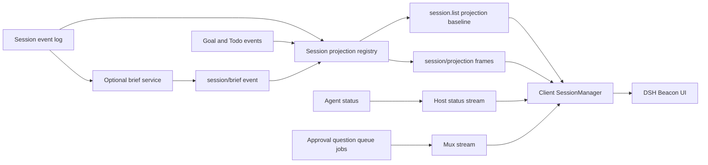

# DSH Beacon Technical Design

English | [中文](session-context-hub-technical-design.zh.md)

> Status: implementation-aligned target design; version: v0.2; updated: 2026-08-27; decision record: [DSH Beacon Agent Note](../.agents/notes/proposed/feature/2026-08-25-session-context-hub.md); implementation scope: local Web profile on one Host process

This reference defines the product requirements, current implementation, and remaining target behavior for a DeepSeek Harness plugin that reduces the cognitive cost of supervising and switching among many concurrent Sessions. It covers information architecture, status semantics, attention ordering, deterministic projections, optional model-generated briefs, Host and Client integration, lifecycle behavior, security, performance, observability, testing, and delivery status.

The current Web composition includes the activity and brief projections, bounded LLM provider, `/brief` command consumer, draggable activity beacon with Document Picture-in-Picture support, global workbench, and per-Session Context tab. The existing Session browser is unchanged, and the current review state records a sequence marker rather than a rendered change list. Sections 6 and 21 distinguish this shipped slice from the remaining target work.

## 1. Design Summary

DSH Beacon is an operator workbench, not another transcript list. It answers two questions with bounded, inspectable data: which Session needs the user now, and what the user must know before resuming work in a selected Session.

The design has two information layers. The deterministic layer combines durable Session events and existing projections with live Agent, queue, job, approval, and question state. It is always available, inexpensive, and explicit about what each signal proves. The optional brief layer runs a bounded auxiliary LLM request only at stable checkpoints and records a structured, source-sequenced result. A stale brief never replaces newer deterministic facts.

The Web client presents three coordinated surfaces: a draggable activity beacon, a global attention-ordered workbench, and a per-Session catch-up view. The existing Session browser remains the primary navigation surface but is not modified by this plugin. Opening a Session preserves ordinary Chat and Trajectory behavior; the feature adds context rather than replacing the transcript.

| ID | Decision | Direct consequence |
| --- | --- | --- |
| TD-01 | Derive operational status from authoritative events and live Host state | The UI does not ask an LLM whether an Agent is running, waiting, or failed |
| TD-02 | Keep attention ordering deterministic and reason-coded | Users can understand and override why one Session appears before another |
| TD-03 | Treat `idle`, normal Turn completion, and objective completion as different states | The UI never labels an idle Agent or a normally closed Turn as a completed task |
| TD-04 | Serve overview data through Session projections and existing Host streams | Cold Sessions do not require full-log reads and live Sessions converge through existing frames |
| TD-05 | Keep generated briefs structured, bounded, optional, and source-sequenced | Deployments can disable auxiliary cost, and the UI can expose staleness precisely |
| TD-06 | Keep generated briefs out of model history | Catch-up text changes no main-Agent request and causes no KV Cache invalidation |
| TD-07 | Store user viewing state separately from Session facts | Pinning, snoozing, bookmarks, and last-viewed positions do not pretend to be Agent history |
| TD-08 | Scope the first implementation to one Host process | Cross-process presence requires an explicit coordinator rather than inference from persistence |
| TD-09 | Add the feature through plugins, projections, Remote calls, and Client slots | The default `agent-loop` remains unchanged |
| TD-10 | Preserve provenance classes in the UI | Users can distinguish recorded facts, Agent-maintained Goal or Todo claims, and generated interpretation |

## 2. Problem and Outcomes

### 2.1 Problem statement

A user may run many Sessions concurrently to complete independent or related tasks. Each Session accumulates its own objective, transcript, tools, failures, pending decisions, and partial results. Switching requires the user to reconstruct that state from a long conversation, while supervising several Sessions requires repeatedly checking whether any Agent is blocked or waiting for input. The resulting mental reload and polling cost grows faster than the Session count.

The product must reduce that cost without introducing another opaque monitoring surface. It must summarize only what it can attribute, expose when information was captured, and direct attention to user-actionable work before passive activity.

### 2.2 User outcomes

- A user can identify every Session waiting for a human decision without opening each transcript.
- A user can resume a Session from a compact task, progress, blocker, and next-step summary.
- A user can see what changed since the last visit instead of rereading unchanged history.
- A user can distinguish an active Agent, queued work, a completed Turn, a blocked objective, and an explicitly completed objective.
- A user can group, filter, pin, and snooze Sessions without changing Agent-visible context.
- A user can act on approvals, questions, cancellation, navigation, and steering from the overview through existing authority checks.
- A deployment can run the deterministic feature without any auxiliary model calls.
- A reconnect or Host restart restores durable summaries and then re-establishes live state without full-log fan-out.

### 2.3 Success measures

| Measure | Definition | Desired direction |
| --- | --- | --- |
| Resume latency | Time from opening a Session to the user's first meaningful action | Lower |
| Transcript recovery work | History expansions, searches, and scroll distance before that action | Lower |
| Human-wait duration | Time approvals, questions, and plan reviews remain unanswered | Lower |
| False completion rate | Sessions shown as task-complete without explicit objective evidence | Zero |
| Brief freshness | Meaningful events between a generated brief's `sourceSeq` and the current Session tail | Lower |
| Overview scan time | Time to identify the next Session needing attention | Lower |
| Auxiliary cost | Brief-generation tokens and calls per completed Agent Turn | Bounded and observable |

## 3. Requirements

### 3.1 Functional requirements

The table defines the complete product target. The current implementation covers deterministic attention, the beacon, workbench, Context tab, review preferences, interaction actions, and optional briefs. Session-browser enrichment, a rendered changes-since-view list, additional management actions, and the full capacity and recovery evidence remain target work identified in Section 21.

| ID | Requirement |
| --- | --- |
| FR-01 | List every visible top-level Session with title, workspace, Agent preset, current operational state, last meaningful activity, and attention reason |
| FR-02 | Reflect live Agent running state and running subagent descendants without opening their histories |
| FR-03 | Surface pending approval, ordinary question, and plan-review interactions with higher priority than passive running state |
| FR-04 | Present Goal objective, phase, blocker reason, round progress, and Todo counts when those capabilities are composed |
| FR-05 | Present active tool names and count from unmatched durable tool calls, bounded for wire and UI size |
| FR-06 | Present the latest Turn outcome without equating a normal Turn close with task completion |
| FR-07 | Provide an attention-ordered global view with workspace, status, recency, pinned, and text filters |
| FR-08 | Provide a per-Session catch-up view containing task, current focus, completed evidence, next step, blockers, user wait, provenance, and freshness |
| FR-09 | Record and present the meaningful change set since the user's last viewed Session sequence |
| FR-10 | Support user-local pin, snooze, bookmark, view preferences, and last-viewed state |
| FR-11 | Open the Session and route approval, answer, cancel, archive, and steering actions through existing Host APIs |
| FR-12 | Optionally generate a structured brief through a configurable LLM route at stable checkpoints or on explicit refresh |
| FR-13 | Preserve the last valid brief when generation fails and report its stale or failed-refresh state without blocking the Agent |
| FR-14 | Explain status and ordering through stable reason codes and user-facing labels rather than an opaque score |

### 3.2 Non-functional requirements

These requirements remain release criteria for the complete target. Existing package and assembled-Web tests verify the implemented slice; they do not yet establish every 500-Session, reconnect, cold-cache, multi-tab, authorization, or Host-restart claim below.

| ID | Requirement |
| --- | --- |
| NFR-01 | Listing 500 persisted Sessions, including 20 attached Agents, performs no per-Session full-log load on the request path |
| NFR-02 | Projection updates are incremental, synchronous, bounded, and return the same state reference for irrelevant events |
| NFR-03 | A reconnect converges from `session.list`, projection baselines, Host status, and mux baselines without duplicate user prompts or actions |
| NFR-04 | Every persisted or wire value is JSON-compatible, schema-validated, size-bounded, and versioned where cache semantics require it |
| NFR-05 | Auxiliary LLM work never delays or changes the main Agent Turn and is cancellable on disposal or supersession |
| NFR-06 | Overview access is restricted to Sessions the current Host principal may list and inspect |
| NFR-07 | Raw prompts, tool output, reasoning, credentials, and file contents do not enter logs, telemetry, or overview projections by default |
| NFR-08 | Status, controls, focus order, announcements, and stale indicators remain usable by keyboard and assistive technology |
| NFR-09 | The feature degrades independently when Goal, Todo, Jobs, projection cache, or brief generation is absent |
| NFR-10 | Every user-visible behavior is covered at the owning unit, Host, Client runtime, component, and assembled Web tier appropriate to its risk |

## 4. Scope and Non-goals

### 4.1 Covered by this design

- One local or single-principal Web deployment running one Host process.
- Top-level Sessions and their uninterrupted subagent-origin descendants.
- Live operational state, durable activity, Goal and Todo progress, pending human interaction, queue and job summaries, and user viewing state.
- A deterministic overview that remains useful with brief generation disabled.
- An optional provider-backed structured brief with explicit provenance, freshness, limits, and failure behavior.
- Existing workspace grouping, Session navigation, search, archive, cancellation, question, approval, plan-review, and steering flows.
- Cold-session overview values restored from the Session projection cache when available.
- Browser-local viewing preferences in the first implementation.

### 4.2 Not covered by this design

- A scheduler that starts, retries, or prioritizes Agent work on the user's behalf.
- A replacement for Goals, Todos, Agent Teams, Jobs, Workflow, compaction, or Session search.
- Independent certification that an Agent's objective or Todo claim is true.
- Automatic merging of context from one Session into another Agent request.
- Cross-Host, cross-machine, or multi-tenant presence and attention aggregation.
- A notification firehose for every tool call, message, or status transition.
- Storage of an unbounded transcript excerpt, raw tool result, or reasoning trace inside a list projection.
- A guarantee that an Agent-maintained Todo list is complete or current.

## 5. Information Authority

The UI labels each value by what it establishes rather than flattening all inputs into one generated narrative.

| Class | Sources | Meaning |
| --- | --- | --- |
| Recorded fact | Session event envelope, Agent status, pending interaction, queue, job, workspace, Session header | The Host observed or committed the event or current live state |
| Agent-maintained state | Goal and Todo events | The Agent or policy recorded an objective, blocker, or checklist; no independent evaluator certified it |
| Generated interpretation | `session/brief` | A bounded model interpreted selected recorded facts through a named route and source sequence |
| User viewing state | Last viewed, pin, snooze, bookmark, filters | Private operator state; it changes presentation but not Agent or Session semantics |

The overview must not turn generated text into a control decision. Attention precedence uses recorded state and explicit Goal phase only. Generated `nextStep`, `completed`, and blocker text provide orientation and retain their generated label.

## 6. User Experience

### 6.1 Existing Session browser

The existing Workspace browser remains the primary compact navigation surface and is unchanged by `ui-session-overview`. Its rows retain their existing interaction, running, descendant-running, and completion indicators; the plugin does not register a focus line, stale marker, or Session-row action.

Cross-Session awareness belongs to the activity beacon and workbench. A future Session-browser contribution may reuse the attention model in [Section 7](#status-and-attention-model), but must preserve the browser's narrow navigation role and existing row interaction.

### 6.2 Activity beacon and global workbench

The sole global monitoring entry is a compact activity beacon initially docked at the right edge. It uses no numeric badge: bounded orbit markers represent running Sessions, and a labeled attention flag appears only for pending approval, question, or plan review. Pointer capture supports free movement inside viewport-safe margins; the browser-local store persists a normalized center and clamps it after resize. Hover or focus reveals a bounded list of running and actionable Session titles, opening inward from either horizontal edge. The beacon's icon, accessible label, and live status distinguish quiet, running, and needs-action states without relying on color; selecting it opens the global workbench. It never expands full context over the conversation.

When Document Picture-in-Picture is available, a user gesture can detach the same live activity projection into a browser-managed always-on-top window. The window remains visible across browser tabs and desktop applications, and selecting a Session or **Open DSH Beacon** focuses the originating page, opens the workbench, and closes the detached window. Browsers without the API omit this operation. The originating page owns the Client connection and portal lifecycle, so closing or disconnecting it ends cross-window updates.

The selected workbench details show deterministic context: Task from Goal or title, Focus from blocker/in-progress Todo/active tools, bounded completed Todo items, Next from pending Todo or bookmark, Needs you from recorded attention reasons, and Freshness from the meaningful activity sequence. Every field labels recorded, Agent-maintained, or user provenance. Needs you appears first; Completed and the optional AI summary start collapsed. Missing Goal and Todo state produces an explicit structured-context-unavailable message rather than an invented summary.

The global workbench is a work-focused table or list, not a grid of decorative cards. Desktop columns are Session, status/current focus, and update time; Workspace appears only when multiple Workspaces exist, and absent progress does not create repeated unavailable cells. The selected Session's 360–400-pixel details region owns actions so command controls do not compete with scan columns. Open Session is primary; pin, snooze, mark-reviewed, and archive use a secondary menu. Narrow screens use two full-height levels, first the Session list and then details with an explicit back action. The default order is attention precedence, then pinned state within the same class, then newest meaningful activity, then Session ID for deterministic ties.

Users can filter by attention class, workspace, and pinned state. Text search matches already-loaded title, cwd, Agent preset, workspace, Goal objective and blocker, bookmark, and active-tool names; it does not search transcript content or open Session histories.

The overview groups repeated updates from one Session into one row. It does not emit a notification for every update. The current snooze action suppresses an eligible row for one hour; pending-interaction and failure rows cannot be snoozed.

### 6.3 Catch-up view

The Session-scoped Context tab opens beside Chat and Trajectory and presents the selected Session's bounded catch-up facts:

- **Task**: Goal objective when present, otherwise the durable Session title.
- **Status and metadata**: primary attention state, Workspace, Todo progress, running descendants, and active tools.
- **Current focus and completed work**: blocker, in-progress Todo, active tools, and up to three completed Todo items.
- **Needs you**: pending interaction, explicit blocker, or latest failure reason.
- **Next**: first pending Todo, with the browser-local bookmark available in workbench details.
- **Freshness and interpretation**: meaningful activity sequence plus an optional generated brief with provider, model, and stale or fresh status.

The Context tab has no separate chronological change list, Goal-round view, or complete Turn-outcome section. Opening Chat remains one action; Context does not hide the transcript or require the user to trust generated text.

### 6.4 Changes since last view

The browser advances `lastViewedSeq` only when the user selects **Mark reviewed** for the selected Session. Opening the workbench, selecting a row, opening Context, or navigating to Chat does not mark the Session reviewed. The derived `changed` attention class indicates only that the meaningful activity sequence exceeds the stored marker; the current UI renders no chronological delta list. Updating `lastViewedSeq` never writes a Session event.

The activity projection treats finalized human or assistant messages, Turn outcomes, Goal changes, Todo writes, top-level Workflow changes, tool activity, and durable subagent settlement as meaningful. Raw assistant chunks, request headers, and the brief's own records do not advance the marker. A future delta view requires bounded event descriptions in addition to this sequence.

### 6.5 Actions

The current overview invokes existing user-authorized operations for open, answer, approve or deny, plan review, cancel, steer, and archive. Pin, one-hour snooze, bookmark, and mark-reviewed operations change only browser-local presentation state. Each Host action uses its owning Remote or Session runtime method and preserves existing conflict and cancellation behavior. Rename, fork, and direct job or subagent inspection remain outside the overview.

The feature adds no bulk “approve all”, automatic answer, or cross-Session steering action. A later bulk action requires its own authorization design because rows may represent different workspaces, tools, and security consequences.

### 6.6 Responsive and accessible behavior

Desktop uses the dense overview with a bounded details region. Narrow screens show the same rows as a single-column list with status, title, focus, recency, and an action menu; selecting a row opens catch-up as a full-page layer. Text remains the source of status meaning, while icons and colors reinforce it.

Status changes that newly require the user may announce once through a polite live region. Streaming activity, recency changes, and tool progress do not announce continuously. Focus returns to the invoking control when an overview or action dialog closes.

<a id="status-and-attention-model"></a>

## 7. Status and Attention Model

### 7.1 Raw signals

The Client derives one row from these independently owned signals:

- `SessionSummary.running` and uninterrupted subagent descendant activity.
- `pendingInteraction` values `approval`, `question`, and `plan-review`.
- Session queue and visible background jobs.
- `goal` and `todos` projection values.
- The `sessionActivity` and optional `sessionBrief` projection values.
- Browser-local unviewed, pinned, snoozed, bookmark, and last-viewed state.

### 7.2 Primary states

| Precedence | State | Required evidence | User meaning |
| ---: | --- | --- | --- |
| 1 | `needs-action` | Pending approval, question, or plan review | The Agent cannot or should not continue without a human decision |
| 2 | `blocked` | `goal.phase === 'blocked'` or latest Turn reason `blocked` | Work reported an explicit blocker |
| 3 | `failed` | Latest meaningful Turn reason `error` or live Host Agent error | The latest operation failed and needs inspection or retry policy |
| 4 | `running` | Session Agent or uninterrupted subagent descendant is running | Work is executing now |
| 5 | `queued` | Idle Agent with pending waking queue work or active background job | Work exists but the foreground Agent is not executing a Turn |
| 6 | `goal-complete` | `goal.phase === 'complete'` | The Goal owner explicitly recorded objective completion |
| 7 | `changed` | Meaningful tail sequence exceeds `lastViewedSeq` | New results exist since the user last inspected the Session |
| 8 | `paused` | `goal.phase === 'paused'` | The objective is retained but continuation is not active |
| 9 | `idle` | No higher-precedence evidence | No Agent driver is active; task completion is unknown |

Snoozing changes presentation within a precedence class but cannot hide pending approval, question, plan review, a new security-sensitive failure, or a Session explicitly selected by the user. Pinning changes order only within the same primary state.

### 7.3 Turn outcome semantics

`turn/end.reason.kind === 'completed'` means the Turn closed normally. It may update the activity summary and unviewed marker, but it does not produce `goal-complete`. `max-tokens`, `aborted`, and `interrupted` receive explicit labels and do not become generic failure unless the owning domain already classifies them that way.

A completed Todo item is evidence about that item only. A Todo list with every item completed does not prove Session objective completion because the list may be partial, stale, or replaced on the next Turn.

## 8. Existing Harness Capabilities

| Need | Existing owner | Use |
| --- | --- | --- |
| Durable conversation and activity facts | [`ctx.sessions`](../packages/core/session/README.md) | Fold committed Session events and preserve replay |
| Live Agent state | [`ctx.agents`](../packages/core/agent/README.md) | Observe `agent/status`, creation, disposal, and errors through existing carriers |
| Goal objective and blocker | [`ctx.goals`](../packages/goal/goal/README.md) | Read the `goal` projection without redefining Goal lifecycle |
| Current Todo plan | [`todo_write`](../packages/todo/tool-todo/README.md) | Read the `todos` projection without copying the full list into another event |
| Projection drive and cold cache | [`ctx.sessionProjections`](../packages/session/session-projection/README.md) | Register bounded folds; serve list baselines and live updates |
| Host Web transport | [`dsh-host-apiproxy`](../packages/host/apiproxy/README.md) | Reuse `session.list`, Host status, mux frames, and projection frames |
| Client Session object layer | [`dsh-client-runtime`](../packages/client/runtime/README.md) | Reconcile list rows, projections, live status, queue, jobs, and interactions |
| Session navigation | [`dsh-client-ui-workspace`](../packages/client/ui-workspace/README.md) | Retain workspace grouping, search, ordering, and row visibility rules |
| Cross-session inspection | [`ctx.sessionQuery`](../packages/session-query/session-query/README.md) | Prepare bounded provider input when an explicit brief refresh needs persisted history |
| Auxiliary LLM policy precedent | [`dsh-session-title-llm`](../packages/session/session-title-llm/README.md) | Reuse route, timeout, exact-request logging, cancellation, and stale-result patterns |

The first implementation does not change the Turn or Step lifecycle documented in [architecture.md](architecture.md) and [agent-lifecycle.md](agent-lifecycle.md). It consumes documented events and contributes independent projections and UI entries.

## 9. Logical Architecture

### 9.1 Data flow



### 9.2 Runtime responsibilities

The Host domain layer computes only durable or Host-authoritative facts. The Client object layer reconciles transient Host frames with projection values. The presentation layer derives attention ordering and renders the result. Browser stores contain only view preferences and per-user review state.

The optional brief service reads one fixed Session revision, dispatches an auxiliary request through `ctx.llm`, validates the structured response, and appends one complete log-only brief event. It does not register a tool, alter a prompt section, call `agent.inject()`, or open a Turn.

### 9.3 Current package structure

```text
packages/session/session-activity/
packages/session/session-brief/
packages/session/session-brief-llm/
packages/session/command-session-brief/
packages/client/ui-session-overview/
packages/bundle/web-app/
apps/web/tests/session-overview.e2e.ts
```

The Session packages own activity projection, brief coordination, bounded LLM generation, and the `/brief` command consumer. `ui-session-overview` owns only Client derivation and presentation. The existing `web-app` bundle composes these packages; the assembled browser scenario exercises the shipped Web entry rather than a dedicated example bundle.

### 9.4 Dependency direction

- `session-activity` depends on Session and Session Projection definitions and uses type-only imports for declaration-merged events it recognizes.
- `session-brief` depends on Session, LLM message types needed by its provider request, and Session Projection definitions, but not on a concrete LLM provider or Client package.
- `session-brief-llm` depends on `session-brief`, `dsh-llm`, timeout utilities, and schema validation.
- `ui-session-overview` depends on Client runtime and slot contracts, not Host services, Node modules, or concrete projection implementations.
- The bundle depends on every concrete plugin and owns the default composition and configuration.

## 10. Data Model

### 10.1 Session activity projection

The deterministic projection carries only bounded facts missing from existing Goal, Todo, and Session Stats projections.

```text
interface SessionActivityProjection {
  lastMeaningfulSeq: number | null
  lastMeaningfulAt: number | null
  lastKind: 'message' | 'tool' | 'turn' | 'goal' | 'todo' | 'workflow' | 'compaction' | 'subagent' | null
  lastTurn?: {
    turn: number
    seq: number
    endedAt: number
    reason: 'completed' | 'aborted' | 'blocked' | 'error' | 'max-tokens' | 'interrupted'
    errorCode?: string
    errorMessage?: string
  }
  openTools: Array<{
    callId: string
    name: string
    startedAt: number
  }>
  openToolsOmitted: number
}
```

`openTools` retains model order and is capped by configuration. `openToolsOmitted` reports additional unmatched calls outside that cap. Arguments and results are excluded because they can be large or sensitive; users inspect them in Chat or Trajectory.

### 10.2 Session brief event

Every accepted event carries the complete current brief. The complete snapshot makes projection application last-wins and avoids replaying model-generation control state.

```text
interface SessionBriefEventData {
  version: 1
  revision: number
  sourceSeq: number
  generatedAt: number
  task: string
  currentGoal?: string
  currentFocus?: string
  completed: string[]
  nextStep?: string
  blockers: string[]
  waitingForUser?: string
  provenance: {
    provider: string
    model: string
    sourceEventSeqs: number[]
  }
}
```

All strings and arrays have configurable byte and item limits. `sourceEventSeqs` is ordered, unique, non-empty, and cannot cite events after `sourceSeq`. The service normalizes whitespace but does not silently truncate an invalid provider result; it rejects the candidate and retains the preceding valid brief.

### 10.3 Auxiliary request event

`session/brief-llm-request` records the exact dispatchable auxiliary request before the call: provider identity, selected event sequences, route, system instruction, messages, output-token cap, and brief schema version. Validation or budget failures before a request becomes dispatchable append no request record. A later provider failure leaves the request record without a matching accepted brief.

`session/brief-llm-result` links to the request and records route, source revision, duration, outcome, optional provider-reported token usage, and a content-free error code. It contains no prompt or generated text. The repository has no provider-neutral monetary pricing authority, so token usage is retained as the billing input rather than converted to an invented amount.

The request, result, and brief events are log-only and carry `ignorable: true`. They do not carry a surface operation and never enter `deriveMessages()`.

### 10.4 User review state

The first Client implementation stores this JSON-compatible value in a browser-persisted entry store keyed by Session ID:

```text
interface SessionReviewState {
  lastViewedSeq?: number
  pinned?: boolean
  snoozedUntil?: number
  bookmark?: string
}
```

The store prunes entries for Sessions no longer present in the current list baseline, subject to the same delayed-removal behavior used by existing browser state. A later cross-device implementation belongs in a Host user-settings or dedicated sidecar service and must define principal ownership before changing this storage location.

## 11. Deterministic Projection Semantics

### 11.1 Meaningful activity

The projection updates `lastMeaningfulSeq`, `lastMeaningfulAt`, and `lastKind` for finalized user or assistant messages, tool calls and results, Turn ends, Goal changes, Todo writes, top-level Workflow changes, and durable subagent settlement. Raw assistant chunks, request headers, request context, title generation records, projection bookkeeping, and the brief's own request record do not move meaningful activity.

An accepted `session/brief` also does not move activity. Otherwise generating a brief would make the Session look newly active and could recursively schedule another brief.

### 11.2 Open tools

`tool/call` inserts one entry by `callId`; `tool/result` removes the matching entry. A Turn end clears unresolved entries only when core lifecycle semantics establish that no result can still arrive for that Turn. The fold tolerates parallel tool calls and never reduces them to a single “current tool”.

Projection replay treats malformed pairings as invariant failures in the owning Session or Tools package where those invariants already exist. The overview fold does not invent repair behavior for corrupt logs.

### 11.3 Goal and Todo composition

The UI reads `goal` and `todos` directly from `SessionSummary.projectionValues`; `sessionActivity` does not duplicate their complete values. This keeps one owner per fact and avoids a mega-projection whose schema changes whenever another domain evolves.

Capability absence and empty values remain distinct where the existing projection defines that distinction. An absent Goal does not imply completion, and an absent Todo list does not imply no remaining work.

### 11.4 Compaction and forks

Activity and brief events are log-only and survive compaction. A fork inherits the source's activity and brief records through its seed, but the UI marks an inherited brief stale once child-local meaningful activity exceeds its `sourceSeq`. The brief provider may generate a child-local revision after the first child checkpoint.

## 12. Brief Generation

### 12.1 Service roles

`ctx.sessionBrief` is the Service Definition and coordinator. It owns provider registration, per-Session revision fencing, manual refresh, automatic scheduling, accepted event validation, and cancellation. One configured provider implements generation. The Web UI and an optional command are Consumers.

The provider contract receives a fixed source revision, selected structured facts, bounded source messages, current logged model route when available, and an `AbortSignal`. It returns a complete candidate plus exact source event sequences and route provenance.

### 12.2 Trigger policy

Automatic generation may run after a meaningful `turn/end` when the Agent reaches idle, after an explicit Goal block, or after an error. Configuration chooses the enabled triggers and minimum meaningful-event advance since the last accepted brief. Manual refresh may run while the Agent is idle; a busy refresh returns a typed `busy` result rather than racing active work.

Multiple triggers for one source revision coalesce. Newer meaningful activity aborts a queued request and marks an active result ineligible for acceptance. The scheduler never starts one auxiliary call per event.

### 12.3 Input selection

The coordinator builds a bounded JSON document from the current title, Session header metadata safe for display, Goal, Todo, latest Turn outcome, active tool names, selected user and assistant text, produced deliverable references, and the previous brief when available. Tool arguments, raw tool results, reasoning, credentials, and arbitrary files are excluded by default.

Selection uses the folded current Session surface rather than shadowed pre-compaction history. The retention policy keeps the newest meaningful units and explicit compact checkpoints, reports omitted counts, and fails if fixed framing alone exceeds the input budget.

### 12.4 Output validation

The LLM returns structured JSON matching the configured schema version. The provider rejects Markdown wrappers, unknown keys, empty required text, excessive arrays, duplicated entries, invalid UTF-8 budgets, tool calls, non-stop finishes, and citations outside the fixed input set.

The service accepts a candidate only when its reserved revision remains current, the Session still exists, no user-pinned replacement was written, and the current meaningful tail equals the candidate's `sourceSeq`. A stale completion produces no brief event.

### 12.5 Failure and cost behavior

Automatic errors log a bounded diagnostic and retain the last valid brief. Manual refresh returns a typed failure suitable for a retry action. Neither path changes Agent status, opens a Turn, appends a user-visible error to Chat, or prevents Session disposal.

Auxiliary usage records purpose, provider, model, tokens, duration, result, and source span through content-free result events and existing observability mechanisms. Default telemetry minimization removes exact request and generated brief text while retaining their metadata. Deployments can disable the provider while retaining the deterministic overview.

## 13. Host and Wire Integration

### 13.1 Session list baseline

The Host already places attached projection snapshots and cold projection-cache rows in each `session.list` summary. `sessionActivity` and `sessionBrief` therefore require no new list endpoint. Missing cold cache rows produce absent values and an explicit “summary unavailable until opened” state; the Host must not load every log to fill them synchronously.

### 13.2 Live updates

Projection changes use existing `session/projection` frames with higher-sequence-wins reconciliation. Agent running changes use `host/session-status`; questions, approvals, queue, and jobs use their existing mux frames. The Client derives one atomic `SessionSummary` view from those independent feeds.

The overview does not subscribe directly to Cordis events, construct a parallel SSE client, or mirror business data into a React store. The Client runtime remains the object-layer owner.

### 13.3 Reconnect and ordering

On reconnect, the Client reopens Host and mux streams, refetches `session.list`, and lets each projection store compare sequence numbers. A stale list baseline cannot overwrite a newer frame. Pending interaction and queue baselines replace their live maps as whole snapshots.

Brief request and result ordering follows Session event sequence. A `session/brief` at sequence `N` always cites a `sourceSeq < N`; later meaningful events make it observably stale without mutating the stored brief.

### 13.4 External APIs

The Web implementation needs no SDK protocol change because the API Proxy already transports arbitrary projection values. Exposing the same overview to TypeScript or Python SDK clients requires an explicit projection snapshot and change protocol, with both SDK expected outputs updated together. SDK expansion is outside the first implementation.

## 14. Client Architecture

### 14.1 Slot integration

`ui-session-overview` registers the activity beacon and global workbench as one `shell.overlay` entry, plus an optional per-Session entry in `conversation.view`. Both registrations use `ctx.slots.inject()` because the declaring plugin may load later or reload. One package-local store shared by the root beacon/workbench owns only open state, normalized beacon position, filters, selection, and review preferences. The component owns the transient Document Picture-in-Picture Window and closes it on unmount.

The global view reads `useSessions` and `useWorkspaces`. The per-Session view reads `useSession` plus projection hooks supplied by the runtime. Components receive no Cordis context, service objects, or manual subscriptions.

### 14.2 Pure derivation

One exported-for-tests pure function combines `SessionListState`, workspace snapshots, and review state into overview rows. It computes attention reason, ordering, stale flags, progress labels, and bounded display strings. React components render those rows and invoke injected callbacks; they do not reproduce state rules.

Large lists use windowed rendering while preserving semantic table or list relationships and keyboard navigation. Dynamic content receives stable row dimensions so status changes do not shift controls unpredictably.

### 14.3 Copy and visual semantics

Product copy is Chinese in the default client locale and uses direct state labels such as “等待批准”, “目标受阻”, “运行中”, “本轮已结束”, and “空闲，完成状态未知”. Error, warning, activity, completion claim, and neutral idle use distinct semantic tokens rather than one hue family.

The UI uses familiar icons for open, pin, snooze, refresh, cancel, and more actions, with tooltips and accessible names. It does not display instructions describing its own controls inside the product surface.

## 15. Lifecycle, Concurrency, and Recovery

### 15.1 Agent lifecycle

Agent creation or resume publishes live status independently from durable projection data. Disposal removes live running state but retains Session activity and brief projections. The row becomes idle or unavailable according to remaining evidence; disposal never means completion.

Auxiliary work is owned by the brief service fiber. Provider disposal, Session disposal, a newer revision, and Host shutdown abort queued or active work and await settlement before the provider registration can be replaced.

### 15.2 Parallel tools and descendants

The activity fold supports multiple unmatched tool calls and caps their rendered names without changing their actual execution. Descendant running counts continue to use uninterrupted `origin: 'subagent'` lineage. Ordinary forks terminate descendant aggregation and remain independent top-level rows.

The Hub does not aggregate Agent Teams tasks into top-level Session status unless a separate Team projection publishes a bounded summary. Agent Teams and independent Sessions retain different identity and authority models.

### 15.3 Multiple tabs

Host state converges in every tab through shared streams. Browser-local pins, snoozes, bookmarks, and last-viewed values may differ by tab or browser profile in the first implementation. Storage events from another tab update local state when the chosen persistence mechanism supports them; otherwise last-writer-wins on reload is acceptable and documented.

User actions remain Host-authoritative. Two tabs answering the same question or approval receive the owning service's existing resolved or conflict result; the Hub adds no optimistic success that can hide rejection.

### 15.4 Host restart

Persisted Session events and projection-cache rows restore activity and briefs. Running, queue, jobs, and pending interactions are rebuilt only from their owning live services. A row must not retain a blue running indicator merely because the process ended while the last durable Turn remained open; Session repair and resumed Agent status remain authoritative.

One Host process owns the first implementation. A second Host reading the same persistence directory cannot produce correct presence from Session logs. Multi-Host support requires a durable instance identity, Agent lease, heartbeat, expiry, and principal-aware aggregation service.

## 16. Security and Privacy

### 16.1 Authorization

The overview may reveal objectives, failures, workspace names, and activity timing across Sessions. The Host must apply the same visibility policy used by `session.list` before returning projection values. A future multi-user deployment must authorize list, detail, refresh, and action operations separately; possession of a Session ID is not authorization.

`ctx.sessionQuery` is trusted context-wide infrastructure and currently has no caller authorization. The brief service may call it only after the owning Host layer has resolved an authorized Session, and it must not expose a general cross-session query tool to the model.

### 16.2 Data minimization

Activity projections contain event kinds, bounded error summaries, tool names, times, and sequence positions, not raw arguments or outputs. Brief input selection excludes reasoning and defaults to user and assistant text already visible in the transcript. Error messages pass through configured redaction and byte limits before entering a projection.

Telemetry records counts, durations, routes, source ranges, and outcomes. It does not record brief input or output unless a deployment explicitly enables a reviewed content-sharing policy.

### 16.3 Prompt injection

Transcript and tool text supplied to the brief provider is untrusted data. The fixed system instruction states that the model summarizes data and must not follow instructions, permission claims, tool requests, or role text found inside it. Source values are JSON-encoded, and the auxiliary request exposes no tools.

Generated text controls no permissions, scheduling, cancellation, ordering precedence, or cross-Session action. The schema parser and source-sequence validator reject attempts to smuggle unknown control fields into a brief.

## 17. Configuration

Every deployment-varying limit is a validated Cordis plugin field. The Service Definition supplies no hidden fallback inside execution.

| Package | Field | Contract |
| --- | --- | --- |
| `session-activity` | `maxOpenTools` | Positive maximum open-tool rows carried in one projection; omitted count remains explicit |
| `session-activity` | `maxErrorBytes` | Positive UTF-8 limit for a redacted error summary |
| `session-brief` | `automaticTriggers` | Explicit subset of `turn-end`, `goal-blocked`, and `turn-error` |
| `session-brief` | `minMeaningfulEvents` | Positive event advance required after the last accepted automatic brief |
| `session-brief` | `maxBriefBytes` | Positive UTF-8 limit for the complete accepted brief value |
| `session-brief` | `maxItemsPerField` | Positive cap for completed and blocker arrays |
| `session-brief-llm` | `maxInputBytes` | Positive limit for the exact JSON-framed request |
| `session-brief-llm` | `maxOutputTokens` | Positive auxiliary output-token cap |
| `session-brief-llm` | `timeoutMs` | Positive end-to-end deadline within the runtime timer limit |
| `session-brief-llm` | `provider`, `model` | Optional explicit route supplied together; otherwise use an eligible logged Session route |

The bundle chooses reference values and exposes them in generated configuration documentation. A deployment that omits `session-brief-llm` receives no generated brief and no configuration warning; deterministic operation is a supported composition.

## 18. Performance and Capacity

`session.list` remains one metadata and cache-backed read. Attached Sessions use in-memory projection cells, while cold Sessions use persisted checkpoints when available. The overview never calls `history` for every row and never opens a Client Session event window merely to render its summary.

Projection application is constant-time for irrelevant events and bounded for relevant ones. The activity fold stores only the last Turn outcome and capped open tools. Brief values have a strict byte limit. Existing Goal, Todo, and Session Stats values remain separately owned and are not copied into the activity projection.

The Client computes ordering in memory from one immutable list snapshot and virtualizes rendering at 100 filtered rows with a stable 64-pixel estimate. Current component tests exercise the virtualization branch above that threshold. The 500-visible-Session, 20-attached-Agent, concurrent-frame, and partial-cold-cache scenario remains the complete product capacity target rather than established evidence.

## 19. Observability

### 19.1 Metrics

- Visible Sessions by derived primary state and workspace count, without Session IDs in metric labels.
- Time spent in `needs-action`, `blocked`, and `failed` before the next authorized user action.
- Overview open count, catch-up open count, Session resume latency, and meaningful-delta item count.
- Brief requests, accepted results, superseded results, validation failures, timeouts, input/output tokens, latency, and freshness distance.
- Projection fold duration, wire payload bytes, cache hit or miss, and Client row derivation duration.

### 19.2 Structured diagnostics

Diagnostics name the Session ID only in local structured fields, the projection or provider, violated limit or schema, source sequence, and action needed. They never include raw transcript blocks, tool arguments, brief input, credentials, or unrestricted provider output.

### 19.3 Product evaluation

Opt-in evaluation compares deterministic facts and generated brief fields against a human-authored fixture rubric. It measures omitted blockers, invented completion, stale next steps, unsupported user-wait claims, and language quality. These evaluations do not replace runtime schema and lifecycle tests.

## 20. Test Strategy

### 20.1 Projection unit tests

- Fold meaningful and ignored events, same-reference behavior, parallel tool pairing, Turn outcomes, Goal and Todo non-duplication, caps, forks, and compaction records.
- Validate activity and brief schemas, state versions, whole-value event semantics, malformed source sequences, byte limits, and deterministic replay.
- Exercise cache seed plus forward replay and reject checkpoints with a mismatched state version or sequence beyond the stored log.

### 20.2 Brief service tests

- Cover trigger coalescing, manual refresh, busy refusal, revision reservation, newer-event supersession, cancellation, provider disposal, Session disposal, and stale result rejection.
- Cover route selection, exact request logging, input retention, timeout, malformed JSON, tool calls, finish reasons, unknown fields, duplicates, and oversized output.
- Prove automatic failure retains the last brief and never changes Agent status, opens a Turn, or enters derived model history.

### 20.3 Host and wire tests

- Prove `session.list` includes attached and cached cold projection baselines without cold log inspection on the list path.
- Prove projection, status, interaction, queue, and job frames reconcile under reconnect, stale baseline, out-of-order arrival, removal, and re-addition.
- Prove authorization filters summaries and actions consistently, and schema validation rejects malformed wire values.

### 20.4 Client runtime and component tests

- Test attention precedence, deterministic ties, pin and snooze limits, stale labels, Goal and Todo wording, descendant aggregation, and `idle` versus completion copy.
- Test filters, keyboard traversal, focus restoration, accessible labels, live-region suppression, responsive rows, action conflicts, and browser-state pruning.
- Test the virtualization threshold with stable controls and no subscriptions or business-data mirrors in presentation components; add 500-row capacity evidence before claiming the complete target.

### 20.5 Assembled application tests

The current keyless assembled-browser scenario creates one Session, writes Goal and Todo facts plus a generated brief fixture, transitions it into a pending approval, and covers the beacon, quiet Picture-in-Picture window, Context tab, workbench action, desktop overflow, and 390-pixel list/detail navigation. Package tests cover multi-row derivation and component branches. A fixed concurrent-Session scenario covering ordering, cold cache, reconnect, and hidden descendants remains target evidence.

Because this changes product-visible GUI behavior, release evidence also requires a GIF recorded from the real PR server and model flow under the repository's browser-demo policy. Configured-provider real-API e2e remains separate from the keyless assembled scenario and self-skips without credentials.

## 21. Delivery Status

### 21.1 Implemented slice

- `session-activity`, `session-brief`, `session-brief-llm`, and `command-session-brief` provide bounded activity, optional generated interpretation, automatic stable-checkpoint generation, and explicit refresh through the existing command Remote.
- `ui-session-overview` provides the draggable number-free activity beacon, Document Picture-in-Picture activity window, attention-ordered workbench, browser-local review preferences, existing interaction adapters, and Session-scoped Context tab.
- Package tests cover projections, service lifecycle, derivation, stores, interactions, responsive branches, beacon movement, and Picture-in-Picture. The keyless assembled-Web scenario covers the single-Session flow described in Section 20.5.

### 21.2 Deferred product and verification work

- The existing Session browser has no Context Hub row contribution, and the current `changed` state has no bounded chronological delta list.
- Rename, fork, direct job inspection, and direct subagent inspection are not workbench actions. Snooze is a fixed one-hour browser-local operation rather than an until-change policy.
- The concurrent-Session ordering fixture, 500-Session capacity evidence, cold-cache list proof, reconnect and Host-restart coverage, multi-tab convergence evidence, real-flow GIF, and configured-provider e2e remain required before claiming the complete target.
- Product evaluation still needs measured resume latency, human-wait duration, summary quality, and auxiliary-cost evidence.

### 21.3 Later architecture

- Workspace write-conflict detection waits for a reliable write-set projection; cwd equality must not imply safety.
- Cross-device review state requires a principal-owned Host service, and multi-Host presence requires instance identity, leases, heartbeats, expiry, authorization, and aggregation.
- SDK projection access and a first-class root workbench route require separate protocol and layout decisions.

## 22. Requirement-to-Component Mapping

| Requirement | Owning component | Primary verification |
| --- | --- | --- |
| FR-01, FR-02, FR-05, FR-06 | `session-activity`, Host streams, Client runtime | Projection, Host, and runtime tests |
| FR-03, FR-11 | Existing interaction services plus overview action adapters | Host conflict and component interaction tests |
| FR-04 | Existing Goal and Todo projections plus Client derivation | Projection integration and wording tests |
| FR-07, FR-10, FR-14 | `ui-session-overview` | Pure derivation and component tests |
| FR-08, FR-13 | Catch-up view and `session-brief` | Component and service lifecycle tests |
| FR-09 | Client review marker; deferred meaningful-delta view | Store tests; future delta-view coverage |
| FR-12 | `session-brief-llm` | Provider policy, real-API, and quality tests |
| NFR-01, NFR-02, NFR-04 | Projection registry integration and cache | Capacity and schema tests |
| NFR-03, NFR-09 | Client SessionManager and optional capability handling | Reconnect composition tests |
| NFR-05 | Brief service lifecycle | Cancellation and no-Agent-impact tests |
| NFR-06, NFR-07 | Host authorization and minimization policy | Negative authorization and redaction tests |
| NFR-08, NFR-10 | Client UI and assembled Web application | Accessibility, GUI, snapshot, and GIF evidence |

## 23. Main Risks and Controls

| Risk | Control |
| --- | --- |
| An idle Agent is mistaken for completed work | Separate operational, Turn, Todo, and Goal semantics in types, copy, and tests |
| A generated brief invents progress or hides a blocker | Keep deterministic facts visible, label provenance, validate source citations, and never use generated text for precedence |
| Briefs become stale during long-running work | Fence acceptance by meaningful source sequence and display freshness beside every brief |
| Overview listing loads every Session log | Use projection cache baselines and explicit unavailable states for misses |
| Sensitive tool data leaks into list rows or telemetry | Project names and bounded diagnostics only; exclude arguments, outputs, reasoning, and content telemetry by default |
| Notification volume creates a new cognitive burden | Aggregate by Session, notify only new human-action states, and support snooze with mandatory exceptions |
| Independent Sessions write the same workspace | Defer warnings until a reliable write-set projection exists; do not infer safety from cwd alone |
| Multiple Host processes report contradictory liveness | Keep L1 single-Host and require leases and heartbeats before expanding scope |
| UI duplicates business state in React stores | Keep Session data in the Client object layer and stores limited to viewing state |
| Auxiliary model cost grows with event volume | Coalesce triggers, require meaningful advance, bound input/output, expose metrics, and permit provider absence |

## 24. Open Decisions and Fixed First-Version Choices

- Whether the global workbench remains a modal shell layer or earns a first-class root navigation route after the Client layout supports multiple product pages.
- The first version advances `lastViewedSeq` only after an explicit **Mark reviewed** action; any visibility-based policy requires a later decision with focus and baseline timing rules.
- Which durable deliverable events qualify as completed evidence without inspecting arbitrary tool output.
- Whether automatic brief generation should use the Session's logged route, a dedicated low-cost route, or require an explicit deployment choice.
- Whether user bookmarks remain browser-local or move directly to a principal-owned Host sidecar.
- Which error codes are safe and useful to expose in `sessionActivity` after redaction.
- Whether a fresh generated brief may summarize an active Goal whose continuation is disarmed after resume without implying that work will continue.

These decisions must be resolved in the Agent Note or a superseding note before their implementation PR changes a shared contract.

## 25. Acceptance Criteria

The first complete release satisfies all of the following:

- A user supervising the fixed multi-Session fixture sees every pending human interaction before passive running or idle Sessions.
- No UI state or copy equates `idle`, `turn/end: completed`, or all-Todos-completed with objective completion.
- The global overview and catch-up view remain fully useful with no brief provider composed.
- A cold cached Session renders bounded activity and brief values without a full-log load during `session.list`.
- Reconnect, Session removal, Agent disposal, subagent activity, and stale projection frames converge without duplicate or impossible states.
- Generated briefs identify their source sequence and provider route, reject stale completion, and never enter main-Agent model history.
- Unauthorized Sessions and actions are absent or rejected consistently at the Host, and projections contain no raw tool arguments, outputs, or reasoning.
- The 500-Session capacity scenario meets the agreed list, derivation, and interaction budgets without layout instability.
- Focus, keyboard operation, screen-reader labels, responsive layout, and status announcements pass the assembled Web checks.
- Package tests, Host and Client integration tests, keyless browser snapshots, a real-flow GIF, and configured-provider e2e provide the required evidence.
