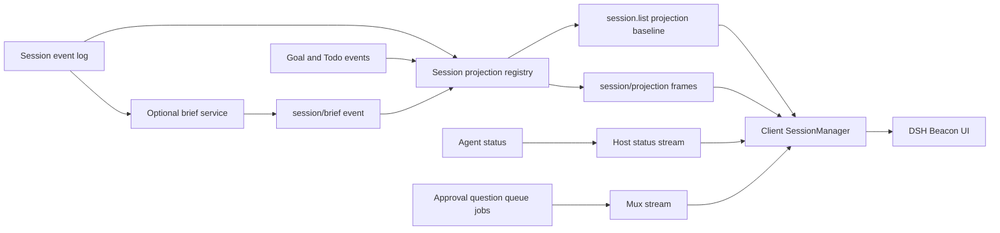

# DSH 信标技术设计

[English](session-context-hub-technical-design.md) | 中文

> 状态：与实现对齐的目标设计；版本：v0.2；更新日期：2026-08-27；决策记录：[DSH 信标 Agent Note](../.agents/notes/proposed/feature/2026-08-25-session-context-hub.zh.md)；实现范围：单个 Host 进程中的本地 Web profile

本文档定义一个 DeepSeek Harness 插件的产品需求、当前实现和剩余目标行为。该插件用于降低用户监督大量并行会话以及在会话之间切换时的认知成本。本文涵盖信息架构、状态语义、注意力排序、确定性投影、可选的模型生成摘要、Host 与 Client 集成、生命周期行为、安全性、性能、可观测性、测试和交付状态。

当前 Web 组合已包含活动与摘要投影、有界 LLM 提供方、`/brief` 命令消费方、支持 Document Picture-in-Picture 的可拖动活动 beacon、全局工作台和单会话 Context tab。现有会话浏览器保持不变，当前审阅状态记录序号标记而不渲染变化列表。第 6 节和第 21 节区分已交付实现与剩余目标工作。

## 1. 设计概述

DSH 信标是面向操作者的工作台，而不是另一种 transcript（文本记录）列表。它使用有界且可检查的数据回答两个问题：哪个会话现在需要用户，以及用户恢复某个会话的工作前必须了解什么。

设计包含两个信息层。确定性层组合持久会话事件、现有投影以及实时 Agent、队列、后台任务、批准和提问状态。它始终可用、成本低，并明确每个信号能够证明什么。可选摘要层只在稳定检查点发起有界的辅助 LLM（大语言模型）请求，并记录结构化且带源序列号的结果。陈旧摘要绝不会覆盖更新的确定性事实。

Web Client 提供 3 个相互配合的界面：可拖动活动 beacon、按注意力排序的全局工作台，以及单会话接管视图。现有会话浏览器仍是主要导航界面，但该插件不会修改它。打开会话后仍保留普通 Chat 和 Trajectory 行为；该功能增加上下文，不替换 transcript。

| ID | 决策 | 直接结果 |
| --- | --- | --- |
| TD-01 | 从权威事件和实时 Host 状态推导运行状态 | UI 不会询问 LLM 某个 Agent 是否正在运行、等待或失败 |
| TD-02 | 采用确定性且带原因代码的注意力排序 | 用户能够理解并覆盖某个会话排在另一个会话前面的原因 |
| TD-03 | 区分 `idle`、轮次正常结束和目标完成 | UI 不会把空闲 Agent 或正常关闭的轮次标记为任务完成 |
| TD-04 | 通过会话投影和现有 Host 流提供总览数据 | 冷会话不需要读取完整日志，live 会话通过现有帧收敛 |
| TD-05 | 生成摘要必须结构化、有界、可选并带源序列号 | 部署可以关闭辅助成本，UI 可以准确展示陈旧程度 |
| TD-06 | 生成摘要不进入模型历史 | 接管文本不会改变主 Agent 请求，也不会使 KV Cache 失效 |
| TD-07 | 用户查看状态与会话事实分开存储 | 固定、稍后提醒、书签和最后查看位置不会伪装成 Agent 历史 |
| TD-08 | 第一版实现限定在单个 Host 进程 | 跨进程 presence 需要显式协调器，不能从持久化内容推断 |
| TD-09 | 通过插件、投影、Remote 调用和 Client slot 添加功能 | 默认 `agent-loop` 保持不变 |
| TD-10 | UI 保留不同来源类别 | 用户能够区分记录事实、Agent 维护的 Goal 或 Todo 声明，以及生成式解释 |

## 2. 问题与结果

### 2.1 问题陈述

用户可能并行运行大量会话来完成相互独立或相关的任务。每个会话都会积累自己的目标、transcript、工具、失败、待决事项和部分结果。切换会话要求用户从长对话中重建这些状态，而监督多个会话又要求反复检查是否有 Agent 受阻或等待输入。随着会话数量增长，心理重新加载和轮询成本会以更快速度增加。

产品必须在不引入另一个不透明监控界面的前提下降低这些成本。它只摘要能够归因的信息，展示信息的捕获时点，并把需要用户操作的工作排在被动活动之前。

### 2.2 用户结果

- 用户无需打开每个 transcript，就能找出所有等待人工决策的会话。
- 用户可以通过紧凑的任务、进度、阻塞项和下一步摘要恢复某个会话。
- 用户可以查看离开之后发生的变化，而无需重新阅读未改变的历史。
- 用户可以区分活跃 Agent、排队工作、已结束轮次、受阻目标和明确完成的目标。
- 用户可以分组、筛选、固定和暂缓会话，而不改变 Agent 可见上下文。
- 用户可以通过现有权限检查，从总览中处理批准、提问、取消、导航和 steering（中途引导）。
- 部署可以在不发起任何辅助模型调用的情况下运行确定性功能。
- 断线重连或 Host 重启可以恢复持久摘要，再重建实时状态，而无需扇出读取完整日志。

### 2.3 成功指标

| 指标 | 定义 | 期望方向 |
| --- | --- | --- |
| 恢复延迟 | 从打开会话到用户第一次有效操作的时间 | 降低 |
| transcript 恢复工作量 | 执行该操作前展开历史、搜索和滚动的距离 | 降低 |
| 等待人工时间 | 批准、提问和计划审阅保持未答复的时间 | 降低 |
| 错误完成率 | 缺少明确目标证据却显示为任务完成的会话比例 | 为零 |
| 摘要新鲜度 | 生成摘要的 `sourceSeq` 与当前会话尾部之间的有意义事件数 | 降低 |
| 总览扫描时间 | 找出下一个需要注意的会话所需时间 | 降低 |
| 辅助成本 | 每个已结束 Agent 轮次对应的摘要生成 token 和调用数 | 有界且可观测 |

## 3. 需求

### 3.1 功能需求

下表定义完整产品目标。当前实现覆盖确定性注意力、beacon、工作台、Context tab、审阅偏好、交互操作和可选摘要。会话浏览器增强、渲染上次查看后变化的列表、额外管理操作，以及完整容量与恢复证据仍是第 21 节列出的目标工作。

| ID | 需求 |
| --- | --- |
| FR-01 | 列出每个可见的顶层会话，并展示标题、workspace、Agent preset、当前运行状态、最后有意义活动和注意原因 |
| FR-02 | 无需打开子会话历史，就能反映实时 Agent 运行状态以及正在运行的 subagent 后代 |
| FR-03 | 以高于被动运行状态的优先级展示待批准、普通提问和计划审阅交互 |
| FR-04 | 在组合了相应能力时展示 Goal 目标、阶段、阻塞原因、Round 进度和 Todo 计数 |
| FR-05 | 从未配对完成的持久工具调用中展示活跃工具名称和数量，并限制协议与 UI 大小 |
| FR-06 | 展示最新轮次结果，但不能把正常轮次关闭等同于任务完成 |
| FR-07 | 提供按注意力排序的全局视图，并支持 workspace、状态、最近活动、固定状态和文本筛选 |
| FR-08 | 提供单会话接管视图，包含任务、当前重点、已完成证据、下一步、阻塞项、用户等待项、来源和新鲜度 |
| FR-09 | 记录并展示用户上次查看会话序列号之后的有意义变化集 |
| FR-10 | 支持用户本地固定、暂缓、书签、视图偏好和最后查看状态 |
| FR-11 | 通过现有 Host API 打开会话，并路由回答、批准、取消、归档和 steering 操作 |
| FR-12 | 可以在稳定检查点或显式刷新时，通过可配置 LLM 路由生成结构化摘要 |
| FR-13 | 生成失败时保留最后一份有效摘要，并展示陈旧或刷新失败状态，但不阻塞 Agent |
| FR-14 | 通过稳定原因代码和面向用户的标签解释状态与排序，而不是使用不透明分数 |

### 3.2 非功能需求

这些需求仍是完整目标的发布标准。现有包测试和组装 Web 测试验证已实现部分，但尚未证明下述每项 500 会话、重连、冷缓存、多标签页、授权或 Host 重启声明。

| ID | 需求 |
| --- | --- |
| NFR-01 | 请求路径列出 500 个持久会话和其中 20 个已附加 Agent 时，不得逐会话读取完整日志 |
| NFR-02 | 投影更新必须增量、同步、有界，并对无关事件返回同一状态引用 |
| NFR-03 | 重连通过 `session.list`、投影基线、Host 状态和 mux 基线收敛，不能产生重复用户提示或操作 |
| NFR-04 | 每个持久化或协议值都必须兼容 JSON、通过 schema 校验、限制大小，并在缓存语义需要时版本化 |
| NFR-05 | 辅助 LLM 工作不得延迟或改变主 Agent 轮次，并可在 dispose（资源释放）或被更新请求取代时取消 |
| NFR-06 | 总览只能访问当前 Host 主体有权列出和检查的会话 |
| NFR-07 | 原始提示词、工具输出、推理内容、凭据和文件内容默认不得进入日志、遥测或总览投影 |
| NFR-08 | 状态、控件、焦点顺序、通知和陈旧指示必须支持键盘与辅助技术 |
| NFR-09 | Goal、Todo、Jobs、投影缓存或摘要生成缺失时，功能必须分别降级 |
| NFR-10 | 每个用户可见行为都必须在与风险相称的所属单元、Host、Client 运行时、组件和组装 Web 层获得覆盖 |

## 4. 范围与非目标

### 4.1 本设计覆盖

- 在单个 Host 进程中运行的本地或单主体 Web 部署。
- 顶层会话及其通过连续 subagent 来源关系连接的后代。
- 实时运行状态、持久活动、Goal 和 Todo 进度、待人工交互、队列与后台任务摘要，以及用户查看状态。
- 在关闭摘要生成时仍然有用的确定性总览。
- 带明确来源、新鲜度、限制和失败行为的可选提供方结构化摘要。
- 现有 workspace 分组、会话导航、搜索、归档、取消、提问、批准、计划审阅和 steering 流程。
- 在可用时从会话投影缓存恢复冷会话总览值。
- 第一版实现中的浏览器本地查看偏好。

### 4.2 本设计不覆盖

- 代表用户启动、重试或调整 Agent 工作优先级的调度器。
- Goal、Todo、Agent Teams、Jobs、Workflow、压缩或会话搜索的替代品。
- 对 Agent 的目标或 Todo 声明进行独立认证。
- 自动把一个会话的上下文合并到另一个 Agent 请求中。
- 跨 Host、跨机器或多租户的 presence 与注意力聚合。
- 针对每个工具调用、消息或状态转换的通知流。
- 在列表投影中存储无限 transcript 摘录、原始工具结果或推理轨迹。
- 保证 Agent 维护的 Todo 列表完整或最新。

## 5. 信息权威性

UI 根据每个值能够证明什么来标记它，而不是把所有输入压成同一段生成式叙述。

| 类别 | 来源 | 含义 |
| --- | --- | --- |
| 记录事实 | 会话事件信封、Agent 状态、待处理交互、队列、后台任务、workspace、会话 header | Host 已观察或提交该事件或当前实时状态 |
| Agent 维护状态 | Goal 和 Todo 事件 | Agent 或策略记录了目标、阻塞项或检查清单；没有独立评估器进行认证 |
| 生成式解释 | `session/brief` | 有界模型通过具名路由和源序列号解释选定的记录事实 |
| 用户查看状态 | 最后查看位置、固定、暂缓、书签、筛选器 | 私有操作者状态；它会改变展示，但不改变 Agent 或会话语义 |

总览不能把生成文本转换为控制决策。注意力优先级只使用记录状态和显式 Goal 阶段。生成的 `nextStep`、`completed` 和阻塞文本用于帮助理解，并保留生成内容标签。

## 6. 用户体验

### 6.1 现有会话浏览器

现有 Workspace 浏览器继续作为主要的紧凑导航界面，`ui-session-overview` 不会修改它。浏览器行保留已有的交互、运行、后代运行和完成指示；该插件不会注册重点行、陈旧标记或会话行操作。

跨会话感知属于活动 beacon 和工作台。未来的会话浏览器贡献可以复用[第 7 节](#status-and-attention-model)的注意力模型，但必须保留浏览器的紧凑导航职责与现有行交互。

### 6.2 活动 Beacon 与全局工作台

初始停靠在右侧边缘的紧凑活动 beacon 是唯一的全局监控入口。它不使用数字徽标：有界轨道点表示运行中的会话，只有待批准、待回答或待计划审核时才显示带文字的注意标签。pointer capture 支持在 viewport 安全边距内自由移动；浏览器本地 store 持久化归一化球心，并在 resize 后夹紧位置。悬停或聚焦会展开运行中和待处理会话标题的有界列表，并根据所在水平边缘向内展开。beacon 的图标、无障碍标签和实时状态在不只依赖颜色的情况下区分安静、运行中和待处理状态；点击后打开全局工作台。它永远不会在对话上方展开完整 context。

Document Picture-in-Picture 可用时，用户手势可以把同一份实时活动投影分离到由浏览器管理的置顶窗口。该窗口跨浏览器标签页与桌面应用保持可见；选择会话或**打开 DSH 信标**会聚焦来源页面、打开工作台并关闭分离窗口。不支持该 API 的浏览器不会显示此操作。来源页面拥有 Client 连接与 portal 生命周期，因此关闭或断开来源页面会终止跨窗口更新。

所选工作台详情显示确定性 context：Task 来自 Goal 或标题，Focus 来自阻塞项、进行中 Todo 或活跃工具，有界 Completed 来自已完成 Todo，Next 来自待处理 Todo 或 bookmark，Needs you 来自已记录注意原因，Freshness 来自有意义活动序号。每个字段都标记记录事实、Agent 维护或用户来源。Needs you 排在首位；Completed 和可选 AI 摘要默认折叠。缺少 Goal 和 Todo 状态时会明确显示结构化 context 不可用，而不是虚构摘要。

全局工作台是面向工作的表格或列表，而不是装饰性卡片网格。桌面列为会话、状态/当前重点和更新时间；只有存在多个 Workspace 时才显示 Workspace，缺失进度不会产生重复的不可用单元格。所选会话的 360–400 像素详情区域拥有操作，因此命令控件不会与扫描列争夺空间。打开会话是主操作；置顶、稍后提醒、标记已查看和归档使用次级菜单。窄屏使用两个全高层级，先显示会话列表，再进入带显式返回操作的详情。默认顺序依次为注意力优先级、同类中的固定状态、最新有意义活动，最后以会话 ID 作为确定性平局规则。

用户可以按注意力类别、workspace 和固定状态筛选。文本搜索匹配已经加载的标题、cwd、Agent preset、workspace、Goal 目标与阻塞项、bookmark 和活跃工具名称；它不会搜索 transcript 内容或打开会话历史。

总览把同一会话的重复更新合并为一行。它不会为每次更新发出通知。当前稍后提醒操作会把符合条件的行抑制一小时；待交互行和失败行不能稍后提醒。

### 6.3 接管视图

Session-scope Context tab 在 Chat 和 Trajectory 旁打开，并展示所选会话的有界接管事实：

- **任务**：存在 Goal 目标时使用它，否则使用持久会话标题。
- **状态与元数据**：主注意力状态、Workspace、Todo 进度、运行中后代和活跃工具。
- **当前重点与已完成工作**：阻塞项、进行中 Todo、活跃工具，以及最多 3 个已完成 Todo 项。
- **需要你**：待处理交互、显式阻塞项或最新失败原因。
- **下一步**：第一个待处理 Todo；浏览器本地 bookmark 可在工作台详情中使用。
- **新鲜度与解释**：有意义活动序号，以及带提供方、模型和新鲜或陈旧状态的可选生成摘要。

Context tab 没有独立的时间顺序变化列表、Goal Round 视图或完整轮次结果部分。打开 Chat 仍然只需一个操作；Context 不会隐藏 transcript，也不会要求用户信任生成文本。

### 6.4 上次查看后的变化

只有用户为所选会话点击**标记已查看**时，浏览器才推进 `lastViewedSeq`。打开工作台、选择一行、打开 Context 或导航到 Chat 都不会把会话标记为已查看。派生的 `changed` 注意力类别只表示有意义活动序号超过已存标记；当前 UI 不渲染时间顺序 delta 列表。更新 `lastViewedSeq` 绝不会写入会话事件。

活动投影把已完成的人工或 assistant 消息、轮次结果、Goal 变化、Todo 写入、顶层 Workflow 变化、工具活动和持久 subagent 结算视为有意义。原始 assistant 分片、请求 header 和摘要自身记录不会推进标记。未来的 delta 视图除该序号外还需要有界事件描述。

### 6.5 操作

当前总览调用已有且经过用户授权的打开、回答、批准或拒绝、计划审阅、取消、steer 和归档操作。固定、一小时稍后提醒、bookmark 和标记已查看只改变浏览器本地展示状态。每项 Host 操作使用所属 Remote 或会话运行时方法，并保留现有冲突和取消行为。重命名、fork 以及直接检查后台任务或 subagent 不属于总览操作。

该功能不增加批量“全部批准”、自动回答或跨会话 steering 操作。未来的批量操作需要独立授权设计，因为各行可能代表不同的 workspace、工具和安全后果。

### 6.6 响应式与无障碍行为

桌面使用密集总览和有界详情区域。窄屏把相同行展示为单列列表，其中包含状态、标题、重点、最近活动和操作菜单；选择一行会把接管视图作为全页面层打开。文本是状态含义的真源，图标与颜色只用于强化表达。

新出现且需要用户处理的状态可以通过礼貌级 live region 通知一次。流式活动、最近活动变化和工具进度不会持续通知。总览或操作对话框关闭后，焦点返回触发控件。

<a id="status-and-attention-model"></a>

## 7. 状态和注意力模型

### 7.1 原始信号

Client 从以下独立归属的信号中推导一行：

- `SessionSummary.running` 和连续 subagent 后代活动。
- `pendingInteraction` 的 `approval`、`question` 和 `plan-review` 值。
- 会话队列和可见后台任务。
- `goal` 和 `todos` 投影值。
- `sessionActivity` 和可选 `sessionBrief` 投影值。
- 浏览器本地未查看、固定、暂缓、书签和最后查看状态。

### 7.2 主状态

| 优先级 | 状态 | 所需证据 | 用户含义 |
| ---: | --- | --- | --- |
| 1 | `needs-action` | 待批准、提问或计划审阅 | 没有人工决策时，Agent 无法或不应继续 |
| 2 | `blocked` | `goal.phase === 'blocked'` 或最新轮次原因是 `blocked` | 工作报告了明确阻塞项 |
| 3 | `failed` | 最新有意义轮次原因是 `error`，或存在实时 Host Agent 错误 | 最新操作失败，需要检查或重试策略 |
| 4 | `running` | 会话 Agent 或连续 subagent 后代正在运行 | 工作当前正在执行 |
| 5 | `queued` | 空闲 Agent 存在待处理唤醒队列工作或活跃后台任务 | 存在工作，但前台 Agent 未执行轮次 |
| 6 | `goal-complete` | `goal.phase === 'complete'` | Goal 所有者明确记录了目标完成 |
| 7 | `changed` | 有意义尾部序列号大于 `lastViewedSeq` | 用户上次检查会话后产生了新结果 |
| 8 | `paused` | `goal.phase === 'paused'` | 目标得到保留，但继续执行未激活 |
| 9 | `idle` | 不存在更高优先级证据 | 没有活跃 Agent driver；任务是否完成未知 |

暂缓会改变同一优先级类别内的展示，但不能隐藏待批准、提问、计划审阅、新的安全敏感失败或用户显式选择的会话。固定只改变同一主状态内的顺序。

### 7.3 轮次结果语义

`turn/end.reason.kind === 'completed'` 表示该轮次正常关闭。它可以更新活动摘要和未查看标记，但不会产生 `goal-complete`。`max-tokens`、`aborted` 和 `interrupted` 使用明确标签；除非所属领域已经这样分类，否则它们不会变成通用失败。

已完成 Todo 项只构成该项目的证据。即使 Todo 列表中的所有项目都已完成，也不能证明会话目标完成，因为列表可能不完整、陈旧或在下一轮次被替换。

## 8. 现有 Harness 能力

| 需求 | 现有所有者 | 用法 |
| --- | --- | --- |
| 持久对话和活动事实 | [`ctx.sessions`](../packages/core/session/README.zh.md) | 折叠已提交的会话事件并保留回放 |
| 实时 Agent 状态 | [`ctx.agents`](../packages/core/agent/README.zh.md) | 通过现有 carrier 观察 `agent/status`、创建、dispose 和错误 |
| Goal 目标和阻塞项 | [`ctx.goals`](../packages/goal/goal/README.zh.md) | 读取 `goal` 投影，不重新定义 Goal 生命周期 |
| 当前 Todo 计划 | [`todo_write`](../packages/todo/tool-todo/README.zh.md) | 读取 `todos` 投影，不把完整列表复制到另一个事件中 |
| 投影驱动和冷缓存 | [`ctx.sessionProjections`](../packages/session/session-projection/README.zh.md) | 注册有界折叠；提供列表基线和实时更新 |
| Host Web 传输 | [`dsh-host-apiproxy`](../packages/host/apiproxy/README.zh.md) | 复用 `session.list`、Host 状态、mux 帧和投影帧 |
| Client 会话对象层 | [`dsh-client-runtime`](../packages/client/runtime/README.zh.md) | 协调列表行、投影、实时状态、队列、后台任务和交互 |
| 会话导航 | [`dsh-client-ui-workspace`](../packages/client/ui-workspace/README.zh.md) | 保留 workspace 分组、搜索、排序和行可见性规则 |
| 跨会话检查 | [`ctx.sessionQuery`](../packages/session-query/session-query/README.zh.md) | 显式摘要刷新需要持久历史时，准备有界提供方输入 |
| 辅助 LLM 策略先例 | [`dsh-session-title-llm`](../packages/session/session-title-llm/README.zh.md) | 复用路由、timeout、准确请求记录、取消和陈旧结果模式 |

第一版实现不会改变 [architecture.zh.md](architecture.zh.md) 和 [agent-lifecycle.zh.md](agent-lifecycle.zh.md)记录的轮次或步骤生命周期。它消费已记录的事件，并贡献独立投影和 UI 项。

## 9. 逻辑架构

### 9.1 数据流



### 9.2 运行时职责

Host 领域层只计算持久事实或 Host 权威事实。Client 对象层协调瞬态 Host 帧和投影值。展示层推导注意力排序并渲染结果。浏览器存储只包含查看偏好和每用户审阅状态。

可选摘要服务读取固定的会话修订，经过 `ctx.llm` 分派辅助请求，校验结构化响应，再追加一个完整的仅日志摘要事件。它不注册工具、不修改提示词段、不调用 `agent.inject()`，也不打开轮次。

### 9.3 当前包结构

```text
packages/session/session-activity/
packages/session/session-brief/
packages/session/session-brief-llm/
packages/session/command-session-brief/
packages/client/ui-session-overview/
packages/bundle/web-app/
apps/web/tests/session-overview.e2e.ts
```

Session 包分别拥有活动投影、摘要协调、有界 LLM 生成和 `/brief` 命令消费方。`ui-session-overview` 只拥有 Client 推导与展示。现有 `web-app` 组合包组合这些包；组装浏览器场景直接测试已交付 Web 入口，而不是专用示例组合包。

### 9.4 依赖方向

- `session-activity` 依赖 Session 和 Session Projection 定义，并对它识别的 declaration-merged 事件使用 type-only import。
- `session-brief` 依赖 Session、提供方请求所需的 LLM 消息类型以及 Session Projection 定义，但不依赖具体 LLM 提供方或 Client 包。
- `session-brief-llm` 依赖 `session-brief`、`dsh-llm`、timeout 工具和 schema 校验。
- `ui-session-overview` 依赖 Client 运行时和 slot 约定，不依赖 Host 服务、Node 模块或具体投影实现。
- 组合包依赖每个具体插件，并拥有默认组合和配置。

## 10. 数据模型

### 10.1 会话活动投影

确定性投影只携带现有 Goal、Todo 和 Session Stats 投影中缺失的有界事实。

```text
interface SessionActivityProjection {
  lastMeaningfulSeq: number | null
  lastMeaningfulAt: number | null
  lastKind: 'message' | 'tool' | 'turn' | 'goal' | 'todo' | 'workflow' | 'compaction' | 'subagent' | null
  lastTurn?: {
    turn: number
    seq: number
    endedAt: number
    reason: 'completed' | 'aborted' | 'blocked' | 'error' | 'max-tokens' | 'interrupted'
    errorCode?: string
    errorMessage?: string
  }
  openTools: Array<{
    callId: string
    name: string
    startedAt: number
  }>
  openToolsOmitted: number
}
```

`openTools` 保留模型顺序，并由配置限制数量。`openToolsOmitted` 报告超出该上限的其他未配对调用。参数和结果会被排除，因为它们可能很大或包含敏感信息；用户可以在 Chat 或 Trajectory 中检查它们。

### 10.2 会话摘要事件

每个已接受事件都携带完整当前摘要。完整快照使投影应用成为 last-wins，并且无需回放模型生成控制状态。

```text
interface SessionBriefEventData {
  version: 1
  revision: number
  sourceSeq: number
  generatedAt: number
  task: string
  currentGoal?: string
  currentFocus?: string
  completed: string[]
  nextStep?: string
  blockers: string[]
  waitingForUser?: string
  provenance: {
    provider: string
    model: string
    sourceEventSeqs: number[]
  }
}
```

所有字符串和数组都受可配置字节和项目数限制。`sourceEventSeqs` 有序、唯一、非空，且不能引用 `sourceSeq` 之后的事件。服务会规范化空白，但不会静默截断无效提供方结果；它会拒绝候选项，并保留前一份有效摘要。

### 10.3 辅助请求事件

`session/brief-llm-request` 在调用前记录准确且可分派的辅助请求：提供方身份、选定事件序列号、路由、系统指令、消息、输出 token 上限和摘要 schema 版本。请求成为可分派状态之前发生的校验或预算失败不会追加请求记录。后续提供方失败会留下没有对应已接受摘要的请求记录。

`session/brief-llm-result` 关联请求，并记录路由、来源 revision、耗时、结果、可选的 provider 报告 token usage 和不含内容的错误 code。它不包含 prompt 或生成文本。仓库没有 provider-neutral 的货币定价权威，因此保留 token usage 作为计费输入，而不会转换为臆造的金额。

请求、结果和摘要事件只存在于日志中，并携带 `ignorable: true`。它们不携带 surface operation，也不会进入 `deriveMessages()`。

### 10.4 用户审阅状态

第一版 Client 实现把以下 JSON 兼容值存储在以会话 ID 为键的浏览器持久 entry store 中：

```text
interface SessionReviewState {
  lastViewedSeq?: number
  pinned?: boolean
  snoozedUntil?: number
  bookmark?: string
}
```

存储会清理当前列表基线中已经不存在的会话项，并遵循现有浏览器状态使用的延迟移除行为。未来的跨设备实现应归属于 Host 用户设置或专用 sidecar 服务，并且在改变该存储位置之前定义主体所有权。

## 11. 确定性投影语义

### 11.1 有意义活动

投影会针对最终 user 或 assistant 消息、工具调用和结果、轮次结束、Goal 变化、Todo 写入、顶层 Workflow 变化以及持久 subagent 结算，更新 `lastMeaningfulSeq`、`lastMeaningfulAt` 和 `lastKind`。原始 assistant 分片、请求 header、请求上下文、标题生成记录、投影记账以及摘要自己的请求记录不会推动有意义活动。

已接受的 `session/brief` 也不会推动活动。否则生成摘要会使会话看起来刚刚活跃，并可能递归调度另一次摘要。

### 11.2 打开的工具

`tool/call` 按 `callId` 插入一项；`tool/result` 移除匹配项。只有核心生命周期语义能够证明该轮次不会再到达结果时，轮次结束才会清理未解决项。折叠支持并行工具调用，绝不会把它们压成单一“当前工具”。

当所属 Session 或 Tools 包中已经存在相应 invariant 时，投影回放会把异常配对视为 invariant 失败。总览折叠不会为损坏日志发明修复行为。

### 11.3 Goal 和 Todo 组合

UI 直接从 `SessionSummary.projectionValues` 读取 `goal` 和 `todos`；`sessionActivity` 不复制它们的完整值。这样可以保持每个事实只有一个所有者，并避免出现每当另一个领域演进就必须改变 schema 的巨型投影。

在现有投影定义了区别时，能力缺失与空值保持不同。缺少 Goal 不代表完成，缺少 Todo 列表也不代表没有剩余工作。

### 11.4 压缩和 fork

活动和摘要事件只存在于日志中，并在压缩后保留。fork 会通过种子继承来源会话的活动和摘要记录，但一旦子会话本地有意义活动超过其 `sourceSeq`，UI 就会把继承摘要标记为陈旧。摘要提供方可以在第一个子会话检查点后生成子会话本地修订。

## 12. 摘要生成

### 12.1 服务角色

`ctx.sessionBrief` 是 Service Definition 和协调器。它拥有提供方注册、每会话修订隔离、手动刷新、自动调度、已接受事件校验和取消。一个已配置提供方负责生成。Web UI 和可选命令是消费方。

提供方约定接收固定源修订、选定结构化事实、有界源消息、可用时当前已记录模型路由，以及一个 `AbortSignal`。它返回完整候选项、准确源事件序列号和路由来源。

### 12.2 触发策略

自动生成可以在有意义 `turn/end` 且 Agent 进入空闲后、显式 Goal 阻塞后或错误后运行。配置选择启用的触发器，以及自上一份已接受摘要以来最少需要推进的有意义事件数。手动刷新可以在 Agent 空闲时运行；繁忙状态下刷新返回类型化 `busy` 结果，而不是与活跃工作竞态。

同一源修订的多个触发会合并。更新的有意义活动会取消排队请求，并使活跃结果失去接受资格。调度器绝不会为每个事件启动一次辅助调用。

### 12.3 输入选择

协调器从当前标题、可安全展示的会话 header 元数据、Goal、Todo、最新轮次结果、活跃工具名称、选定 user 和 assistant 文本、产出交付物引用，以及存在时的上一份摘要，构建有界 JSON 文档。默认排除工具参数、原始工具结果、推理内容、凭据和任意文件。

选择使用折叠后的当前会话 surface，而不是压缩前已被遮蔽的历史。保留策略保留最新有意义单元和显式压缩检查点，报告省略数量，并在固定框架本身超过输入预算时失败。

### 12.4 输出校验

LLM 返回匹配已配置 schema 版本的结构化 JSON。提供方拒绝 Markdown 包装、未知键、空的必需文本、过长数组、重复项、无效 UTF-8 预算、工具调用、非 stop 结束原因，以及固定输入集合之外的引用。

只有在预留修订仍然是当前值、会话仍存在、没有用户固定的替代内容写入，并且当前有意义尾部等于候选项 `sourceSeq` 时，服务才接受候选项。陈旧完成不会产生摘要事件。

### 12.5 失败和成本行为

自动错误记录有界诊断并保留最后一份有效摘要。手动刷新返回适合重试操作的类型化失败。两条路径都不会改变 Agent 状态、打开轮次、向 Chat 追加用户可见错误或阻止会话 dispose。

辅助用量通过不含内容的结果事件和现有可观测性机制记录 purpose、提供方、模型、token、持续时间、结果和源跨度。默认 telemetry 最小化会删除精确请求和生成摘要文本，同时保留其元数据。部署可以关闭提供方，同时保留确定性总览。

## 13. Host 和协议集成

### 13.1 会话列表基线

Host 已经把附加会话的投影快照和冷投影缓存行放入每个 `session.list` 概述。因此 `sessionActivity` 和 `sessionBrief` 不需要新列表端点。冷缓存行缺失时产生缺失值和明确的“打开后才能获取摘要”状态；Host 不得为了同步填充它们而读取每份日志。

### 13.2 实时更新

投影变化使用现有 `session/projection` 帧，并采用高序列号优先协调。Agent 运行变化使用 `host/session-status`；提问、批准、队列和后台任务使用其现有 mux 帧。Client 从这些独立 feed 中推导一个原子 `SessionSummary` 视图。

总览不会直接订阅 Cordis 事件、构造并行 SSE 客户端，也不会把业务数据镜像到 React store 中。Client 运行时继续作为对象层所有者。

### 13.3 重连和排序

重连时，Client 重新打开 Host 与 mux 流，重新获取 `session.list`，并让每个投影 store 比较序列号。陈旧列表基线不能覆盖更新帧。待处理交互和队列基线会以完整快照替换其 live map。

摘要请求和结果排序遵循会话事件序列。序列号为 `N` 的 `session/brief` 总是引用 `sourceSeq < N`；后续有意义事件会使其在不修改已存摘要的情况下变得可观测地陈旧。

### 13.4 外部 API

Web 实现不需要修改 SDK 协议，因为 API Proxy 已经传输任意投影值。若要向 TypeScript 或 Python SDK Client 暴露同一总览，需要增加显式投影快照和变化协议，并一起更新两个 SDK 的预期输出。SDK 扩展不属于第一版实现。

## 14. Client 架构

### 14.1 Slot 集成

`ui-session-overview` 把活动 beacon 与全局工作台作为一个 `shell.overlay` entry 注册，并可选向 `conversation.view` 注册单会话项。由于声明插件可能更晚加载或重载，两个注册都使用 `ctx.slots.inject()`。root beacon/workbench 共享一个包本地 store，它只拥有打开状态、归一化 beacon 位置、筛选器、选择和审阅偏好。组件拥有临时 Document Picture-in-Picture Window，并在卸载时将其关闭。

全局视图读取 `useSessions` 和 `useWorkspaces`。单会话视图读取 `useSession` 以及运行时提供的投影 hook。组件不会接收 Cordis context、服务对象或手动订阅。

### 14.2 纯推导

一个为测试导出的纯函数把 `SessionListState`、workspace 快照和审阅状态组合成总览行。它计算注意原因、排序、陈旧标记、进度标签和有界展示字符串。React 组件渲染这些行并调用注入回调；它们不会重复实现状态规则。

大列表使用窗口化渲染，同时保留语义表格或列表关系和键盘导航。动态内容使用稳定行尺寸，使状态变化不会导致控件不可预测地移动。

### 14.3 文案和视觉语义

默认 Client locale 的产品文案使用中文，并采用“等待批准”“目标受阻”“运行中”“本轮已结束”和“空闲，完成状态未知”等直接状态标签。错误、警告、活动、完成声明和中性空闲使用不同语义 token，而不是同一色系。

UI 对打开、固定、暂缓、刷新、取消和更多操作使用熟悉图标，并提供 tooltip 和无障碍名称。产品界面不会展示描述自身控件使用方法的说明文字。

## 15. 生命周期、并发和恢复

### 15.1 Agent 生命周期

Agent 创建或恢复会独立于持久投影数据发布实时状态。dispose 会移除实时运行状态，但保留会话活动和摘要投影。行会根据剩余证据变成空闲或不可用；dispose 绝不意味着完成。

辅助工作由摘要服务 fiber 拥有。提供方 dispose、会话 dispose、更新修订和 Host 关闭会取消排队或活跃工作，并在替换提供方注册之前等待其结算。

### 15.2 并行工具和后代

活动折叠支持多个未配对完成的工具调用，并限制其渲染名称数量，但不改变实际执行。后代运行计数继续使用连续 `origin: 'subagent'` 关系。普通 fork 会终止后代聚合，并保持独立顶层行。

除非独立 Team 投影发布有界概述，否则 Hub 不会把 Agent Teams 任务聚合到顶层会话状态中。Agent Teams 和独立会话保留不同的身份和权限模型。

### 15.3 多标签页

Host 状态通过共享流在每个标签页中收敛。第一版实现中的浏览器本地固定、暂缓、书签和最后查看值可以因标签页或浏览器 profile 而异。当所选持久化机制支持时，另一个标签页的存储事件会更新本地状态；否则重载时 last-writer-wins 是可接受且有文档说明的行为。

用户操作继续以 Host 为权威。两个标签页回答同一提问或批准时，会收到所属服务现有的已解决或冲突结果；Hub 不会增加可能隐藏拒绝结果的乐观成功。

### 15.4 Host 重启

持久会话事件和投影缓存行恢复活动和摘要。运行、队列、后台任务和待处理交互只从其所属 live 服务重建。某行不能仅仅因为进程结束时最后一个持久轮次仍打开，就保留蓝色运行指示；会话修复和已恢复 Agent 状态仍然具有权威性。

第一版实现由一个 Host 进程拥有。读取同一持久化目录的第二个 Host 无法从会话日志生成正确 presence。多 Host 支持需要持久实例身份、Agent lease、heartbeat、失效以及主体感知的聚合服务。

## 16. 安全和隐私

### 16.1 授权

总览可能泄露跨会话目标、失败、workspace 名称和活动时间。Host 必须在返回投影值之前，应用 `session.list` 使用的相同可见性策略。未来多用户部署必须分别授权列表、详情、刷新和操作；持有会话 ID 不等于获得授权。

`ctx.sessionQuery` 是可信的 context 范围基础设施，当前没有调用方授权。摘要服务只能在所属 Host 层解析出已授权会话后调用它，并且不能向模型暴露通用跨会话查询工具。

### 16.2 数据最小化

活动投影包含事件类型、有界错误摘要、工具名称、时间和序列位置，不包含原始参数或输出。摘要输入选择会排除推理内容，默认只使用 transcript 中已经可见的 user 与 assistant 文本。错误消息进入投影之前需要经过已配置脱敏和字节限制。

遥测记录计数、持续时间、路由、源范围和结果。除非部署显式启用经过评审的内容共享策略，否则它不会记录摘要输入或输出。

### 16.3 提示词注入

提供给摘要提供方的 transcript 和工具文本是不可信数据。固定系统指令要求模型只摘要数据，不能遵循其中的指令、权限声明、工具请求或角色文本。源值使用 JSON 编码，辅助请求不暴露工具。

生成文本不控制权限、调度、取消、排序优先级或跨会话操作。schema 解析器和源序列校验器会拒绝试图把未知控制字段混入摘要的输出。

## 17. 配置

每个随部署变化的限制都是经过校验的 Cordis 插件字段。Service Definition 不会在执行内部提供隐藏 fallback。

| 包 | 字段 | 约定 |
| --- | --- | --- |
| `session-activity` | `maxOpenTools` | 一个投影携带的打开工具行数正数上限；省略数量仍需明确 |
| `session-activity` | `maxErrorBytes` | 脱敏错误摘要的正数 UTF-8 上限 |
| `session-brief` | `automaticTriggers` | `turn-end`、`goal-blocked` 和 `turn-error` 的显式子集 |
| `session-brief` | `minMeaningfulEvents` | 自动摘要相对上一份已接受摘要必须推进的正数事件数 |
| `session-brief` | `maxBriefBytes` | 完整已接受摘要值的正数 UTF-8 上限 |
| `session-brief` | `maxItemsPerField` | 已完成项和阻塞项数组的正数上限 |
| `session-brief-llm` | `maxInputBytes` | 准确 JSON 框架请求的正数上限 |
| `session-brief-llm` | `maxOutputTokens` | 辅助输出 token 的正数上限 |
| `session-brief-llm` | `timeoutMs` | 运行时 timer 限制内的正数端到端 deadline |
| `session-brief-llm` | `provider`, `model` | 可选显式路由，两者必须同时提供；否则使用符合条件的已记录会话路由 |

组合包选择参考值，并在生成配置文档中公开它们。未组合 `session-brief-llm` 的部署不会获得生成摘要，也不会收到配置警告；确定性运行是受支持的组合。

## 18. 性能和容量

`session.list` 保持为一次元数据和缓存支持的读取。已附加会话使用内存投影 cell，冷会话在可用时使用持久检查点。总览绝不会为每行调用 `history`，也不会仅仅为了渲染概述而打开 Client 会话事件窗口。

对于无关事件，投影应用为常数时间；对于相关事件，投影应用保持有界。活动折叠只存储最后轮次结果和受限的打开工具。摘要值有严格字节限制。现有 Goal、Todo 和 Session Stats 值继续独立归属，不会复制到活动投影中。

Client 从一个不可变列表快照在内存中计算顺序，并从 100 个筛选结果起使用稳定 64 像素估算值进行虚拟化渲染。当前组件测试会在超过该阈值时执行虚拟化分支。500 个可见会话、20 个已附加 Agent、并发帧和部分冷缓存 miss 场景仍是完整产品容量目标，而不是已经建立的证据。

## 19. 可观测性

### 19.1 指标

- 按推导主状态和 workspace 数量统计的可见会话数，指标 label 中不包含会话 ID。
- 从进入 `needs-action`、`blocked` 和 `failed` 到下一次已授权用户操作的时间。
- 总览打开次数、接管视图打开次数、会话恢复延迟和有意义 delta 项数。
- 摘要请求、已接受结果、被取代结果、校验失败、timeout、输入/输出 token、延迟和新鲜距离。
- 投影折叠持续时间、协议 payload 字节数、缓存 hit 或 miss，以及 Client 行推导持续时间。

### 19.2 结构化诊断

诊断只在本地结构化字段中指出会话 ID、投影或提供方、违反的限制或 schema、源序列号和所需操作。它绝不包含原始 transcript 块、工具参数、摘要输入、凭据或不受限的提供方输出。

### 19.3 产品评估

选择加入的评估把确定性事实和生成摘要字段与人工编写的 fixture（测试前置数据）评估标准比较。它衡量遗漏阻塞项、虚构完成、陈旧下一步、无依据的用户等待声明和语言质量。这些评估不能替代运行时 schema 与生命周期测试。

## 20. 测试策略

### 20.1 投影单元测试

- 折叠有意义和忽略事件、同引用行为、并行工具配对、轮次结果、Goal 和 Todo 非重复、上限、fork 以及压缩记录。
- 校验活动和摘要 schema、状态版本、完整值事件语义、异常源序列号、字节限制和确定性回放。
- 覆盖缓存种子加前向回放，并拒绝状态版本不匹配或序列号超出存储日志的检查点。

### 20.2 摘要服务测试

- 覆盖触发合并、手动刷新、繁忙拒绝、修订预留、更新事件取代、取消、提供方 dispose、会话 dispose 和陈旧结果拒绝。
- 覆盖路由选择、准确请求记录、输入保留、timeout、异常 JSON、工具调用、结束原因、未知字段、重复项和超大输出。
- 证明自动失败会保留最后摘要，并且绝不改变 Agent 状态、打开轮次或进入派生模型历史。

### 20.3 Host 和协议测试

- 证明 `session.list` 包含已附加投影和缓存冷投影基线，并且列表路径不会检查冷日志。
- 证明投影、状态、交互、队列和后台任务帧能够在重连、陈旧基线、乱序到达、移除和重新添加时收敛。
- 证明授权一致地筛选摘要与操作，并且 schema 校验拒绝异常协议值。

### 20.4 Client 运行时和组件测试

- 测试注意力优先级、确定性平局规则、固定和暂缓限制、陈旧标签、Goal 和 Todo 文案、后代聚合，以及 `idle` 与完成文案。
- 测试筛选、键盘遍历、焦点恢复、无障碍标签、live-region 抑制、响应式行、操作冲突和浏览器状态清理。
- 使用稳定控件测试虚拟化阈值，并确保展示组件中没有订阅或业务数据镜像；声明完整目标前补充 500 行容量证据。

### 20.5 组装应用测试

当前无密钥组装浏览器场景创建一个会话，写入 Goal 与 Todo 事实及一份生成摘要 fixture，再把会话转入待批准状态，并覆盖 beacon、安静状态下的 Picture-in-Picture 窗口、Context tab、工作台操作、桌面 overflow 和 390 像素列表/详情导航。包测试覆盖多行推导和组件分支。覆盖排序、冷缓存、重连和隐藏后代的固定并行会话场景仍是目标证据。

由于这会改变产品用户可见 GUI 行为，发布证据还需要按照仓库浏览器演示策略，从真实 PR server 与模型流程录制 GIF。已配置提供方的真实 API e2e 与无密钥组装场景分离，并在缺少凭据时自行跳过。

## 21. 交付状态

### 21.1 已实现部分

- `session-activity`、`session-brief`、`session-brief-llm` 和 `command-session-brief` 提供有界活动、可选生成式解释、稳定检查点自动生成，以及通过现有命令 Remote 执行的显式刷新。
- `ui-session-overview` 提供可拖动且无数字徽标的活动 beacon、Document Picture-in-Picture 活动窗口、按注意力排序的工作台、浏览器本地审阅偏好、现有交互适配器和 Session-scope Context tab。
- 包测试覆盖投影、服务生命周期、推导、store、交互、响应式分支、beacon 移动和 Picture-in-Picture。无密钥组装 Web 场景覆盖第 20.5 节所述单会话流程。

### 21.2 延期产品与验证工作

- 现有会话浏览器没有 Context Hub 行贡献，当前 `changed` 状态也没有有界的时间顺序 delta 列表。
- 重命名、fork、直接检查后台任务和直接检查 subagent 不是工作台操作。稍后提醒是固定一小时的浏览器本地操作，而不是持续到状态变化的策略。
- 声明完整目标前，仍需补充并行会话排序 fixture、500 会话容量证据、冷缓存列表证明、重连与 Host 重启覆盖、多标签页收敛证据、真实流程 GIF 和已配置提供方 e2e。
- 产品评估仍需测量恢复延迟、等待人工时间、摘要质量和辅助成本。

### 21.3 后续架构

- Workspace 写入冲突检测等待可靠写入集合投影；不能用 cwd 相等来暗示安全性。
- 跨设备审阅状态需要主体所有的 Host 服务；多 Host presence 需要实例身份、lease、heartbeat、失效、授权和聚合。
- SDK 投影访问和一级根工作台路由需要独立的协议与 layout 决策。

## 22. 需求到组件映射

| 需求 | 所属组件 | 主要验证 |
| --- | --- | --- |
| FR-01、FR-02、FR-05、FR-06 | `session-activity`、Host 流、Client 运行时 | 投影、Host 和运行时测试 |
| FR-03、FR-11 | 现有交互服务和总览操作适配器 | Host 冲突和组件交互测试 |
| FR-04 | 现有 Goal 和 Todo 投影以及 Client 推导 | 投影集成和文案测试 |
| FR-07、FR-10、FR-14 | `ui-session-overview` | 纯推导和组件测试 |
| FR-08、FR-13 | 接管视图和 `session-brief` | 组件和服务生命周期测试 |
| FR-09 | Client 审阅标记；延期的有意义 delta 视图 | Store 测试；未来 delta 视图覆盖 |
| FR-12 | `session-brief-llm` | 提供方策略、真实 API 和质量测试 |
| NFR-01、NFR-02、NFR-04 | 投影注册表集成和缓存 | 容量和 schema 测试 |
| NFR-03、NFR-09 | Client SessionManager 和可选能力处理 | 重连组合测试 |
| NFR-05 | 摘要服务生命周期 | 取消和无 Agent 影响测试 |
| NFR-06、NFR-07 | Host 授权和最小化策略 | 授权负面和脱敏测试 |
| NFR-08、NFR-10 | Client UI 和组装 Web 应用 | 无障碍、GUI、snapshot 和 GIF 证据 |

## 23. 主要风险和控制

| 风险 | 控制 |
| --- | --- |
| 空闲 Agent 被误认为工作完成 | 在类型、文案和测试中区分运行、轮次、Todo 和 Goal 语义 |
| 生成摘要虚构进度或隐藏阻塞项 | 保持确定性事实可见、标记来源、校验源引用，并且排序优先级绝不使用生成文本 |
| 长时间运行期间摘要变得陈旧 | 按有意义源序列号隔离接受操作，并在每份摘要旁展示新鲜度 |
| 总览列表加载每份会话日志 | 使用投影缓存基线，并为 miss 使用明确不可用状态 |
| 敏感工具数据泄露到列表行或遥测 | 只投影名称和有界诊断；默认排除参数、输出、推理和内容遥测 |
| 通知数量制造新的认知负担 | 按会话聚合、只通知新的人工操作状态，并支持带强制例外的暂缓 |
| 独立会话写入同一 workspace | 在存在可靠写入集合投影前推迟警告；不能仅从 cwd 推断安全性 |
| 多个 Host 进程报告矛盾 liveness | L1 保持单 Host，并在扩展范围前要求 lease 和 heartbeat |
| UI 在 React store 中复制业务状态 | 会话数据保留在 Client 对象层，store 仅限查看状态 |
| 辅助模型成本随事件量增长 | 合并触发、要求有意义推进、限制输入/输出、公开指标，并允许提供方缺失 |

## 24. 待决事项与第一版固定选择

- 在 Client layout 支持多个产品页面之后，全局工作台是继续作为模态 shell 层，还是获得一级根导航路由。
- 第一版仅在显式点击**标记已查看**后推进 `lastViewedSeq`；任何基于可见性的策略都需要包含焦点与基线时序规则的后续决策。
- 哪些持久交付物事件可以作为已完成证据，而无需检查任意工具输出。
- 自动摘要生成应使用会话已记录路由、专用低成本路由，还是要求显式部署选择。
- 用户书签是保持浏览器本地，还是直接移到主体所有的 Host sidecar。
- 哪些错误代码经过脱敏后可以安全且有效地在 `sessionActivity` 中公开。
- 新鲜生成摘要能否摘要恢复后继续执行未激活的活跃 Goal，同时又不暗示工作将继续。

这些事项在实现 PR 改变共享约定之前，必须在 Agent Note 或取代它的新 Agent Note 中解决。

## 25. 验收标准

首个完整版本满足以下全部条件：

- 监督固定多会话 fixture 的用户会在被动运行或空闲会话之前看到每个待人工交互。
- 任何 UI 状态或文案都不会把 `idle`、`turn/end: completed` 或所有 Todo 已完成等同于目标完成。
- 没有组合摘要提供方时，全局总览和接管视图仍然完全有用。
- 冷缓存会话在 `session.list` 期间无需读取完整日志，就能渲染有界活动和摘要值。
- 重连、会话移除、Agent dispose、subagent 活动和陈旧投影帧能够收敛，不产生重复或不可能状态。
- 生成摘要会标识源序列号和提供方路由、拒绝陈旧完成，并且绝不进入主 Agent 模型历史。
- 未授权会话和操作在 Host 处被一致排除或拒绝，投影不包含原始工具参数、输出或推理内容。
- 500 会话容量场景满足约定的列表、推导和交互预算，并且布局保持稳定。
- 焦点、键盘操作、screen reader 标签、响应式布局和状态通知通过组装 Web 检查。
- 包测试、Host 与 Client 集成测试、无密钥浏览器 snapshot、真实流程 GIF 和已配置提供方 e2e 提供所需证据。
